# Course 1: Neural Networks and Deep Learning

- [Course 1: Neural Networks and Deep Learning](#course-1-neural-networks-and-deep-learning)
  - [Week 1: Introduction to Deep Learning](#week-1-introduction-to-deep-learning)
    - [Learning Objectives](#learning-objectives)
    - [Introduction to Deep Learning](#introduction-to-deep-learning)
      - [What is a neural network](#what-is-a-neural-network)
      - [Supervised learning with neural networks](#supervised-learning-with-neural-networks)
      - [Why is deep learning taking off](#why-is-deep-learning-taking-off)
  - [Week 2: Neural Networks Basics](#week-2-neural-networks-basics)
    - [Learning Objectives](#learning-objectives-1)
    - [Logistic Regression as a Neural Network](#logistic-regression-as-a-neural-network)
      - [Binary Classification](#binary-classification)
      - [Logistic Regression](#logistic-regression)
      - [Logistic Regression Cost Function](#logistic-regression-cost-function)
      - [Gradient Descent](#gradient-descent)
      - [Derivatives](#derivatives)
      - [Computation Graph](#computation-graph)
      - [Derivatives with a Computation Graph](#derivatives-with-a-computation-graph)
      - [Logistic Regression Gradient Descent](#logistic-regression-gradient-descent)
      - [Gradient Descent on m Examples](#gradient-descent-on-m-examples)
      - [Derivation of dL/dz](#derivation-of-dldz)
    - [Python and Vectorization](#python-and-vectorization)
      - [Vectorization](#vectorization)
      - [Vectorizing Logistic Regression](#vectorizing-logistic-regression)
      - [Broadcasting in Python](#broadcasting-in-python)
      - [A note on python/numpy vectors](#a-note-on-pythonnumpy-vectors)
      - [Quick tour of Jupyter/iPython Notebooks](#quick-tour-of-jupyteripython-notebooks)
      - [Explanation of logistic regression cost function (optional)](#explanation-of-logistic-regression-cost-function-optional)
  - [Week 3: Shallow Neural Networks](#week-3-shallow-neural-networks)
    - [Learning Objectives](#learning-objectives-2)
    - [Shallow Neural Network](#shallow-neural-network)
      - [Neural Networks Overview](#neural-networks-overview)
      - [Neural Network Representation](#neural-network-representation)
      - [Computing a Neural Network's Output](#computing-a-neural-networks-output)
      - [Vectorizing across multiple examples](#vectorizing-across-multiple-examples)
      - [Activation functions](#activation-functions)
      - [Why do you need non-linear activation functions](#why-do-you-need-non-linear-activation-functions)
      - [Derivatives of activation functions](#derivatives-of-activation-functions)
      - [Gradient descent for Neural Networks](#gradient-descent-for-neural-networks)
      - [Random initialization](#random-initialization)
  - [Week 4: Deep Neural Networks](#week-4-deep-neural-networks)
    - [Learning Objectives](#learning-objectives-3)
    - [Deep Neural Network](#deep-neural-network)
      - [Deep L-layer neural network](#deep-l-layer-neural-network)
      - [Forward Propagation in a deep network](#forward-propagation-in-a-deep-network)
      - [Getting your matrix dimensions right](#getting-your-matrix-dimensions-right)
      - [Why deep representations](#why-deep-representations)
      - [Building blocks of deep neural networks](#building-blocks-of-deep-neural-networks)
      - [Forward and Backward Propagation](#forward-and-backward-propagation)
      - [Parameters vs Hyperparameters](#parameters-vs-hyperparameters)
    - [What does this have to do with the brain](#what-does-this-have-to-do-with-the-brain)

## Week 1: Introduction to Deep Learning

### Learning Objectives

- Discuss the major trends driving the rise of deep learning
- Explain how deep learning is applied to supervised learning
- List the major categories of models (CNNs, RNNs, etc.), and when they should be applied
- Assess appropriate use cases for deep learning

### Introduction to Deep Learning

#### What is a neural network

It is a powerful learning algorithm inspired by how the brain works. Here is a definition from [mathworks][nn-definition-mathworks]:

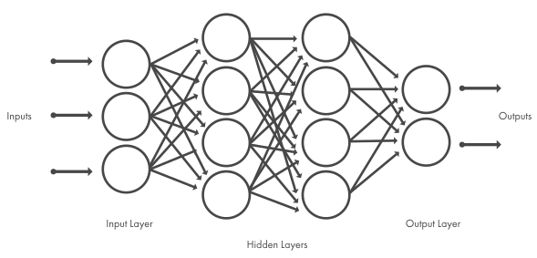

*image source: [mathworks][nn-definition-mathworks]*

> A neural network (also called an artificial neural network) is an adaptive system that learns by using interconnected nodes or neurons in a layered structure that resembles a human brain. A neural network can learn from data—so it can be trained to recognize patterns, classify data, and forecast future events.
>
> A neural network breaks down the input into layers of abstraction. It can be trained using many examples to recognize patterns in speech or images, for example, just as the human brain does. Its behavior is defined by the way its individual elements are connected and by the strength, or weights, of those connections. These weights are automatically adjusted during training according to a specified learning rule until the artificial neural network performs the desired task correctly.
>
> A neural network combines several processing layers, using simple elements operating in parallel and inspired by biological nervous systems. It consists of an input layer, one or more hidden layers, and an output layer. In each layer there are several nodes, or neurons, with each layer using the output of the previous layer as its input, so neurons interconnect the different layers. Each neuron typically has weights that are adjusted during the learning process, and as the weight decreases or increases, it changes the strength of the signal of that neuron.

#### Supervised learning with neural networks

In supervised learning, we are given a data set and already know what our correct output should look like, having the idea that there is a relationship between the input and the output.

Supervised learning problems are categorized into "regression" and "classification" problems. In a regression problem, we are trying to predict results within a continuous output, meaning that we are trying to map input variables to some continuous function. In a classification problem, we are instead trying to predict results in a discrete output. In other words, we are trying to map input variables into discrete categories.

*Examples of supervised learning applications*:

| Input(X) | Output(y) | Application |
| :-----| :---- | :---- |
| Home features | Price | Real Estate |
| Ad, user info | Click on ad? (0/1) | Online Advertising |
| Image | Object (1,...,1000) | Photo tagging |
| Audio | Text transcript | Speech recognition |
| English | Chinese | Machine translation |
| Image, Radar info | Position of other cars | Autonomous driving |

*Structured vs unstructured data*

- Structured data refers to things that has a defined meaning such as price, age
- Unstructured data refers to thing like pixel, raw audio, text.

#### Why is deep learning taking off

Deep learning is taking off due to a large amount of data available through the digitization of the society, faster computation and innovation in the development of neural network algorithm.

*Two things have to be considered to get to the high level of performance*:

1. Being able to train a big enough neural network
2. Huge amount of labeled data

## Week 2: Neural Networks Basics

### Learning Objectives

- Build a logistic regression model structured as a shallow neural network
- Build the general architecture of a learning algorithm, including parameter initialization, cost function and gradient calculation, and optimization implemetation (gradient descent)
- Implement computationally efficient and highly vectorized versions of models
- Compute derivatives for logistic regression, using a backpropagation mindset
- Use Numpy functions and Numpy matrix/vector operations
- Work with iPython Notebooks
- Implement vectorization across multiple training examples

### Logistic Regression as a Neural Network

#### Binary Classification

Week2 focuses on the basics of neural network programming, especially some important techniques, such as how to deal with m training examples in the computation and how to implement forward and backward propagation. To illustrate this process step by step, Andrew Ng took a lot of time explaining how Logistic regression is implemented for a binary classification, here a Cat vs. Non-Cat classification, which would take an image as an input and output a label to propagation whether this image is a cat (label 1) or not (label 0).

An image is store in the computer in three separate matrices corresponding to the Red, Green, and Blue color channels of the image. The three matrices have the same size as the image, for example, the resolution of the cat image is 64 pixels x 64 pixels, the three matrices (RGB) are 64 by 64 each. To create a feature vector, x, the pixel intensity values will be “unroll” or “reshape” for each color. The dimension of the input feature vector x is 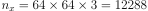.

#### Logistic Regression

> Logistic regression is useful for situations in which you want to be able to predict the presence or absence of a characteristic or outcome based on values of a set of predictor variables. It is similar to a linear regression model but is suited to models where the dependent variable is dichotomous. Logistic regression coefficients can be used to estimate odds ratios for each of the independent variables in the model. Logistic regression is applicable to a broader range of research situations than discriminant analysis. (from [ibm knowledge center][lr-definition-ibm])

A detailed guide on [Logistic Regression for Machine Learning][lr-for-ml] by Jason Brownlee is the best summary of this topic for data science engineers.

Andrew Ng's course on Logistic Regression here focuses more on LR as the simplest neural network, as its programming implementation is a good starting point for the deep neural networks that will be covered later.

#### Logistic Regression Cost Function

In Logistic regression, we want to train the parameters `w` and `b`, we need to define a cost function.

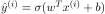, where 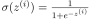  
Given 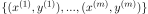, we want 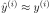

The loss function measures the discrepancy between the prediction (𝑦̂(𝑖)) and the desired output (𝑦(𝑖)). In other words, the loss function computes the error for a single training example.

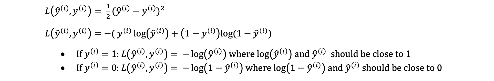

The cost function is the average of the loss function of the entire training set. We are going to find the parameters 𝑤 𝑎𝑛𝑑 𝑏 that minimize the overall cost function.

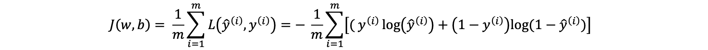

The loss function measures how well the model is doing on the single training example, whereas the cost function measures how well the parameters w and b are doing on the entire training set.

#### Gradient Descent

As you go through any course on machine learning or deep learning, gradient descent the concept that comes up most often. It is used when training models, can be combined with every algorithm and is easy to understand and implement.

The goal of the training model is to minimize the loss function, usually with randomly initialized parameters, and using a gradient descent method with the following main steps. Randomization of parameters initialization is not necessary in logistic regression (zero initialization is fine), but it is necessary in multilayer neural networks.

1. Start calculating the cost and gradient for the given training set of (x,y) with the parameters w and b.
2. update parameters w and b with pre-set learning rate:
                              w_new =w_old – learning_rate * gradient_of_at(w_old)
Repeat these steps until you reach the minimal values of cost function.

The fancy image below comes from [analytics vidhya][gradient-descent-img].

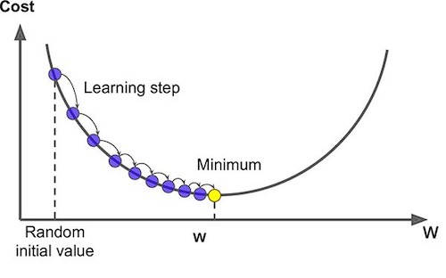

#### Derivatives

Derivatives are crucial in backpropagation during neural network training, which uses the concept of computational graphs and the chain rule of derivatives to make the computation of thousands of parameters in neural networks more efficient.

#### Computation Graph

A nice illustration by [colah's blog][computation-graph-colah] can help better understand.

Computational graphs are a nice way to think about mathematical expressions. For example, consider the expression e=(a+b)∗(b+1). There are three operations: two additions and one multiplication. To help us talk about this, let’s introduce two intermediary variables, c and d so that every function’s output has a variable. We now have:

```python
c=a+b
d=b+1
e=c∗d
```

To create a computational graph, we make each of these operations, along with the input variables, into nodes. When one node’s value is the input to another node, an arrow goes from one to another.

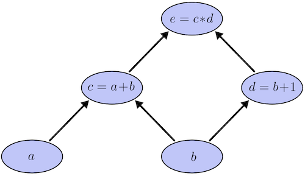

#### Derivatives with a Computation Graph

If one wants to understand derivatives in a computational graph, the key is to understand derivatives on the edges. If a directly affects c, then we want to know how it affects c. If a changes a little bit, how does c change? We call this the partial derivative of c with respect to a.

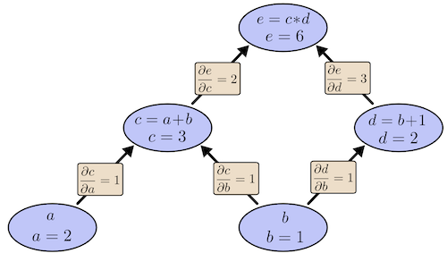

#### Logistic Regression Gradient Descent

Andrew did logistic regreesion gradient descent computation using the computation graph in order to get us familiar with computation graph ideas for neural networks.

#### Gradient Descent on m Examples

The cost function is computed as an average of the `m` individual loss values, the gradient with respect to each parameter should also be calculated as the mean of the `m` gradient values on each example.

The calculattion process can be done in a loop through m examples.

```python
J=0
dw=np.zeros(n)
db=0

for i in range(m):
  z[i] = w.transpose() * x[i] + b
  a[i] = sigmoid(z[i])
  J = J + (-[y[i]*log(a[i])+(1-y[i])*log(1-a[i])])
  dz[i] = a[i] - y[i]
  
  # inner loop for n features, later will be optimized by vectorization
  for j in range(n):
    dw[j] = dw[j] + x[i][j] * dz[i]
  
  db = db + dz[i]
  
j = j / m
dw = dw / m
db = db / m
```

After gradient computation, we can update parameters with a learning rate `alpha`.

```python
# vectorization should also applied here
for j in range(n):
  w[j] = w[j] - alpha * dw[j]
b = b - alpha * db
```

As you can see above, to update parameters one step, we have to go throught all the `m` examples. This will be mentioned again in later videos. Stay tuned!

#### Derivation of dL/dz

You may be wondering why `dz=a-y` in the above code is calculated this way and where it comes from. Here is a [detailed derivation process of dl/dz][discussion-dz] on discussion forum.

### Python and Vectorization

#### Vectorization

Both GPU and CPU have parallelization instructions. They're sometimes called SIMD instructions, which stands for a single instruction multiple data. The rule of thumb to remember is whenever possible avoid using explicit four loops. 

#### Vectorizing Logistic Regression

If we stack all the `m` examples of `x` we have a input matrix `X` with each column representing an example. So by the builtin vectorization of numpy we can simplify the above gradient descent calculation with a few lines of code which can boost the computational efficiency definitely.

```python
Z = np.dot(w.T, X) + b
A = sigmoid(Z)
dz = A - Y

# in constrast to the inner loop above, vectorization is used here to boost computation
dw = 1/m * np.dot(X, dz.T)
db = 1/m * np.sum(dz)  
```

Update parameters:

```python
w = w - alpha * dw
b = b - alpha * db
```

#### Broadcasting in Python

The term broadcasting describes how numpy treats arrays with different shapes during arithmetic operations. Subject to certain constraints, the smaller array is "broadcast" across the larger array so that they have compatible shapes. Broadcasting provides a means of vectorizing array operations so that looping occurs in C instead of Python. More detailed examples on [numpy.org][broadcasting].


#### A note on python/numpy vectors

Do not use rank 1 arrays:

```python
# an example of rank 1 array
a = np.random.randn(5)
a.shape
# (5,)
```

Instead, we should use these:

```python
a = np.random.randn(5,1)
a = np.random.randn(1,5)
```

Or, just reshape the first case if necessary:

```python
a = a.reshape(5,1)
a.shape
# (5,1)
```

#### Quick tour of Jupyter/iPython Notebooks

The Jupyter Notebook is an open-source web application that allows you to create and share documents that contain live code, equations, visualizations and narrative text. Uses include: data cleaning and transformation, numerical simulation, statistical modeling, data visualization, machine learning, and much more.

JupyterLab is a web-based interactive development environment for Jupyter notebooks, code, and data. JupyterLab is flexible: configure and arrange the user interface to support a wide range of workflows in data science, scientific computing, and machine learning. JupyterLab is extensible and modular: write plugins that add new components and integrate with existing ones.

See [jupyter.org](https://jupyter.org/)

```bash
pip install jupyterlab
```

To open jupyter lab, run

```bash
jupyter-lab
```

#### Explanation of logistic regression cost function (optional)

But so to summarize, by minimizing this cost function J(w,b) we're really carrying out maximum likelihood estimation with the logistic regression model because minimizing the loss corresponds to maximizing the log of the probability. 

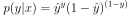

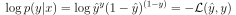

## Week 3: Shallow Neural Networks

### Learning Objectives

- Describe hidden units and hidden layers
- Use units with a non-linear activation function, such as tanh
- Implement forward and backward propagation
- Apply random initialization to your neural network
- Increase fluency in Deep Learning notations and Neural Network Representations
- Implement a 2-class classification neural network with a single hidden layer

### Shallow Neural Network

#### Neural Networks Overview

This is a simple 2-layer neural network.

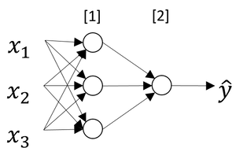

Using computation graph, the forward computation process is like this.

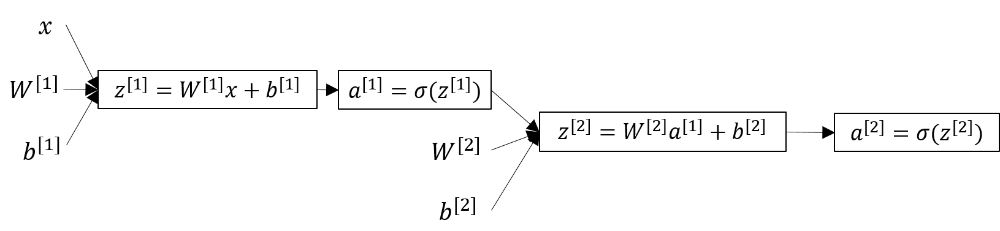

#### Neural Network Representation

A neural network consists of three types of layers: input layer, hidden layer and output layer. Input layer is not counted in the number of layers of one neural network. When we talk about training a neural network, basically we are training parameters associated with the hidden layers and the output layer.

- Input layer: input features (x1, x2, x3, ...) stack up vertically
- Hidden layer(s): values for the nodes are not observed
- Output layer: responsilble for generating the predicted value

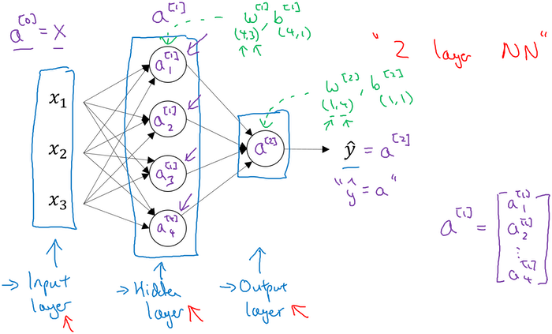

#### Computing a Neural Network's Output

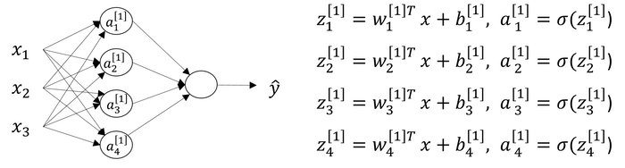

In the above example, `z[1]` is the result of linear computation of the input values and the parameters of the hidden layer and `a[1]` is the activation as a sigmoid function of `z[1]`.

Generally, in a two-layer neural network, if we have `nx` features of input `x` and `n1` neurons of hidden layer and one output value, we have the following dimensions of each variable. Specifically, we have `nx=3, n1=4` in the above network.

| variable | shape | description |
| :----: | :----: | :---- |
| `x` | `(nx,1)` | input value with `nx` features |
| `W[1]` | `(n1,nx)` | weight matrix of first layer, i.e., hidden layer |
| `b[1]` | `(n1,1)` | bias terms of hidden layer | 
| `z[1]` | `(n1,1)` | result of linear computation of hidden layer |
| `a[1]` | `(n1,1)` | activation of hidden layer |
| `W[2]` | `(1,n1)` | weight matrix of second layer, i.e., output layer here |
| `b[2]` | `(1,1)` | bias terms of output layer |
| `z[2]` | `(1,1)` | result of linear computation of output layer |
| `a[2]` | `(1,1)` | activation of output layer, i.e., output value |

We should compute `z[1], a[1], z[2], a[2]` for each example `i` of `m` examples:

```python
for i in range(m):
  z[1][i] = W[1]*x[i] + b[1]
  a[1][i] = sigmoid(z[1][i])
  z[2][i] = W[2]*a[1][i] + b[2]
  a[2][i] = sigmoid(z[2][i])
```

#### Vectorizing across multiple examples

Just as we have already been familiar with vectorization and broadcasting in the logistic regression, we can also apply the same method to the neural networks training. Inevitably, we have to go through the `m` examples of input values in the process of computation. Stacking them together is good idea. So we have the following vectorizing variables with only small differences as before.

| variable | shape | description |
| :----: | :----: | :---- |
| `X` | `(nx,m)` | input values with `nx` features |
| `W[1]` | `(n1,nx)` | weight matrix of first layer, i.e., hidden layer |
| `b[1]` | `(n1,1)` | bias terms of hidden layer | 
| `Z[1]` | `(n1,m)` | results of linear computation of hidden layer |
| `A[1]` | `(n1,m)` | activations of hidden layer |
| `W[2]` | `(1,n1)` | weight matrix of second layer, i.e., output layer here |
| `b[2]` | `(1,1)` | bias terms of output layer |
| `Z[2]` | `(1,1)` | results of linear computation of output layer |
| `A[2]` | `(1,1)` | activations of output layer, i.e., output value |

Now we can compute `Z[1], A[1], Z[2], A[2]` all at once.

```python
Z[1] = W[1]*X + b[1]
A[1] = sigmoid(Z[1])
Z[2] = W[2]*A[1] + b[2]
A[2] = sigmoid(Z[2])
```

#### Activation functions

So far, we know that a non-linear function is applied in the output step of each layer. Actually there are several common activation functions which are also popular.

| activation | formula | graph | description |
| :----: | :----: | :----: | :---- |
| sigmoid | 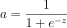 | 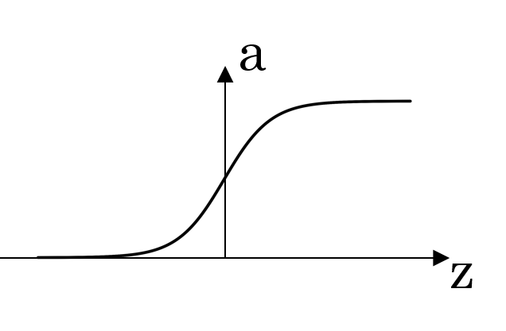 | also called logistic activation function, looks like an S-shape, if your output value between 0 and 1 choose sigmoid |
| tanh | 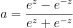 | 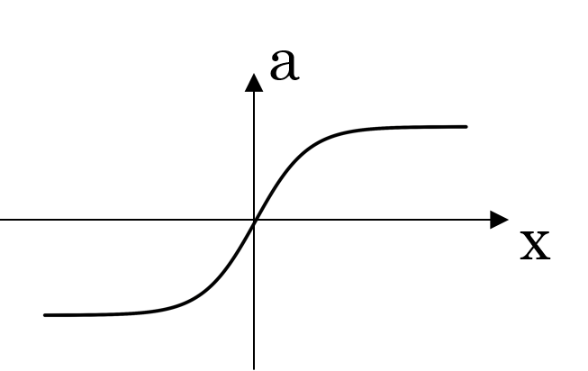 | tanh activation usually works better than sigmoid activation function for hidden units because the mean of its output is closer to zero, and so it centers the data better for the next layer |
| ReLU | `a=max(0,z)` | 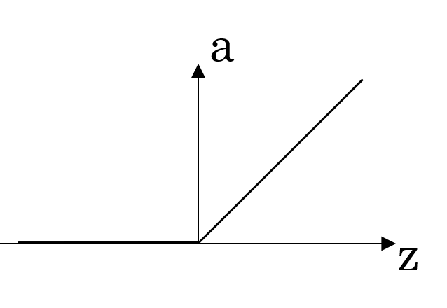 | rectified linear unit, the most widely used activation function | 
| Leaky ReLU | `a=max(0.01z,z)` | 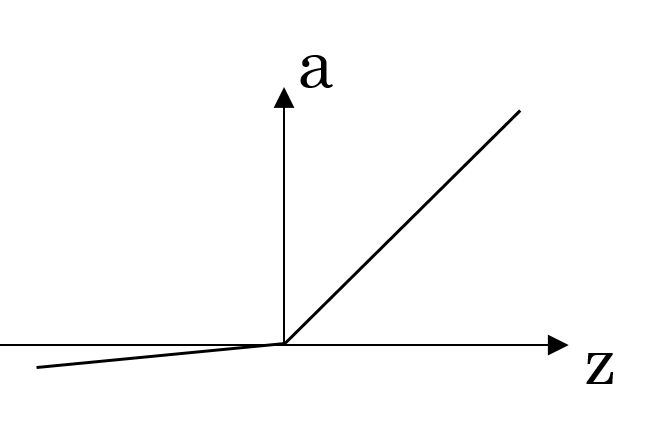 | an improved version of ReLU, 0.01 can be a parameter |

#### Why do you need non-linear activation functions

> If we only allow linear activation functions in a neural network, the output will just be a linear transformation of the input, which is not enough to form a universal function approximator. Such a network can just be represented as a matrix multiplication, and you would not be able to obtain very interesting behaviors from such a network.

A good explanation on [Stack Overflow][why-nonlinear-activation].

#### Derivatives of activation functions

| activation | formula | derivative |
| :----: | :----: | :----: |
| sigmoid |  | a(1-a) |
| tanh |  | 1-a^2 |
| ReLU | `a=max(0,z)` | 0 if z<0; 1 if z>=0 | 
| Leaky ReLU | `a=max(0.01z,z)` | 0.01 if z<0; 1 if z>=0 |

#### Gradient descent for Neural Networks

Again we will have a single hidden layer in our neural network, this section focuses on the equations we need to implement in order to get back-propagation or to get gradient descent working. Suppose we have nx input features, n1 hidden units and n2 output units in our examples. In the previous vectorization section we have n2 equals one. Here we will have a more general representation in order to give ourselves a smoother transition to the next week of the course.

*Variables*:

| variable | shape | description |
| :----: | :----: | :---- |
| `X` | `(nx,m)` | input values with `nx` features |
| `Z[1]` | `(n1,m)` | results of linear computation of hidden layer |
| `A[1]` | `(n1,m)` | activations of hidden layer |
| `Z[2]` | `(n2,1)` | results of linear computation of output layer |
| `A[2]` | `(n2,1)` | activations of output layer, i.e., output value |

*Parameters*:

| variable | shape | description |
| :----: | :----: | :---- |
| `W[1]` | `(n1,nx)` | weight matrix of first layer, i.e., hidden layer |
| `b[1]` | `(n1,1)` | bias terms of hidden layer | 
| `W[2]` | `(n2,n1)` | weight matrix of second layer, i.e., output layer here |
| `b[2]` | `(n2,1)` | bias terms of output layer |

*Forward propagation* computes all the variable values of each layer, which will also be used in the backpropagation computation.

```python
Z[1] = W[1]*X + b[1]
A[1] = sigmoid(Z[1])
Z[2] = W[2]*A[1] + b[2]
A[2] = sigmoid(Z[2])
```

*Backpropagation* computes the derivatives of parameters by the chain rule.

```python
# backpropagation
dZ[2] = A[2] - Y  # get this with combination of the derivative of cost function and g'[2]
dW[2] = 1/m * np.matmul(dZ[2], A[1].T)
db[2] = 1/m * np.sum(dZ[2], axis=1, keepdims=True)
dZ[1] = np.multiply(np.matmul(W[2].T, dZ[2]), g'[1](Z[1]))  # derivative of activation is used here 
dW[1] = 1/m * np.matmul(dZ[1], X.T)
db[1] = 1/m * np.sum(dZ[1])

# update parameters
W[1] = W[1] - learning_rate * dW[1]
b[1] = b[1] - learning_rate * db[1]
W[2] = W[2] - learning_rate * dW[2]
b[2] = b[2] - learning_rate * db[2]
```

*Repeat* forward propagation and backpropagation a lot of times until the parameters look like they're converging.

#### Random initialization

Initialization of parameters:

```python
W[1] = np.random.randn((n1,nx)) * 0.01  # randomized small numbers
b[1] = np.zeros((n1,1))                 # zeros is fine for bias terms
W[2] = np.random.randn((n2,n1)) * 0.01
b[2] = np.zeros((n2,1))
```

*Why randomized initialization?*

In order to break the symmetry for hidden layers.

> Imagine that you initialize all weights to the same value (e.g. zero or one). In this case, each hidden unit will get exactly the same signal. E.g. if all weights are initialized to 1, each unit gets signal equal to sum of inputs (and outputs sigmoid(sum(inputs))). If all weights are zeros, which is even worse, every hidden unit will get zero signal. No matter what was the input - if all weights are the same, all units in hidden layer will be the same too.

See some interesting discussion on [Stack Overflow][random-initialization].

*Why small numbers?*

This is for sigmoid or tanh activation function. If weight parameters are initially large, we are more likely to get large values of `z` calculated by `z=wx+b`. If we check this in the graph of sigmoid(tanh) function, we can see the slope in large `z` is very close to zero, which would slow down the learning process since parameters are updated by only a very small amount each time.

## Week 4: Deep Neural Networks

### Learning Objectives

- Describe the successive block structure of a deep neural network
- Build a deep L-layer neural network
- Analyze matrix and vector dimensions to check neural network implementations
- Use a cache to pass information from forward to back propagation
- Explain the role of hyperparameters in deep learning

### Deep Neural Network

#### Deep L-layer neural network

Technically logistic regression is a 1-layer neural network. Deep neural networks, with more layers, can learn functions that shallower models are often unable to.

Here `L` denotes the number of layers in a deep neural network. Some notations:

| notation | description |
| :----: | :---- |
| `n[0]` | number of neurons in the input layer |
| `n[l]` | number of neurons in the `lth` layer, `l` from 1 to L |
| `W[l]` | weights of the l-layer of shape `(n[l], n[l-1])` |
| `b[l]` | bias term of the l-layer of shape `(n[l], 1)` |
| `Z[l]` | affine result of the l-layer of shape `(n[l], m)`, `Z[l]=W[l]A[l-1]+b[l]` |
| `g[l]` | activation function of the l-layer |
| `A[l]` | activation output of the l-layer of shape `(n[l], m)`, `A[l]=g[l](Z[l])` |

#### Forward Propagation in a deep network

With `A[0]=X`, forward propagation is generalized as:

```python
Z[l] = W[l]*A[l-1] + b[l]
A[l] = sigmoid(Z[l])
```

*Backpropagation* computes the derivatives of parameters by the chain rule.

```python
# backpropagation
dZ[2] = A[2] - Y  # get this with combination of the derivative of cost function and g'[2]
dW[2] = 1/m * np.matmul(dZ[2], A[1].T)
db[2] = 1/m * np.sum(dZ[2], axis=1, keepdims=True)
dZ[1] = np.multiply(np.matmul(W[2].T, dZ[2]), g'[1](Z[1]))  # derivative of activation is used here 
dW[1] = 1/m * np.matmul(dZ[1], X.T)
db[1] = 1/m * np.sum(dZ[1])

# update parameters
W[1] = W[1] - learning_rate * dW[1]
b[1] = b[1] - learning_rate * db[1]
W[2] = W[2] - learning_rate * dW[2]
b[2] = b[2] - learning_rate * db[2]
```

#### Getting your matrix dimensions right

| matrix | dimension |
| :----: | :----: |
| `W[l]` | `(n[l], n[l-1])` |
| `b[l]` | `(n[l], 1)` |
| `Z[l]` | `(n[l], m)` |
| `A[l]` | `(n[l], m)` |
| `dW[l]` | `(n[l], n[l-1])` |
| `db[l]` | `(n[l], 1)` |
| `dZ[l]` | `(n[l], m)` |
| `dA[l]` | `(n[l], m)` |

#### Why deep representations

- Deep neural network with multiple hidden layers might be able to have the earlier layers learn lower level simple features and then have the later deeper layers then put together the simpler things it's detected in order to detect more complex things like recognize specific words or even phrases or sentences.
- If there aren't enough hidden layers, then we might require exponentially more hidden units to compute in shallower networks.

#### Building blocks of deep neural networks

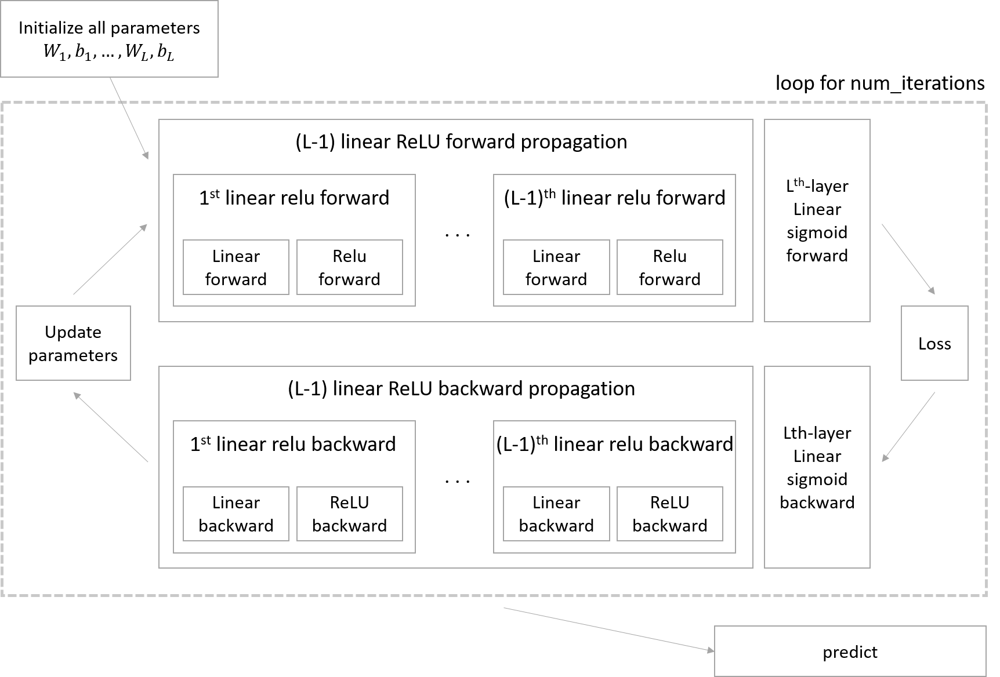

*Implementation steps*:

1. Initialize parameters / Define hyperparameters
2. Loop for num_iterations:
   1. Forward propagation
   2. Compute cost function
   3. Backward propagation
   4. Update parameters (using parameters, and grads from backprop)
3. Use trained parameters to predict labels

#### Forward and Backward Propagation

In the algorithm implementation, outputting intermediate values as caches (basically `Z` and `A`) of each forward step is crucial for backward computation.

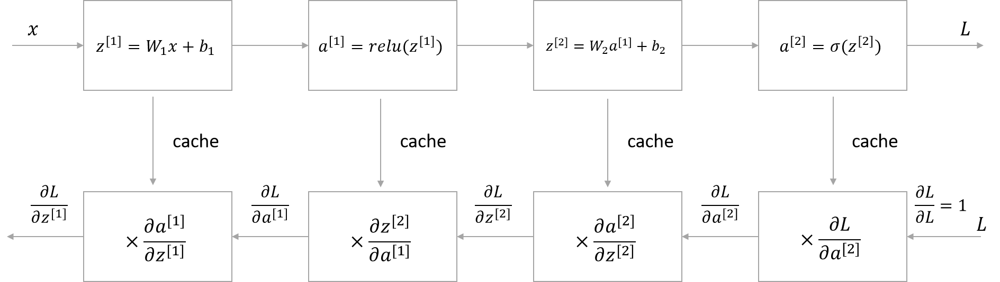

#### Parameters vs Hyperparameters

*Parameters*:

- weight matrices `W` of each layer
- bias terms `b` of each layer

*Hyper parameters*:

- number of hidden units `n[l]`
- learning rate
- number of iteration
- number of layers `L`
- choice of activation functions

### What does this have to do with the brain

About this topic, I think the following Andrew's explanation is the best summary:

> I do think that maybe the few that computer vision has taken a bit more inspiration from the human brain than other disciplines that also apply deep learning, but I personally use the analogy to the human brain less than I used to. 

[nn-definition-mathworks]: https://www.mathworks.com/discovery/neural-network.html

[lr-definition-ibm]: https://www.ibm.com/support/knowledgecenter/en/SSLVMB_26.0.0/statistics_mainhelp_ddita/spss/regression/idh_lreg.html

[lr-for-ml]: https://machinelearningmastery.com/logistic-regression-for-machine-learning/

[gradient-descent-img]: https://www.analyticsvidhya.com/blog/2020/10/what-does-gradient-descent-actually-mean/

[computation-graph-colah]: https://colah.github.io/posts/2015-08-Backprop/

[backprop]: http://neuralnetworksanddeeplearning.com/chap2.html

[discussion-dz]: https://www.coursera.org/learn/neural-networks-deep-learning/discussions/weeks/2/threads/ysF-gYfISSGBfoGHyLkhYg

[broadcasting]: https://numpy.org/doc/stable/user/theory.broadcasting.html#array-broadcasting-in-numpy

[why-nonlinear-activation]: https://stackoverflow.com/questions/9782071/why-must-a-nonlinear-activation-function-be-used-in-a-backpropagation-neural-net

[random-initialization]: https://stackoverflow.com/questions/20027598/why-should-weights-of-neural-networks-be-initialized-to-random-numbers

---
Notes by Aaron © 2020
