# Course 2: Improving Deep Neural Networks: Hyperparameter tuning, Regularization and Optimization

- [Course 2: Improving Deep Neural Networks: Hyperparameter tuning, Regularization and Optimization](#course-2-improving-deep-neural-networks-hyperparameter-tuning-regularization-and-optimization)
  - [Week 1: Practical aspects of Deep Learning](#week-1-practical-aspects-of-deep-learning)
    - [Learning Objectives](#learning-objectives)
    - [Setting up your Machine Learning Application](#setting-up-your-machine-learning-application)
      - [Train / Dev / Test sets](#train--dev--test-sets)
      - [Bias / Variance](#bias--variance)
      - [Bisic Recipe for Machine Learning](#bisic-recipe-for-machine-learning)
    - [Regularizing your neural network](#regularizing-your-neural-network)
      - [Regularization](#regularization)
      - [Why regularization reduces overfitting](#why-regularization-reduces-overfitting)
      - [Dropout Regularization](#dropout-regularization)
      - [Understanding Dropout](#understanding-dropout)
      - [Other regularization methods](#other-regularization-methods)
    - [Setting up your optimization problem](#setting-up-your-optimization-problem)
      - [Normalizing inputs](#normalizing-inputs)
      - [Vanishing / Exploding gradients](#vanishing--exploding-gradients)
      - [Weight Initialization for Deep Networks](#weight-initialization-for-deep-networks)
      - [Numerical approximation of gradients](#numerical-approximation-of-gradients)
      - [Gradient checking](#gradient-checking)
      - [Gradient checking implementation notes](#gradient-checking-implementation-notes)
  - [Week 2: Optimization algorithms](#week-2-optimization-algorithms)
    - [Learning Objectives](#learning-objectives-1)
    - [Optimization algorithms](#optimization-algorithms)
      - [Mini-batch gradient descent](#mini-batch-gradient-descent)
      - [Understanding mini-batch gradient descent](#understanding-mini-batch-gradient-descent)
      - [Exponentially Weighted Averages](#exponentially-weighted-averages)
      - [Understanding exponentially weighted averages](#understanding-exponentially-weighted-averages)
      - [Bias correction in exponentially weighted averages](#bias-correction-in-exponentially-weighted-averages)
      - [Gradient descent with momentum](#gradient-descent-with-momentum)
      - [RMSprop](#rmsprop)
      - [Adam optimization algorithm](#adam-optimization-algorithm)
      - [Learning rate decay](#learning-rate-decay)
      - [The problem of local optima](#the-problem-of-local-optima)
      - [Quick notes for optimization algorithms](#quick-notes-for-optimization-algorithms)
  - [Week 3: Hyperparameter tuning, Batch Normalization and Programming Frameworks](#week-3-hyperparameter-tuning-batch-normalization-and-programming-frameworks)
    - [Learning Objectives](#learning-objectives-2)
    - [Hyperparameter tuning](#hyperparameter-tuning)
      - [Tuning process](#tuning-process)
      - [Using an appropriate scale to pick hyperparameters](#using-an-appropriate-scale-to-pick-hyperparameters)
      - [Hyperparameters tuning in practice: Panda vs. Caviar](#hyperparameters-tuning-in-practice-panda-vs-caviar)
    - [Batch Normalization](#batch-normalization)
      - [Normalizing activations in a network](#normalizing-activations-in-a-network)
      - [Fitting Batch Norm into a neural network](#fitting-batch-norm-into-a-neural-network)
      - [Why does Batch Norm work](#why-does-batch-norm-work)
      - [Batch Norm at test time](#batch-norm-at-test-time)
    - [Multi-class classification](#multi-class-classification)
      - [Softmax Regression](#softmax-regression)
      - [Training a softmax classifier](#training-a-softmax-classifier)
    - [Introduction to programming frameworks](#introduction-to-programming-frameworks)
      - [Deep learning frameworks](#deep-learning-frameworks)
      - [Tensorflow](#tensorflow)

## Week 1: Practical aspects of Deep Learning

### Learning Objectives

- Give examples of how different types of initializations can lead to different results
- Examine the importance of initialization in complex neural networks
- Explain the difference between train/dev/test sets
- Diagnose the bias and variance issues in your model
- Assess the right time and place for using regularization methods such as dropout or L2 regularization
- Explain Vanishing and Exploding gradients and how to deal with them
- Use gradient checking to verify the accuracy of your backpropagation implementation

### Setting up your Machine Learning Application

#### Train / Dev / Test sets

Setting up the training, development (dev, also called validate set) and test sets has a huge impact on productivity. It is important to choose the dev and test sets from the same distribution and it must be taken randomly from all the data.

*Guideline*:

- Choose a dev set and test set to reflect data you expect to get in the future.
- The dev and test sets should be just big enough to represent accurately the performance of the model.

#### Bias / Variance

| error type | high variance | high bias | high bias, high variance | low bias, low variance |
| :---- | :----: | :----: | :----: | :----: |
| Train set error | 1% | 15% | 15% | 0.5% |
| Dev set error | 11% | 16% | 30% | 1% |

> When we discuss prediction models, prediction errors can be decomposed into two main subcomponents we care about: error due to "bias" and error due to "variance". There is a tradeoff between a model's ability to minimize bias and variance. Understanding these two types of error can help us diagnose model results and avoid the mistake of over- or under-fitting.

To understand bias and variance better, read this essay: [Understanding the Bias-Variance Tradeoff][bias-variance-tradeoff].

#### Bisic Recipe for Machine Learning

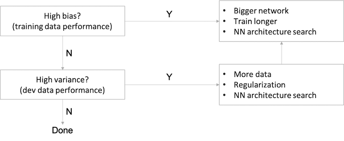

- For a high bias problem, getting more training data is actually not going to help. 
- Back in the pre-deep learning era, we didn't have as many tools that just reduce bias or that just reduce variance without hurting the other one.
- In the modern deep learning, big data era, getting a bigger network and more data almost always just reduces bias without necessarily hurting your variance, so long as you regularize appropriately. 
- This has been one of the big reasons that deep learning has been so useful for supervised learning.
- The main cost of training a big neural network is just computational time, so long as you're regularizing. 

### Regularizing your neural network

#### Regularization

**Regularization for Logistic Regression**:

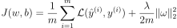

`b` is just one parameter over a very large number of parameters, so no need to include it in the regularization.

| regularization | formula | description |
| :---- | :----: | :---- |
| L2 regularization | 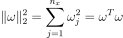 | most common type of regularization |
| L1 regularization | 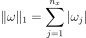 | w vector will have a lot of zeros, so L1 regularization makes your model sparse |

**Regularization for a Neural Network**:

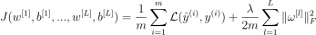

For the matrix `w`, this norm is called the Frobenius norm. Its definition looks like `L2` norm but is not called the `L2` norm:

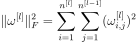

Regularization of gradient:

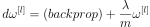

With regularization the coefficient of `w` is slightly less than `1`, in which case it is called **weight decay**.

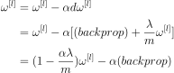


#### Why regularization reduces overfitting

- If we make regularization lambda to be very big, then weight matrices will be set to be reasonably close to zero, effectively zeroing out a lot of the impact of the hidden units. Then the simplified neural network becomes a much smaller neural network, eventually almost like a logistic regression. We'll end up with a much smaller network that is therefore less prone to overfitting.
- Taking activation function `g(Z)=tanh(Z)` as example, if lambda is large, then weights `W` are small and subsequently `Z` ends up taking relatively small values, where `g` and `Z` will be roughly linear which is not able to fit those very complicated decision boundary, i.e., less able to overfit.

*Implementation tips*:

Without regularization term, we should see the cost function decreases monotonically in the plot. Whereas in the case of regularization, to debug gradient descent make sure that we plot `J` with a regularization term; otherwise, if we plot only the first term (the old J), we might not see a decrease monotonically.

#### Dropout Regularization

- Dropout is another powerful regularization technique.
- With dropout, what we're going to do is go through each of the layers of the network and set some probability of eliminating a node in neural network. It's as if on every iteration you're working with a smaller neural network, which has a regularizing effect.
- Inverted dropout technique, `a3 = a3 / keep_prob`, ensures that the expected value of `a3` remains the same, which makes test time easier because you have less of a scaling problem. 

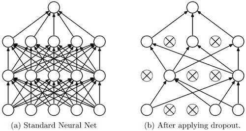

*(image source: [deepnotes](https://deepnotes.io/dropout))*

#### Understanding Dropout

- Can't rely on any one feature, so have to spread out weights, which has an effect of shrinking the squared norm of the weights, similar to what we saw with L2 regularization, helping prevent overfitting.
- For layers where you're more worried about over-fitting, really the layers with a lot of parameters, you can set the key prop to be smaller to apply a more powerful form of drop out. 
- Downside: with `keep prop` for some layers, more hyperparameters to search for using cross-validation.
- Frequently used in computer vision, as the input size is so big, inputting all these pixels that you almost never have enough data, prone to overfitting.
- Cost function `J` is no longer well-defined and harder to debug or double check that `J` is going downhill on every iteration. So first run code and make sure old `J` is monotonically decreasing, and then turn on drop out in order to make sure that no bug in drop out.

*Note*:

- A **common mistake** when using dropout is to use it both in training and testing. You should use dropout (randomly eliminate nodes) only in training.
- Deep learning frameworks like [tensorflow](https://www.tensorflow.org/api_docs/python/tf/nn/dropout), [PaddlePaddle](https://www.paddlepaddle.org.cn/documentation/docs/en/api/layers/dropout.html), [keras](https://keras.io/api/layers/regularization_layers/dropout/) or [caffe](http://caffe.berkeleyvision.org/tutorial/layers/dropout.html) come with a dropout layer implementation. Don't stress - you will soon learn some of these frameworks.

#### Other regularization methods

- **Data augmentation**: getting more training data can be expensive and somtimes can't get more data, so flipping horizontally, random cropping, random distortion and translation of image can make additional fake training examples.
- **Early stopping**: stopping halfway to get a mid-size `w`.
  - *Disadvantage*: early stopping couples two tasks of machine learning, optimizing the cost function `J` and not overfitting, which are supposed to be completely separate tasks, to make things more complicated.
  - *Advantage*: running the gradient descent process just once, you get to try out values of small `w`, mid-size `w`, and large `w`, without needing to try a lot of values of the L2 regularization hyperparameter lambda.
  
Related to **orthogonalization**, explained later, stay tuned!

### Setting up your optimization problem

#### Normalizing inputs

With normalization, cost function will be more round and easier to optimize when features are all on similar scales. This is a very common topic, see more on [Stack Overflow][normalizing].

#### Vanishing / Exploding gradients

- In a very deep network derivatives or slopes can sometimes get either very big or very small, maybe even exponentially, and this makes training difficult.
- The weights W, if they're all just a little bit bigger than one or just a little bit bigger than the identity matrix, then with a very deep network the activations can explode. And if W is just a little bit less than identity, the activations will decrease exponentially.

#### Weight Initialization for Deep Networks

A partial solution to the problems of vanishing and exploding gradients is better or more careful choice of the random initialization for neural network.

For a single neuron, suppose we have `n` features for the input layer, then we want `Z = W1X1 + W2X2 + ... + WnXn` not blow up and not become too small, so the larger `n` is, the smaller we want `Wi` to be.

- It's reasonable to set variance of `Wi` to be equal to `1/n`
- It helps reduce the vanishing and exploding gradients problem, because it's trying to set each of the weight matrices `W` not too much bigger than `1` and not too much less than `1`.
- Generally for layer `l`, set `W[l]=np.random.randn(shape) * np.sqrt(1/n[l-1])`.
  - For `relu` activation, set `Var(W)=2/n` by `W[l]=np.random.randn(shape) * np.sqrt(2/n[l-1])`. (aka He initialization by [Kaiming He](http://kaiminghe.com/))
  - For `tanh` activation, `W[l]=np.random.randn(shape) * np.sqrt(1/n[l-1])`. (Xavier initialization)
  - `W[l]=np.random.randn(shape) * np.sqrt(2/(n[l-1]+n[l]))` (Yoshua Bengio)
- `1` or `2` in variance `Var(W)=1/n or 2/n` can be a hyperparameter, but not as important as other hyperparameters.

*A well chosen initialization can*:

- Speed up the convergence of gradient descent
- Increase the odds of gradient descent converging to a lower training (and generalization) error

*Implementation tips*:

- The weights `W[l]` should be initialized randomly to *break symmetry* and make sure different hidden units can learn different things. Initializing all the weights to zero results in the network failing to break symmetry. This means that every neuron in each layer will learn the same thing.
- It is however okay to initialize the biases `b[l]` to zeros. Symmetry is still broken so long as `W[l]` is initialized randomly.
- Initializing weights to very large random values does not work well.
- Hopefully intializing with small random values does better. The important question is: how small should be these random values be? He initialization works well for networks with ReLU activations. In other cases, try other initializations.

#### Numerical approximation of gradients

Numerically verify implementation of derivative of a function is correct and hence to check if there is a bug in the backpropagation implementation.

*Two-sided difference formula is much more accurate*:

- In two side case, `f'(𝜃)=lim(f(𝜃+𝜀)-f(𝜃-𝜀))/(2𝜀), error term ~ O(𝜀^2)`
- In one side case, `f'(𝜃)=lim(f(𝜃+𝜀)-f(𝜃))/(𝜀), error term ~ O(𝜀)`
- `𝜀 < 1`, so `O(𝜀^2) < O(𝜀)`

#### Gradient checking

*Implementation steps*:

1. Take `W[1],b[1],...,W[L],b[L]` and reshape into a big vector `𝜃`: `J(W[1],b[1],...,W[L],b[L])=J(𝜃)`.
2. Take `dW[1],db[1],...,dW[L],db[L]` and reshape into a big vector `d𝜃`.
3. For each `i`: `d𝜃_approx[i] = (J(𝜃1,𝜃2,...,𝜃i+𝜀,...)-J(𝜃1,𝜃2,...,𝜃i-𝜀,...))/(2𝜀)`. (Should have `d𝜃_approx[i] ≈ d𝜃[i]`)
4. Check `diff_ratio = norm_2(d𝜃_approx-d𝜃) / (norm_2(d𝜃_approx)+norm_2(d𝜃)) ≈ eps`:
   1. `diff_ratio ≈ 10^-7`, great, backprop is very likely correct.
   2. `diff_ratio ≈ 10^-5`, maybe OK, better check no component of this difference is particularly large.
   3. `diff_ratio ≈ 10^-3`, worry, check if there is a bug.

#### Gradient checking implementation notes

- Don't use in training - only to debug
- If algorithm fails grad check, look at components to try to identify bug.
- Remember regularization.
- Doesn't work with dropout. (you can first check grad, then turn on dropout)
- Run at random initialization; perhaps again after some training.

## Week 2: Optimization algorithms

### Learning Objectives

- Apply optimization methods such as (Stochastic) Gradient Descent, Momentum, RMSProp and Adam
- Use random minibatches to accelerate convergence and improve optimization
- Describe the benefits of learning rate decay and apply it to your optimization

### Optimization algorithms

#### Mini-batch gradient descent

Vectorization allows you to process all M examples relatively quickly if M is very large, but it can still be slow. For example, `m = 5,000,000` (or `m = 50,000,000` or even bigger), we have to process the entire training sets of five million training samples before we take one little step of gradient descent.

We can use the mini-batch method to let gradient descent start to make some progress before we finish processing the entire, giant training set of 5 million examples by splitting up the training set into smaller, little baby training sets called mini-batches. In this case, we have 5000 mini-batches with 1000 examples each.

*Notations*:

- `(i)`: the *i*-th training sample
- `[l]`: the *l*-th layer of the neural network
- `{t}`: the *t*-th mini batch

In every step of the iteration loop, we need to loop for `num_batches` and do forward and backward computation for each batch.

1. Forward propagation
2. Compute cost function
3. Backward propagation
4. Update parameters (using parameters, and grads from backprop)

With mini-batch gradient descent, a single pass through the training set is one epoch, which in the above 5 million example, means 5000 gradient descent steps.

#### Understanding mini-batch gradient descent

| batch size | method | description | guidelines |
| :---- | :----: | :---- | :---- |
| =`m` | batch gradient descent | cost function decreases on every iteration;<br>but too long per iteration. | for a small training set (<2000). |
| =`1` | stochastic gradient descent | cost function oscillates, can be extremely noisy;<br>wander around minimum;<br>lose speedup from vectorization, inefficient. | use a smaller learning rate when it oscillates too much. |
| between `1` and `m` | mini-batch gradient descent | somewhere in between, vectorization advantage, faster;<br>not guaranteed to always head toward the minimum but more consistently in that direction than stochastic descent;<br>not always exactly converge, may oscillate in a very small region, reducing the learning rate slowly may also help. | mini-batch size is a hyperparameter;<br>batch size better in [64, 128, 256, 512], a power of 2;<br>make sure that mini-batch fits in CPU/GPU memory. |

#### Exponentially Weighted Averages

Moving averages are favored statistical tools of active traders to measure momentum. There are three MA methods:

| MA methods | calculations |
| :---- | :---- |
| simple moving average (SMA) |	calculated from the average closing prices for a specified period |
| weighted moving average (WMA) |	calculated by multiplying the given price by its associated weighting (assign a heavier weighting to more current data points) and totaling the values |
| exponential moving average (EWMA) | also weighted toward the most recent prices, but the rate of decrease is exponential |

For a list of daily temperatures:

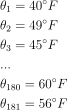

This data looks a little bit noisy (blue dots):

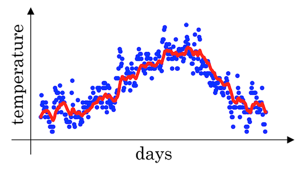

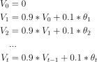

If we want to compute the trends, by averaging over a larger window, the above exponentially weighted average formula adapts more slowly when the temperature changes. So, there's just a bit more latency. (See the red curve above)

- When `β=0.98` then it's giving a lot of weight to the previous value and a much smaller weight just 0.02, to whatever you're seeing right now. (See the green curve below)
- When `β=0.5`, which something like averaging over just two days temperature. And by averaging only over two days temperature, as if averaging over much shorter window. It's much more noisy, much more susceptible to outliers. But this adapts much more quickly to what the temperature changes. (See the yellow curve below)

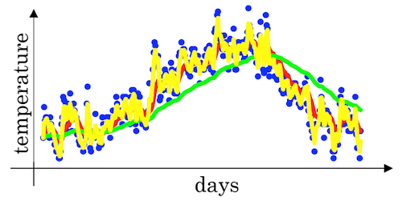

#### Understanding exponentially weighted averages

This topic is basically related to [gradient descent optimizations][gradient-descent-ewa].

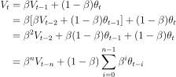

The exponentially weighted average adds a fraction β of the current value to a leaky running sum of past values. Effectively, the contribution from the *t−n*th value is scaled by 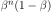.

For example, here are the contributions to the current value after 5 iterations (iteration 5 is the current iteration)

| iteration | contribution |
| :----: | :----: |
| 1 | `β^4(1−β)` |
| 2 | `β^3(1−β)` |
| 3 | `β^2(1−β)` |
| 4 | `β^1(1−β)` |
| 5 | `(1−β)` |

Since `β<1`, the contribution decreases exponentially with the passage of time. Effectively, this acts as a smoother for a function.

***e*-folding**:

Andrew Ng also mentioned an interesting concept related to *e*-folding. He said:

- if `β=0.9` it would take about 10 days for `V` to decay to about `1/3` (`1/e ≈ 1/3`) of the peak;
- if `β=0.98` it would be 50 days.

Here 10 or 50 days is called one lifetime (1 *e*-folding). Generally, for an exponential decay quantity, after one lifetime (`1/(1-β)` iterations), `1/e ≈ 37%` is remained and after two lifetime, `1/e^2 ≈ 14%` is left. 

For more information, check the definition of [*e*-folding][e-folding].

#### Bias correction in exponentially weighted averages

There's one technical detail called biased correction that can make you computation of these averages more accurately. In the temperature example above, when we set `β=0.98`, we won't actually get the green curve; instead, we get the purple curve (see the graph below). 


Because when we're implementing the exponentially weighted moving average, we initialize it with `V0=0`, subsequently we have the following result in the beginning of the iteration:

- `V1 = 0.98*V0 + 0.02*θ1 = 0.02 * θ1`
- `V2 = 0.98*V1 + 0.02*θ2 = 0.0196 * θ1 + 0.02 * θ2`

As a result, `V1` and `V2` calculated by this are not very good estimates of the first two temperature. So we need some modification to make it more accurate, especially during the initial phase of our estimate to avoid an **initial bias**. This can be corrected by scaling with `1/(1-β^t)` where `t` is the iteration number.

| original | correction |
| :----: | :----: |
| 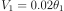 | 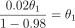 |
| 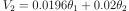 | 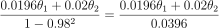 |

#### Gradient descent with momentum

Because mini-batch gradient descent makes a parameter update after seeing just a subset of examples, the direction of the update has some variance, and so the path taken by mini-batch gradient descent will "oscillate" toward convergence. Using momentum can reduce these oscillations. 

- gradient descent with momentum, which computes an EWA of gradients to update weights almost always works faster than the standard gradient descent algorithm.
- algorithm has two hyperparameters of `alpha`, the learning rate, and `beta` which controls your exponentially weighted average. common value for `beta` is `0.9`.
- don't bother with bias correction

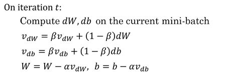

*Implementation tips*:

- If `β = 0`, then this just becomes standard gradient descent without momentum. 
- The larger the momentum `β` is, the smoother the update because the more we take the past gradients into account. But if `β` is too big, it could also smooth out the updates too much. 
- Common values for `β` range from `0.8` to `0.999`. If you don't feel inclined to tune this, `β = 0.9` is often a reasonable default. 
- It can be applied with batch gradient descent, mini-batch gradient descent or stochastic gradient descent.

#### RMSprop

RMSprop(root mean square), similar to momentum, has the effects of damping out the oscillations in gradient descent and mini-batch gradient descent and allowing you to maybe use a larger learning rate alpha.

The algorithm computes the exponentially weighted averages of the squared gradients and updates weights by the square root of the EWA.

```python
for iteration t:
  # compute dW, db on mini-batch

  S_dW = (beta * S_dW) + (1 - beta) * dW^2
  S_db = (beta * S_db) + (1 - beta) * db^2
  W = W - alpha * dW / sqrt(S_dW + 𝜀)   # 𝜀: small number(10^-8) to avoid dividing by zero
  b = b - alpha * db / sqrt(S_db + 𝜀)
```

#### Adam optimization algorithm

- Adam (Adaptive Moment Estimation) optimization algorithm is basically putting momentum and RMSprop together and combines the effect of gradient descent with momentum together with gradient descent with RMSprop.
- This is a commonly used learning algorithm that is proven to be very effective for many different neural networks of a very wide variety of architectures.
- In the typical implementation of Adam, bias correction is on.

```python
V_dW = 0
V_db = 0
S_dW = 0
S_db = 0

for iteration t:
  # compute dW, db using mini-batch                
  
  # momentum
  V_dW = (beta1 * V_dW) + (1 - beta1) * dW     
  V_db = (beta1 * V_db) + (1 - beta1) * db     
  
  # RMSprop
  S_dW = (beta2 * S_dW) + (1 - beta2) * dW^2   
  S_db = (beta2 * S_db) + (1 - beta2) * db^2   
  
  # bias correction
  V_dW_c = V_dW / (1 - beta1^t)      
  V_db_c = V_db / (1 - beta1^t)
  S_dW_c = S_dW / (1 - beta2^t)
  S_db_c = S_db / (1 - beta2^t)
          
  W = W - alpha * V_dW_c / (sqrt(S_dW_c) + 𝜀)
  b = b - alpha * V_db_c / (sqrt(S_db_c) + 𝜀)
```

*Implementation tips*:

1. It calculates an exponentially weighted average of past gradients, and stores it in variables `V_dW,V_db` (before bias correction) and `V_dW_c,V_db_c` (with bias correction). 
2. It calculates an exponentially weighted average of the squares of the past gradients, and stores it in variables `S_dW,S_db` (before bias correction) and `S_dW_c,S_db_c` (with bias correction). 
3. It updates parameters in a direction based on combining information from "1" and "2".

| hyperparameter | guideline |
| :---- | :---- |
| `learning rate` | tune |
| `beta1` (parameter of the momentum, for `dW`) | `0.9` |
| `beta2` (parameter of the RMSprop, for `dW^2`) | `0.999` |
| `𝜀` (avoid dividing by zero) | `10^-8` |

Adam paper: [Adam: A Method for Stochastic Optimization][adam]

#### Learning rate decay

The learning algorithm might just end up wandering around, and never really converge, because you're using some fixed value for alpha. Learning rate decay methods can help by making learning rate smaller when optimum is near. There are several decay methods:

| decay factor | description |
| :---- | :---- |
| `0.95^epoch_num` | exponential decay |
| `k/sqrt(epoch_num)` or `k/sqrt(t)` | polynomial decay |
| discrete staircase | piecewise constant |
| manual decay | -- |

#### The problem of local optima

- First, you're actually pretty unlikely to get stuck in bad local optima, but much more likely to run into a saddle point, so long as you're training a reasonably large neural network, save a lot of parameters, and the cost function J is defined over a **relatively high dimensional space**.
- Second, that plateaus are a problem and you can actually make learning pretty slow. And this is where algorithms like **momentum** or **RMSProp** or **Adam** can really help your learning algorithm.

This is what a saddle point look like.

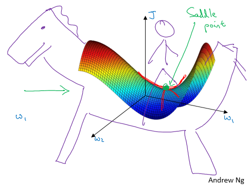

#### Quick notes for optimization algorithms

Recall that in [Course 1](../C1-Neural-Networks-and-Deep-Learning/readme.md#building-blocks-of-deep-neural-networks) we have already known that there are several steps in the neural network implementation:

1. Initialize parameters / Define hyperparameters
2. Loop for num_iterations:
   1. Forward propagation
   2. Compute cost function
   3. Backward propagation
   4. **Update parameters (using parameters, and grads from backprop)**
3. Use trained parameters to predict labels

When we create `momentum`, `RMSprop` or `Adam` optimization methods, what we do is to implement algorithms in the **update parameters** step. A good practice is to wrap them up as options so we can compare them during our alchemy training：

```python
if optimizer == "gd":
    parameters = update_parameters_with_gd(parameters, grads, learning_rate)
elif optimizer == "momentum":
    parameters, v = update_parameters_with_momentum(parameters, grads, v, beta, learning_rate)
elif optimizer == "adam":
    t = t + 1 # Adam counter
    parameters, v, s = update_parameters_with_adam(parameters, grads, v, s, t, learning_rate, beta1, beta2, epsilon)
```

## Week 3: Hyperparameter tuning, Batch Normalization and Programming Frameworks

### Learning Objectives

- Master the process of hyperparameter tuning

### Hyperparameter tuning

#### Tuning process

Importance of hyperparameters (roughly):

| importance level | hyperparameters |
| :----: | :---- |
| first | learning rate `alpha` |
| second | momentum term `beta`<br>mini-batch size<br>number of hidden units |
| third | number of layers<br>learning rate decay<br>Adam `beta1, beta2, epsilon` |

*Tuning tips*:

- Choose points at random, not in a grid
- Optionally use a coarse to fine search process

#### Using an appropriate scale to pick hyperparameters

Search for hyperparameters on a log scale.

```python
r = -4 * np.random.rand() # r in [-4,0]
alpha = 10**r             # alpha in [10^-4, 1]
```

It's easy to extend to a more generalized case `[a,b]`.

As for `beta`, use the same logarithmic scale method for `1-beta`.

#### Hyperparameters tuning in practice: Panda vs. Caviar

- **Panda approach**: Not enough computational capacity: babysitting one model
- **Caviar approach**: training many models in parallel

### Batch Normalization

#### Normalizing activations in a network

- Batch normalization makes your hyperparameter search problem much easier, makes your neural network much more robust.
- What batch norm does is it applies that normalization process not just to the input layer, but to the values even deep in some hidden layer in the neural network. So it will apply this type of normalization to normalize the mean and
variance of `z[i]` of hidden units.
- One difference between the training input and these hidden unit values is that you might not want your hidden unit values be forced to have mean 0 and variance 1.
  - For example, if you have a sigmoid activation function, you don't want your values to always be clustered in the normal distribution around `0`. You might want them to have a larger variance or have a mean that's different than 0, in order to better take advantage of the nonlinearity of the sigmoid function rather than have all your values be in just this linear region (near `0` on sigmoid function).
  - What it does really is it then shows that your hidden units have standardized mean and variance, where the mean and variance are controlled by two explicit parameters `gamma` and `beta` which the learning algorithm can set to whatever it wants.

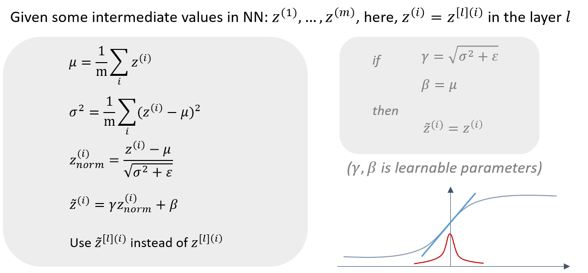

#### Fitting Batch Norm into a neural network

- `𝛽[1],𝛾[1],𝛽[2],𝛾[2],⋯,𝛽[𝐿],𝛾[𝐿]` can also be updated using gradient descent with momentum (or RMSprop, Adam). `𝛽[l],𝛾[l]` have the shape with `z[l]`.
- Similar computation can also be applied to mini-batches.
- With batch normalization, the parameter `b[l]` can be eliminated. So `w[l],𝛽[l],𝛾[l]` need to be trained.
- The parameter `𝛽` here has nothing to do with the `beta` in the momentum, RMSprop or Adam algorithms.

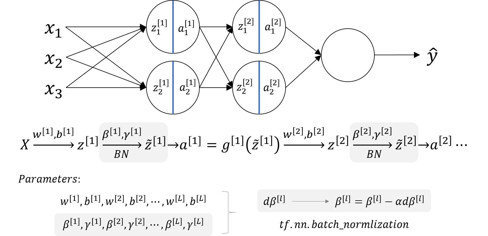

#### Why does Batch Norm work

- By normalizing all the features, input features `X`, to take on a similar range of values that can speed up learning. So batch normalization is doing a similar thing.
- To avoid *covariate shift* of data distribution, which makes the parameters change a lot in the training progress. Batch norm can reduce the amount that the distribution of the hidden unit values shifts around by making the mean and variance of `z` values remain the same. 
  - It allows each layer of the network to learn by itself, a little bit more independently of other layers, and this has the effect of speedup of learning in the whole network.
  - From the perspective of one of the later layers of the neural network, the earlier layers don't get to shift around as much, because they're constrained to have the same mean and variance. This makes the job of learning on the later layers easier.
- It has a slight regularization effect.
  - The mean and variance is a little bit noisy because it's estimated with just a relatively small sample of data (each mini-batch). So similar to dropout, it adds some noise to each hidden layer's activations. 
  - It's forcing the downstream hidden units not to rely too much on any one hidden unit.
  - The noise added is quite small, so not a huge regularization effect. You can use batch norm together with dropouts if you want the more powerful regularization effect of dropout.
  - Using bigger mini-batch size can reduce noise and therefore reduce regularization effect.
  - Don't turn to batch norm as a regularization. This is not the intent of batch norm.
  - Just use it as a way to normalize hidden units activations and therefore speedup learning.
- At test time, you try to make predictors and evaluate the neural network, you might not have a mini-batch of examples, you might be processing one single example at the time. So, at test time you need to do something slightly differently to make sure your predictions make sense.

#### Batch Norm at test time

- Batch norm processes our data one mini batch at a time, but at test time we need to process examples one at a time.
- In theory we could run the whole training set through final network to get `𝜇` and `𝜎^2`.
- In practice, usually implement an exponentially weighted average where we just keep track of the `𝜇` and `𝜎^2` we're seeing during training and use an EWA (across mini-batches), also sometimes called the running average, to get a rough estimate of `𝜇` and `𝜎^2` and then use these to scale at test time.
  - `𝜇{1}[l], 𝜇{2}[l], 𝜇{3}[l], ...` —> `𝜇[l]`
  - `𝜎^2{1}[l], 𝜎^2{2}[l], 𝜎^2{3}[l], ...` —> `𝜎^2[l]`

### Multi-class classification

#### Softmax Regression

Use softmax activation function.

```python
def softmax(z):
    return np.exp(z) / sum(np.exp(z))

z = [1,0.5,-2,1,3]
print(softmax(z)) 
# array([0.09954831, 0.0603791 , 0.00495622, 0.09954831, 0.73556806])
```

#### Training a softmax classifier

Softmax regression is a generalization of logistic regression to more than two classes.

### Introduction to programming frameworks

#### Deep learning frameworks

- Caffe/Caffe2
- CNTK
- DL4J
- Keras
- Lasagne
- mxnet
- PaddlePaddle
- TensorFlow
- Theano
- Torch

*Choosing deep learning frameworks*:

- Ease of programming (development and deployment)
- Running speed
- Truly open (open source with good governance)

#### Tensorflow

- The two main object classes in tensorflow are *Tensors* and *Operators*.
- When we code in tensorflow we have to take the following steps:
  - Create a graph containing Tensors (*Variables*, *Placeholders* ...) and *Operations* (`tf.matmul`, `tf.add`, ...)
  - Create a *session*
  - Initialize the *session*
  - Run the *session* to execute the graph
- We might need to execute the graph multiple times when implementing `model()`
- The backpropagation and optimization is automatically done when running the session on the "optimizer" object.

```python
import numpy as np 
import tensorflow as tf

coefficients = np.array([[1], [-20], [25]])
w = tf.Variable([0],dtype=tf.float32)
x = tf.placeholder(tf.float32, [3,1])
cost = x[0][0]*w**2 + x[1][0]*w + x[2][0]    # (w-5)**2
train = tf.train.GradientDescentOptimizer(0.01).minimize(cost)
init = tf.global_variables_initializer()
session = tf.Session()
session.run(init) 
print(session.run(w))

for i in range(1000):
  session.run(train, feed_dict={x:coefficients})
print(session.run(w))
```

[CS230-blog]: https://cs230.stanford.edu/blog/split/

[bias-variance-tradeoff]: http://scott.fortmann-roe.com/docs/BiasVariance.html

[normalizing]: https://stackoverflow.com/questions/4674623/why-do-we-have-to-normalize-the-input-for-an-artificial-neural-network

[gradient-descent-ewa]: http://people.duke.edu/~ccc14/sta-663-2018/notebooks/S09G_Gradient_Descent_Optimization.html

[gradient-descent-momentum-ewa]: https://stats.stackexchange.com/questions/353833/why-is-gradient-descent-with-momentum-considered-an-exponentially-weighted-avera

[e-folding]: https://en.formulasearchengine.com/wiki/E-folding

[adam]: https://arxiv.org/abs/1412.6980

---
Notes by Aaron © 2020
