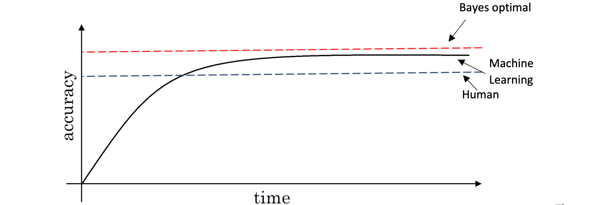
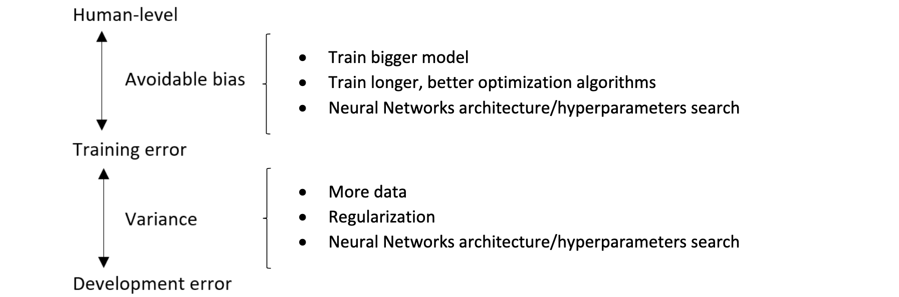
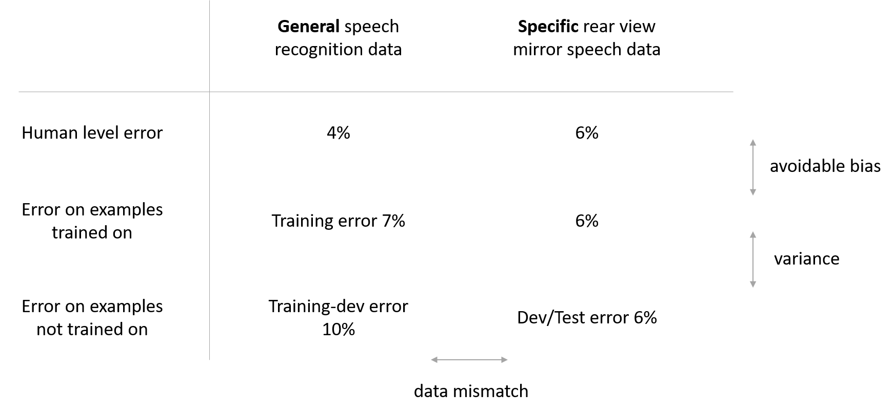
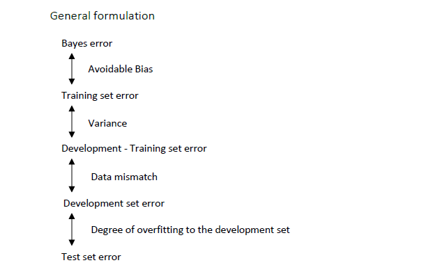
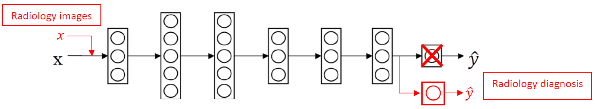
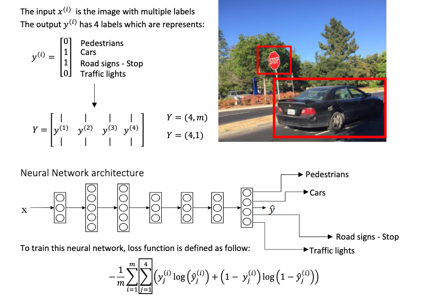
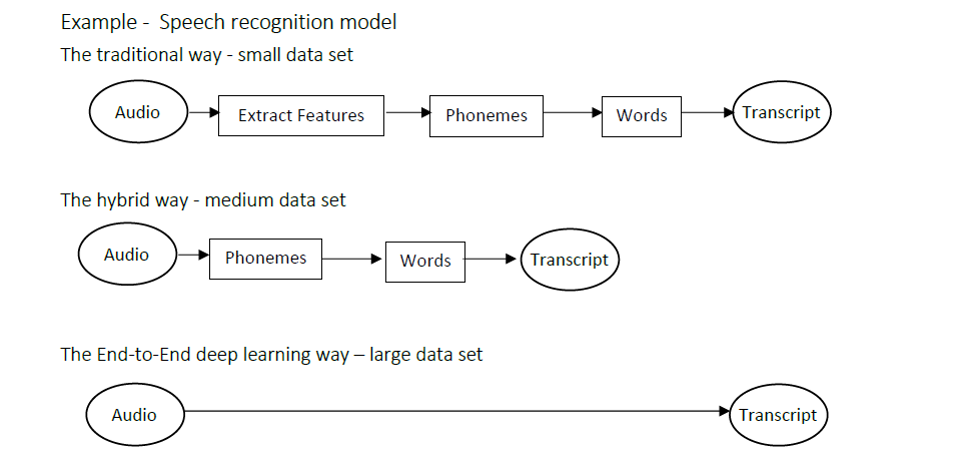

# Course 3: Structuring Machine Learning Projects

- [Course 3: Structuring Machine Learning Projects](#course-3-structuring-machine-learning-projects)
  - [Week 1: ML Strategy (1)](#week-1-ml-strategy-1)
    - [Learning Objectives](#learning-objectives)
    - [Introduction to ML Strategy](#introduction-to-ml-strategy)
      - [Why ML Strategy](#why-ml-strategy)
      - [Orthogonalization](#orthogonalization)
    - [Setting up your goal](#setting-up-your-goal)
      - [Single number evaluation metric](#single-number-evaluation-metric)
      - [Satisficing and optimizing metric](#satisficing-and-optimizing-metric)
      - [Train/dev/test distributions](#traindevtest-distributions)
      - [Size of the dev and test sets](#size-of-the-dev-and-test-sets)
      - [When to change dev/test sets and metrics](#when-to-change-devtest-sets-and-metrics)
    - [Comparing to human-level performance](#comparing-to-human-level-performance)
      - [Why human-level performance](#why-human-level-performance)
      - [Avoidable bias](#avoidable-bias)
      - [Understanding human-level performance](#understanding-human-level-performance)
      - [Surpassing human-level performance](#surpassing-human-level-performance)
      - [Improving your model performance](#improving-your-model-performance)
  - [Week 2: ML Strategy (2)](#week-2-ml-strategy-2)
    - [Learning Objectives](#learning-objectives-1)
    - [Error Analysis](#error-analysis)
      - [Carrying out error analysis](#carrying-out-error-analysis)
      - [Cleaning up incorrectly labeled data](#cleaning-up-incorrectly-labeled-data)
      - [Build your first system quickly, then iterate](#build-your-first-system-quickly-then-iterate)
    - [Mismatched training and dev/test set](#mismatched-training-and-devtest-set)
      - [Training and testing on different distributions](#training-and-testing-on-different-distributions)
      - [Bias and Variance with mismatched data distributions](#bias-and-variance-with-mismatched-data-distributions)
      - [Addressing data mismatch](#addressing-data-mismatch)
    - [Learning from multiple tasks](#learning-from-multiple-tasks)
      - [Transfering learning](#transfering-learning)
      - [Multi-task learning](#multi-task-learning)
    - [End-to-end deep learning](#end-to-end-deep-learning)
      - [What is end-to-end deep learning](#what-is-end-to-end-deep-learning)
      - [Whether to use end-to-end deep learning](#whether-to-use-end-to-end-deep-learning)

## Week 1: ML Strategy (1)

### Learning Objectives

- Explain why Machine Learning strategy is important
- Apply satisficing and optimizing metrics to set up your goal for ML projects
- Choose a correct train/dev/test split of your dataset
- Define human-level performance
- Use human-level performance to define key priorities in ML projects
- Take the correct ML Strategic decision based on observations of performances and dataset

### Introduction to ML Strategy

#### Why ML Strategy

*Ideas to improve a machine learning system*:

- Collect more data
- Collect more diverse training set
- Train algorithm longer with gradient descent
- Try Adam instead of gradient descent
- Try bigger network
- Try smaller network
- Try dropout
- Add L2 regularization
- Network architecture
  - Activation functions
  - number of hidden units
  - ...

In order to have quick and effective ways to figure out which of all of these ideas and maybe even other ideas, are worth pursuing and which ones we can safely discard, we need ML strategies.

#### Orthogonalization

In the example of TV tuning knobs, orthogonalization refers to that the TV designers had designed the knobs so that each knob kind of does only one thing.

In a car the stearing wheel controls the angle and the accelerator and brake control the speed. If there are two controllers, each has different effect simultaneously on angle and speed, then it's much harder to set the car to the speed and angle we want.

```python
0.3 * angle - 0.8 * speed
2 * angle + 0.9 * speed
```

Orthogonal means at 90 degrees to each other. By having orthogonal controls that are ideally aligned with the things we actually want to control. It makes it much easier to tune the knobs we have to tune. To tune the steering wheel angle, and the accelerator, the brake, to get the car to do what we want.

| chain of assumptions in ML | tune the *knobs* |
| :---- | :---- |
| Fit training set well on cost function | bigger network<br>better optimization algorithm, Adam... |
| Fit dev set well on cost function | regularization<br>bigger training set |
| Fit test set well on cost function | bigger dev set |
| Performs well in real world | change dev set or cost function<br>(dev test set distribution not correct or cost function not right) |

Early stopping, though not a bad technique, is a *knob* that simultaneously affects the training set and dev set performance, and therefore is **less orthogonalized**, so Andrew tend not to use it.

### Setting up your goal

#### Single number evaluation metric

Evaluation metric allows you to quickly tell if classifier A or classifier B is better, and therefore having a dev set plus single number evaluation metric tends to speed up iterating.

| metric | calculation | definition |
| :----: | :----: | :---- |
| Precision | `P = TP/(TP+FP)` | percentage of true positive in predicted positive |
| Recall | `R = TP/(TP+FN)` | percentage of true positive predicted in all real positive |
| F1 score | `F1 = 2PR/(P+R)` or `1/F1 = (1/P+1/R)/2` | harmonic mean of precision and recall |

#### Satisficing and optimizing metric

If we care about the classification accuracy of our cat's classifier and also care about the running time or some other performance, instead of combining them into an overall evaluation metric by their *artificial* linear weighted sum, we actually can have one thing as an **optimizing metric** and the others as **satisficing metrics**.

- In the cat's classifier example, we might have accuracy as optimizing metric and running time as satificing metric.
- In wake words detection system (like Amazon Echo, Apple Siri, ...), maybe accuracy is an optimizing metric and false positive `≤ 1` every 24 hours is a satificing metric.

#### Train/dev/test distributions

*Guideline*:

- Choose a dev set and test set to reflect data you expect to get in future and consider important to do well on.
- In particular, **the dev set and the test set here, should come from the same distribution**.

#### Size of the dev and test sets

- In the era of big data, the old rule of thumb of a 70/30 is that, that no longer applies. And the trend has been to use more data for training and less for dev and test, especially when you have a very large data sets.
- Suppose we have a million training examples, it might be quite reasonable to set up the data so that we have 98% in the training set, 1% dev, and 1% test.
- The guideline is, to set your test set to big enough to give high confidence in the overall performance of your system.
- When people were talking about using train test splits, what they actually had was a train dev split and no test set.
- In the history of machine learning, not everyone has been completely clean and completely records of about calling the dev set when it really should be treated as dev set.

#### When to change dev/test sets and metrics

In an example of cat classification system, classification error might not be a reasonable metric if two algorithms have the following performance:

| algorithm | classification error | issues | review |
| :----: | :----: | :---- | :---- |
| Algorithm A | 3% | letting through lots of porn images | showing pornographic images to users is intolerable |
| Algorithm B | 5% | no pornographic images | classifies fewer images but acceptable |

In this case, metric should be modified. One way to change this evaluation metric would be adding weight terms.

| metric | calculation | notation |
| :----: | :----: | :----: |
| classification error |  | `L` can be identity function to count correct labels |
| weighted classification error |  |  |

So if you find that evaluation metric is not giving the correct rank order preference for what is actually better algorithm, then there's a time to think about defining a new evaluation metric.

This is actually an example of an orthogonalization where I think you should take a machine learning problem and break it into distinct steps.

- First, figure out how to define a metric that captures what you want to do. (*place the target*)
- Second, think about how to actually do well on this metric. (*shoot the target*)

The overall guideline is if your current metric and data you are evaluating on doesn't correspond to doing well on what you actually care about, then change your metrics and/or your dev/test set to better capture what you need your algorithm to actually do well on.

### Comparing to human-level performance

#### Why human-level performance

A lot more machine learning teams have been talking about comparing the machine learning systems to human-level performance.

- First, because of advances in deep learning, machine learning algorithms are suddenly working much better and so it has become much more feasible in a lot of application areas for machine learning algorithms to actually become competitive with human-level performance.
- Second, the workflow of designing and building a machine learning system is much more efficient when we're trying to do something that humans can also do.

The graph below shows the performance of humans and machine learning over time.



Machine learning progresses slowly when it surpasses human-level performance. One of the reason is that human-level performance can be closeto Bayes optimal error, especially for natural perception problem.

Bayes optimal error is defined as the best possible error. In other words, it means that any functions mapping from x to y can’t surpass a certain level of accuracy.

Also, when the performance of machine learning is worse than the performance of humans, we can improve it with different tools. They are harder to use once it surpasses human-level performance.

*These tools are*:

- Get labelled data from humans
- Gain insight from manual error analysis: Why did a person get this right?
- Better analysis of bias/variance.

#### Avoidable bias

By knowing what the human-level performanceis, it is possible to tell when a training set is performing well or not.

| performance | Scenario A | Scenario B |
| :----: | :----: | :----: |
| humans | 1 | 7.5 |
| training error | 8 | 8 |
| development error | 10 | 10 |

In this case, the human-level error as a proxy for Bayes error since humans are good to identify images. If you want to improve the performance of the training set but you can’t do better than the Bayes error otherwise the training set is overfitting. By knowing the Bayes error, it is easier to focus on whether bias or variance avoidance tactics will improve the performance of the model.

- *Scenario A*: There is a 7% gap between the performance of the training set and the human-level error. It means that the algorithm isn’t fitting well with the training set since the target is around 1%. To resolve the issue, we use bias reduction technique such as training a bigger neural network or running the training set longer.

- *Scenario B*: The training set is doing good since there is only a 0.5% difference with the human-level error. The difference between the training set and the human-level error is called **avoidable bias**. The focus here is to reduce the variance since the difference between the training error and the development error is 2%. To resolve the issue, we use variance reduction technique such as regularization or have a bigger training set.

#### Understanding human-level performance

Summary of bias/variance with human-level performance:

- Human-level error is a proxy for Bayes error.
- If the difference between human-level error and the training error is bigger than the difference between the training error and the development error. The focus should be on bias reduction technique.
- If the difference between training error and the development error is bigger than the difference between the human-level error and the training error. The focus should be on variance reduction technique


#### Surpassing human-level performance

*Classification task performance (classification error)*:

| performance | Scenario A | Scenario B |
| :----: | :----: | :----: |
| Team of humans | 0.5 | 0.5 |
| One human | 1.0 | 1 |
| Training error | 0.6 | 0.3 |
| Development error | 0.8 | 0.4 |

- Scenario A: In this case, the Bayes error is 0.5%, therefore the available bias is 0.1%et the variance is 0.2%.
- Scenario B: In this case, there is not enough information to know if bias reduction or variance reduction has to be done on the algorithm. It doesn’t mean that the model cannot be improve, it means that the conventional ways to know if bias reduction or variance reduction are not working in this case.

There are many problems where machine learning significantly surpasses human-level performance, especially with structured data:

| problem | structured data |
| :---- | :---- |
| Online advertising | database of what has users clicked on |
| Product recommendations | database of proper support for |
| Logistics (predicting transit time) | database of how long it takes to get from A to B |
| Loan approvals | database of previous loan applications and their outcomes |

And these are not **natural perception problems**, so these are not *computer vision*, or *speech recognition*, or *natural language processing* task. Humans tend to be very good in natural perception task. So it is possible, but it's just a bit harder for computers to surpass human-level performance on natural perception task.

#### Improving your model performance

*There are two fundamental assumptions of supervised learning.*

- The first one is to have a low avoidable bias which means that the training set fits well.
- The second one is to have a low or acceptable variance which means that the training set performance generalizes well to the development set and test set.



## Week 2: ML Strategy (2)

### Learning Objectives

- Describe multi-task learning and transfer learning
- Recognize bias, variance and data-mismatch by looking at the performances of your algorithm on train/dev/test sets

### Error Analysis

#### Carrying out error analysis

*To carry out error analysis, you should*:

- find a set of mislabeled examples in your dev set.
- look at the mislabeled examples for false positives and false negatives.
- count up the number of errors that fall into various different categories.
- you might be inspired to generate new categories of errors.

#### Cleaning up incorrectly labeled data

*Some facts*:

- Deep learning algorithms are quite robust to random errors in the training set.
- The goal of the dev set, the main purpose of the dev set is, you want to really use it to help you select between two classifiers A and B.
- It's super important that your dev and test sets come from the same distribution.

*Correcting incorrect dev/test set examples*:

- Apply same process to your dev and test sets to make sure they continue to come from the same distribution.
- Consider examining examples your algorithm got right as well as ones it got wrong.
- Train and dev/test data may now come from slightly different distributions.

#### Build your first system quickly, then iterate

Depending on the area of application, the guideline below will help you prioritize when you build your system.

*Guideline*:

1. Set up development/test set and metrics
   1. Set up a target
2. Build an initial system quickly
   1. Train training set quickly: Fit the parameters
   2. Development set: Tune the parameters
   3. Test set: Assess the performance
3. Use **bias/variance analysis** & **error analysis** to prioritize next steps

### Mismatched training and dev/test set

#### Training and testing on different distributions

In the *Cat vs Non-cat* example, there are two sources of data used to develop **the mobile app**. 

- The first data distribution is small, 10,000 pictures uploaded from the mobile application. Since they are from amateur users,the pictures are not professionally shot, not well framed and blurrier.
- The second source is from the web, you downloaded 200,000 pictures where cat’s pictures are professionally framed and in high resolution.

The guideline is that you have to choose a development set and test set to reflect data you expect to get **in the future** and consider important to do well.


#### Bias and Variance with mismatched data distributions

Instead of just having bias and variance as two potential problems, you now have a third potential problem, data mismatch.





#### Addressing data mismatch

*This is a general guideline to address data mismatch*:

- Perform manual error analysis to understand the error differences between training, development/test sets. Development should never be done on test set to avoid overfitting.
- Make training data or collect data similar to development and test sets. To make the training data more similar to your development set, you can use is **artificial data synthesis**. However, it is possible that if you might be accidentally simulating data only from a tiny subset of the space of all possible examples.

### Learning from multiple tasks

#### Transfering learning

Transfer learning refers to using the neural network knowledge for another application.

*When to use transfer learning*:

- Task A and B have the same input 𝑥
- A lot more data for Task A than Task B
- Low level features from Task A could be helpful for Task B

*Example 1: Cat recognition - radiology diagnosis*

The following neural network is trained for cat recognition, but we want to adapt it for radiology diagnosis. The neural network will learn about the structure and the nature of images. This initial phase of training on image recognition is called **pre-training**, since it will pre-initialize the weights of the neural network. Updating all the weights afterwards is called **fine-tuning**.

*Guideline*:

- Delete last layer of neural network
- Delete weights feeding into the last output layer of the neural network
- Create a new set of randomly initialized weights for the last layer only
- New data set `(𝑥, 𝑦)`



#### Multi-task learning

Multi-task learning refers to having one neural network do simultaneously several tasks.

*When to use multi-tasklearning*:

- Training on a set of tasks that could benefit from having shared lower-level features
- Usually: Amount of data youhave for each task is quite similar
- Can train a big enough neural network to do well on all tasks



### End-to-end deep learning

#### What is end-to-end deep learning

- End-to-end deep learning is the simplification of a processing or learning systems into one neural network.
- End-to-end deep learning cannot be used for every problem since it needs a lot of labeled data. It is used mainly in
  - audio transcripts,
  - image captures,
  - image synthesis,
  - machine translation,
  - steering in self-driving cars, etc.



#### Whether to use end-to-end deep learning

Before applying end-to-end deep learning, you need to ask yourself the following question: Do you have enough data to learn a function of the complexity needed to map x and y?

*Pro*:

- *Let the data speak*. By having a pure machine learning approach, the neural network will learn from x to y. It will be able to find which statistics are in the data, rather than being forced to reflect human preconceptions.
- *Less hand-designing of components needed*. It simplifies the design work flow.

*Cons*:

- *Large amount of labeled data*. It cannot be used for every problem as it needs a lot of labeled data.
- *Excludes potentially useful hand-designed component*. Data and any hand-design’s components or features are the 2 main sources of knowledge for a learning algorithm. If the data set is small than a hand-design system is a way to give manual knowledge into the algorithm.

---
Notes by Aaron © 2020
