# Course 4: Convolutional Neural Networks

- [Course 4: Convolutional Neural Networks](#course-4-convolutional-neural-networks)
  - [Week 1: Foundations of Convolutional Neural Networks](#week-1-foundations-of-convolutional-neural-networks)
    - [Learning Objectives](#learning-objectives)
    - [Convolutional Neural Networks](#convolutional-neural-networks)
      - [Computer Vision](#computer-vision)
      - [Edge Detection Example](#edge-detection-example)
      - [More Edge Detection](#more-edge-detection)
      - [Padding](#padding)
      - [Strided Convolutions](#strided-convolutions)
      - [Convolutions Over Volume](#convolutions-over-volume)
      - [One Layer of a Convolutional Network](#one-layer-of-a-convolutional-network)
      - [Simple Convolutional Network](#simple-convolutional-network)
      - [Pooling Layers](#pooling-layers)
      - [CNN Example](#cnn-example)
      - [Why Convolutions](#why-convolutions)
  - [Week 2: Classic Networks](#week-2-classic-networks)
    - [Learning Objectives](#learning-objectives-1)
    - [Case Studies](#case-studies)
      - [Why look at case studies](#why-look-at-case-studies)
      - [Classic Networks](#classic-networks)
        - [LeNet-5](#lenet-5)
        - [AlexNet](#alexnet)
        - [VGG-16](#vgg-16)
      - [ResNets](#resnets)
      - [Why ResNets](#why-resnets)
      - [Networks in Networks and 1x1 Convolutions](#networks-in-networks-and-1x1-convolutions)
      - [Inception Network Motivation](#inception-network-motivation)
      - [Inception Network](#inception-network)
    - [Practical advices for using ConvNets](#practical-advices-for-using-convnets)
      - [Using Open-Source Implementation](#using-open-source-implementation)
      - [Transfering Learning](#transfering-learning)
      - [Data Augmentation](#data-augmentation)
      - [State of Computer Vision](#state-of-computer-vision)
      - [Tips for Keras](#tips-for-keras)
  - [Week 3: Object detection](#week-3-object-detection)
    - [Learning Objectives](#learning-objectives-2)
    - [Detection algorithms](#detection-algorithms)
      - [Object Localization](#object-localization)
      - [Landmark Detection](#landmark-detection)
      - [Object Detection](#object-detection)
      - [Convolutional Implementation of Sliding Windows](#convolutional-implementation-of-sliding-windows)
      - [Bounding Box Predictions (YOLO)](#bounding-box-predictions-yolo)
      - [Intersection Over Union](#intersection-over-union)
      - [Non-max Suppression](#non-max-suppression)
      - [Anchor Boxes](#anchor-boxes)
      - [YOLO Algorithm](#yolo-algorithm)
      - [(Optional) Region Proposals](#optional-region-proposals)
  - [Week 4: Special applications: Face recognition & Neural style transfer](#week-4-special-applications-face-recognition--neural-style-transfer)
    - [Face Recognition](#face-recognition)
      - [What is face recognition](#what-is-face-recognition)
      - [One Shot Learning](#one-shot-learning)
      - [Siamese network](#siamese-network)
      - [Triplet Loss](#triplet-loss)
      - [Face Verification and Binary Classification](#face-verification-and-binary-classification)
      - [Summary of Face Recognition](#summary-of-face-recognition)
    - [Neural Style Transfer](#neural-style-transfer)
      - [What is neural style transfer](#what-is-neural-style-transfer)
      - [What are deep ConvNets learning](#what-are-deep-convnets-learning)
      - [Cost Function](#cost-function)
      - [Content Cost Function](#content-cost-function)
      - [Style Cost Function](#style-cost-function)
      - [1D and 3D Generalizations](#1d-and-3d-generalizations)

## Week 1: Foundations of Convolutional Neural Networks

### Learning Objectives

- Explain the convolution operation
- Apply two different types of pooling operations
- Identify the components used in a convolutional neural network (padding, stride, filter, ...) and their purpose
- Build and train a ConvNet in TensorFlow for a classification problem

### Convolutional Neural Networks

#### Computer Vision

*Deep learning computer vision can now*:

- help self-driving cars figure out where the other cars and pedestrians around so as to avoid them.
- make face recognition work much better than ever before.
- unlock a phone or unlock a door using just your face.

*Deep learning for computer vision is exciting* because:

- First, rapid advances in computer vision are enabling brand new applications to view, though they just were impossible a few years ago.
- Second, even if you don't end up building computer vision systems per se, I found that because the computer vision research community has been so creative and so inventive in coming up with new neural network architectures and algorithms, is actually inspire that creates a lot cross-fertilization into other areas as well.

For computer vision applications, you don't want to be stuck using only tiny little images. You want to use large images. To do that, you need to better implement the **convolution operation**, which is one of the fundamental building blocks of **convolutional neural networks**.

#### Edge Detection Example

- The convolution operation is one of the fundamental building blocks of a convolutional neural network.
- Early layers of the neural network might detect edges and then some later layers might detect parts of objects and then even later layers may detect parts of complete objects like people's faces.
- Given a picture for a computer to figure out what are the objects in the picture, the first thing you might do is maybe detect edges in the image.

The *convolution operation* gives you a convenient way to specify how to find these **vertical edges** in an image.

A `3 by 3` filter or `3 by 3` matrix may look like below, and this is called a vertical edge detector or a vertical edge detection filter. In this matrix, pixels are relatively bright on the left part and relatively dark on the right part.

```text
1, 0, -1
1, 0, -1
1, 0, -1
```

Convolving it with the vertical edge detection filter results in detecting the vertical edge down the middle of the image. 

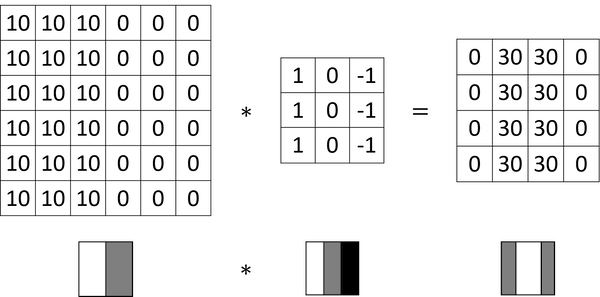

#### More Edge Detection

In the horizontal filter matrix below, pixels are relatively bright on the top part and relatively dark on the bottom part.

```text
 1,  1,  1
 0,  0,  0
-1, -1, -1
```

Different filters allow you to find vertical and horizontal edges. The following filter is called a **Sobel filter** the advantage of which is it puts a little bit more weight to the central row, the central pixel, and this makes it maybe a little bit more robust. [More about Sobel filter](https://fiveko.com/tutorials/image-processing/sobel-filter/).

```text
1, 0, -1
2, 0, -2
1, 0, -1
```

Here is another filter called **Scharr filter**:

```text
 3, 0, -3
10, 0, -10
 3, 0, -3
```

More about [**Scharr filter**](https://plantcv.readthedocs.io/en/v3.0.5/scharr_filter/).


```text
w1, w2, w3
w4, w5, w6
w7, w8, w9
```

By just letting all of these numbers be parameters and learning them automatically from data, we find that neural networks can actually learn low level features, can learn features such as edges, even more robustly than computer vision researchers are generally able to code up these things by hand.

#### Padding

In order to fix the following two problems, padding is usually applied in the convolutional operation.

- Every time you apply a convolutional operator the image shrinks.
- A lot of information from the edges of the image is thrown away.

*Notations*:

- image size: `n x n`
- convolution size: `f x f`
- padding size: `p`

*Output size after convolution*:

- without padding: `(n-f+1) x (n-f+1)`
- with padding: `(n+2p-f+1) x (n+2p-f+1)`

*Convention*:

- Valid convolutions: no padding
- Same convolutions: output size is the same as the input size
- `f` is usually odd

#### Strided Convolutions

*Notation*:

- stride `s`

*Output size after convolution*: `floor((n+2p-f)/s+1) x floor((n+2p-f)/s+1)`

*Conventions*:

- The filter must lie entirely within the image or the image plus the padding region.
- In the deep learning literature by convention, a convolutional operation (maybe better *called cross-correlation*) is what we usually do not bother with a flipping operation, which is included before the product and summing step in a typical math textbook or a signal processing textbook.
  - In the latter case, the filter is flipped vertically and horizontally.

#### Convolutions Over Volume

For a RGB image, the filter itself has three layers corresponding to the red, green, and blue channels.

`height x width x channel`

`n x n x nc` * `f x f x nc` --> `(n-f+1) x (n-f+1) x nc'`

#### One Layer of a Convolutional Network

*Notations*:

| size | notation |
| :---- | :---- |
| filter size | 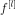 |
| padding size | 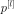 |
| stride size | 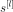 |
| number of filters | 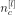 |
| filter shape | 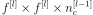 |
| input shape | 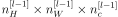 |
| output shape | 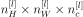 |
| output height | 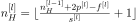 |
| output width | 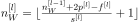 |
| activations `a[l]` |  |
| activations `A[l]` | 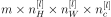 |
| weights | 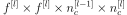 |
| bias | 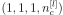 |

#### Simple Convolutional Network

Types of layer in a convolutional network:

- Convolution (CONV)
- Pooling (POOL)
- Fully connected (FC)

#### Pooling Layers

- One interesting property of max pooling is that it has a set of hyperparameters but it has no parameters to learn. There's actually nothing for gradient descent to learn.
- Formulas that we had developed previously for figuring out the output size for conv layer also work for max pooling.
- The max pooling is used much more often than the average pooling.
- When you do max pooling, usually, you do not use any padding.

#### CNN Example
 
- Because the pooling layer has no weights, has no parameters, only a few hyper parameters, I'm going to use a convention that `CONV1` and `POOL1` shared together.
- As you go deeper usually the *height* and *width* will decrease, whereas the number of *channels* will increase.
- max pooling layers don't have any parameters
- The conv layers tend to have relatively few parameters and a lot of the parameters tend to be in the fully collected layers of the neural network.
- The activation size tends to maybe go down *gradually* as you go deeper in the neural network. If it drops too quickly, that's usually not great for performance as well.

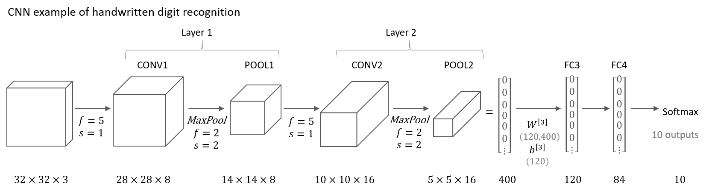

*Layer shapes of the network*:

| layer | activation shape | activation size | # parameters |
| :----: | :----: | :----: | :----: |
| Input | (32,32,3) | 3072 | 0 |
| CONV1 (f=5,s=1) | (28,28,8) | 6272 | 608 `=(5*5*3+1)*8` |
| *POOL1* | (14,14,8) | 1,568 | 0 |
| CONV2 (f=5,s=1) | (10,10,16) | 1600 | 3216 `=(5*5*8+1)*16` |
| *POOL2* | (5,5,16) | 400 | 0 |
| FC3 | (120,1) | 120 | 48120 `=400*120+120` |
| FC4 | (84,1) | 84 | 10164 `=120*84+84` |
| softmax | (10,1) | 10 | 850 `=84*10+10` |

#### Why Convolutions

There are two main advantages of convolutional layers over just using fully connected layers.

- Parameter sharing: A feature detector (such as a vertical edge detector) that’s useful in one part of the image is probably useful in another part of the image.
- Sparsity of connections: In each layer, each output value depends only on a small number of inputs.

Through these two mechanisms, a neural network has a lot fewer parameters which allows it to be trained with smaller training cells and is less prone to be overfitting.

- Convolutional structure helps the neural network encode the fact that an image shifted a few pixels should result in pretty similar features and should probably be assigned the same output label.
- And the fact that you are applying the same filter in all the positions of the image, both in the early layers and in the late layers that helps a neural network automatically learn to be more robust or to better capture the desirable property of translation invariance.

## Week 2: Classic Networks

### Learning Objectives

- Discuss multiple foundational papers written about convolutional neural networks
- Analyze the dimensionality reduction of a volume in a very deep network
- Implement the basic building blocks of ResNets in a deep neural network using Keras
- Train a state-of-the-art neural network for image classification
- Implement a skip connection in your network
- Clone a repository from github and use transfer learning

### Case Studies

#### Why look at case studies

It is helpful in taking someone else's neural network architecture and applying that to another problem.

- Classic networks
  - LeNet-5
  - AlexNet
  - VGG
- ResNet
- Inception

#### Classic Networks

##### LeNet-5

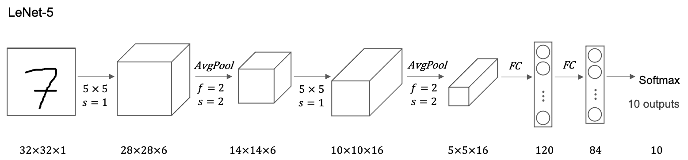

Some difficult points about reading the [LeNet-5 paper](https://pdfs.semanticscholar.org/62d7/9ced441a6c78dfd161fb472c5769791192f6.pdf):

- Back then, people used sigmoid and tanh nonlinearities, not relu.
- To save on computation as well as some parameters, the original LeNet-5 had some crazy complicated way where different filters would look at different channels of the input block. And so the paper talks about those details, but the more modern implementation wouldn't have that type of complexity these days.
- One last thing that was done back then I guess but isn't really done right now is that the original LeNet-5 had a non-linearity after pooling, and I think it actually uses sigmoid non-linearity after the pooling layer.
- Andrew Ng recommend focusing on section two which talks about this architecture, and take a quick look at section three which has a bunch of experiments and results, which is pretty interesting. Later sections talked about the graph transformer network, which isn't widely used today.

##### AlexNet

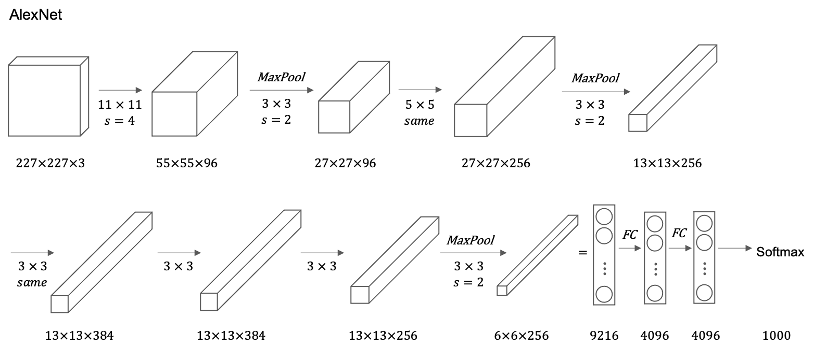

- AlexNet has a lot of similarities to LeNet (60,000 parameters), but it is much bigger (60 million parameters).
- The paper had a complicated way of training on two GPUs since GPU was still a little bit slower back then.
- The original AlexNet architecture had another set of a layer called local response normalization, which isn't really used much.
- Before AlexNet, deep learning was starting to gain traction in speech recognition and a few other areas, but it was really just paper that convinced a lot of the computer vision community to take a serious look at deep learning, to convince them that deep learning really works in computer vision.

##### VGG-16

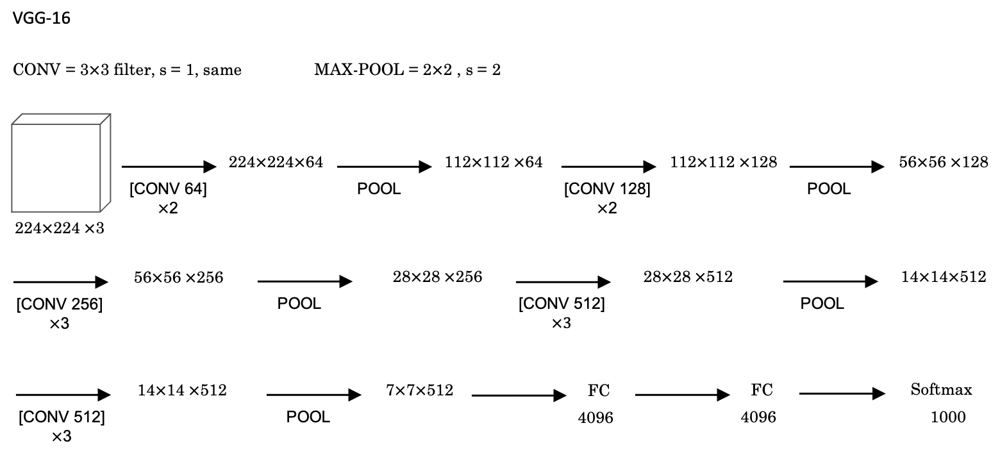

- Filters are always `3x3` with a stride of `1` and are always `same` convolutions.
- VGG-16 has 16 layers that have weights. A total of about 138 million parameters. Pretty large even by modern standards.
- It is the simplicity, or the uniformity, of the VGG-16 architecture made it quite appealing.
  - There is a few conv-layers followed by a pooling layer which reduces the height and width by a factor of `2`.
  - Doubling through every stack of conv-layers is a simple principle used to design the architecture of this network.
- The main downside is that you have to train a large number of parameters.

#### ResNets

Paper: [Deep Residual Learning for Image Recognition](https://arxiv.org/abs/1512.03385)

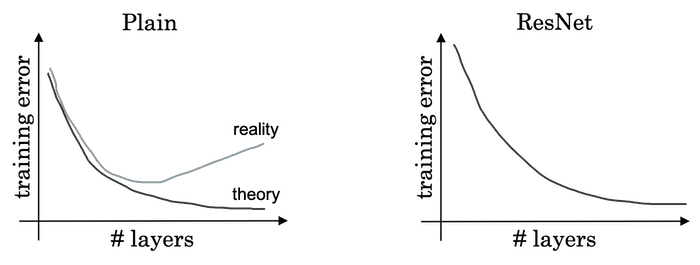

- Deeper neural networks are more difficult to train. They present a residual learning framework to ease the training of networks that are substantially deeper than those used previously.
- When deeper networks are able to start converging, a degradation problem has been exposed: with the network depth increasing, accuracy gets saturated (which might be unsurprising) and then degrades rapidly. The paper address the degradation problem by introducing a deep residual learning framework. Instead of hoping each few stacked layers directly fit a desired underlying mapping, they explicitly let these layers fit a residual mapping.
- The paper authors show that: 1) Their extremely deep residual nets are easy to optimize, but the counterpart "plain" nets (that simply stack layers) exhibit higher training error when the depth increases; 2) Their deep residual nets can easily enjoy accuracy gains from greatly increased depth, producing results substantially better than previous networks.

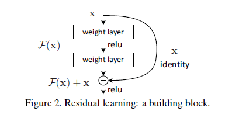

Formally, denoting the desired underlying mapping as `H(x)`, they let the stacked nonlinear layers fit another mapping of `F(x):=H(x)-x`. The original mapping `H(x)` is recast into `F(x)+x`. If the added layers can be constructed as identity mappings, a deeper model should have training error no greater than its shallower counterpart.


#### Why ResNets

- Doing well on the training set is usually a prerequisite to doing well on your hold up or on your depth or on your test sets. So, being able to at least train ResNet to do well on the training set is a good first step toward that.
- But if you make a network deeper, it can hurt your ability to train the network to do well on the training set. It is not true or at least less true when training a ResNet.
  - If we use `L2` regularization on `a[l+2]=g(Z[l+2]+a[l])=g(W[l+2]a[l+1]+b[l+2]+a[l])`, and if the value of `W[l+2],b[l+2]` shrink to zero, then `a[l+2]=g(a[l])=a[l]` since we use `relu` activation and `a[l]` is also non-negative. So we just get back `a[l]`. This shows that the identity function is easy for residual block to learn.
  - It's easy to get `a[l+2]` equals to `a[l]` because of this skip connection. What this means is that adding these two layers in the neural network doesn't really hurt the neural network's ability to do as well as this simpler network without these two extra layers, because it's quite easy for it to learn the identity function to just copy `a[l]` to `a[l+2]` despite the addition of these two layers. 
  - So adding two extra layers or adding this residual block to somewhere in the middle or the end of this big neural network doesn't hurt performance. It is easier to go from a decent baseline of not hurting performance and then gradient descent can only improve the solution from there.

*About dimensions*:

- In `a[l+2]=g(Z[l+2]+a[l])` we're assuming that `Z[l+2]` and `a[l]` have the same dimension. So what we see in ResNet is a lot of use of same convolutions.
- In case the input and output have different dimensions, we can add an extra matrix `W_s` so that `a[l+2] = g(Z[l+2] + W_s * a[l])`. The matrix `W_s` could be a matrix of parameters we learned or could be a fixed matrix that just implements zero paddings.

*An example from the paper*:

A plain network in which you input an image and then have a number of `CONV` layers until eventually you have a softmax output at the end.

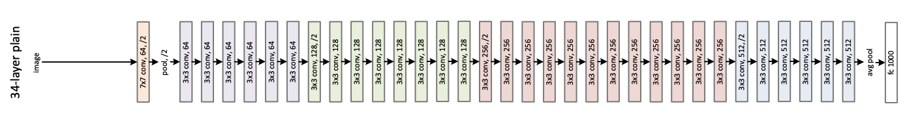

To turn this into a ResNet, you add those extra skip connections and there are a lot of `3x3` convolutions and most of these are `3x3` same convolutions and that's why you're adding equal dimension feature vectors. There are occasionally pooling layers and in these cases you need to make an adjustment to the dimension by the matrix `W_s`.


**Practice advices on ResNet**:

- Very deep "plain" networks don't work in practice because they are hard to train due to vanishing gradients.  
- The skip-connections help to address the Vanishing Gradient problem. They also make it easy for a ResNet block to learn an identity function. 
- There are two main types of blocks: The identity block and the convolutional block. 
- Very deep Residual Networks are built by stacking these blocks together.

#### Networks in Networks and 1x1 Convolutions

Paper: [Network in Network](https://arxiv.org/abs/1312.4400)

- At first, a 1×1 convolution does not seem to make much sense. After all, a convolution correlates adjacent pixels. A 1×1 convolution obviously does not.
- Because the minimum window is used, the 1×1 convolution loses the ability of larger convolutional layers to recognize patterns consisting of interactions among adjacent elements in the height and width dimensions. The only computation of the 1×1 convolution occurs on the channel dimension.
- The 1×1 convolutional layer is typically used to *adjust the number of channels* between network layers and to control model complexity.

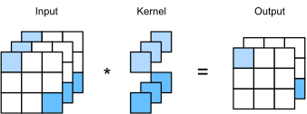

*(image from [here][d2l_ai_conv_1by1])*

The 1×1 convolutional layer is equivalent to *the fully-connected layer*, when applied on a per pixel basis.

- You can take every pixel as an *example* with `n_c[l]` input values (channels) and the output layer has `n_c[l+1]` nodes. The kernel is just nothing but the weights.
- Thus the 1x1 convolutional layer requires `n_c[l+1] x n_c[l]` weights and the bias.

The 1x1 convolutional layer is actually doing something pretty non-trivial and adds non-linearity to your neural network and allow you to decrease or keep the same or if you want, increase the number of channels in your volumes.

#### Inception Network Motivation

Paper: [Going Deeper with Convolutions](https://arxiv.org/abs/1409.4842)

When designing a layer for a ConvNet, you might have to pick, do you want a 1 by 3 filter, or 3 by 3, or 5 by 5, or do you want a pooling layer?
What the inception network does is it says, why shouldn't do them all? And this makes the network architecture more complicated, but it also works remarkably well.

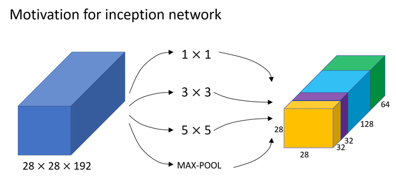

And the basic idea is that instead of you need to pick one of these filter sizes or pooling you want and commit to that, you can do them all and just concatenate all the outputs, and let the network learn whatever parameters it wants to use, whatever the combinations of these filter sizes it wants. Now it turns out that there is a problem with the inception layer as we've described it here, which is *computational cost*.

*The analysis of computational cost*:

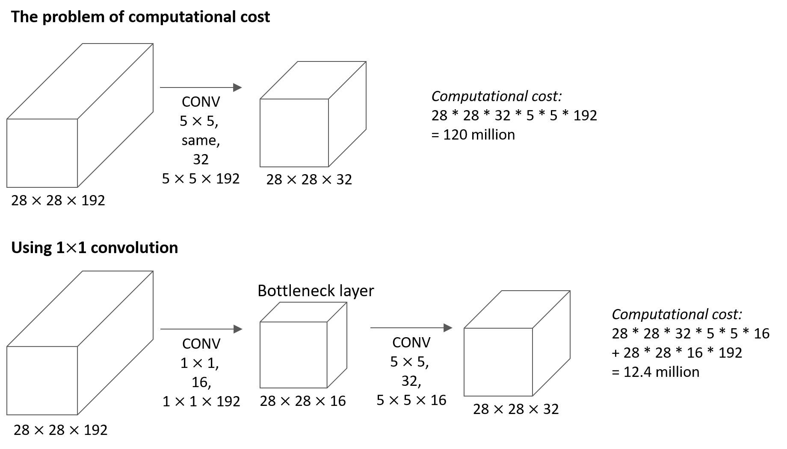

*Inception modules*:

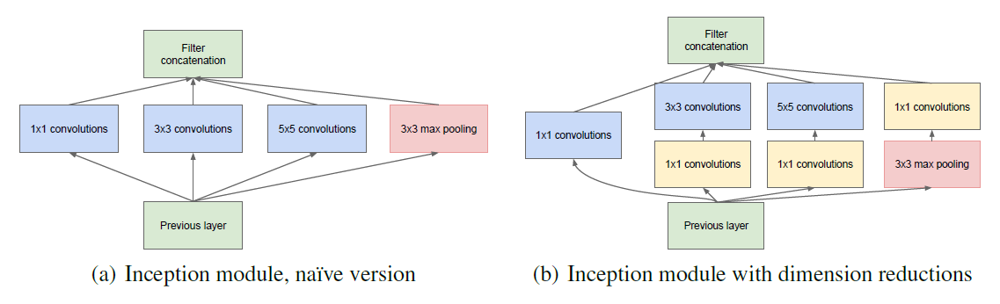

#### Inception Network

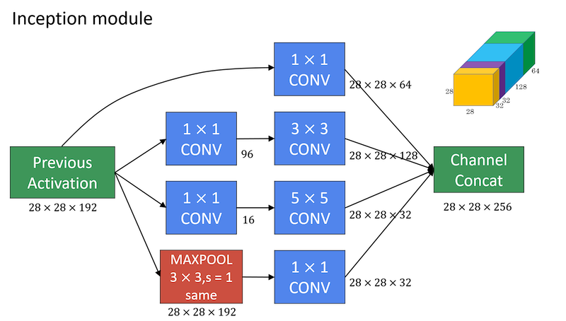

- In order to really concatenate all of these outputs at the end we are going to use the same type of padding for pooling.
- What the inception network does is more or less put a lot of these modules together.

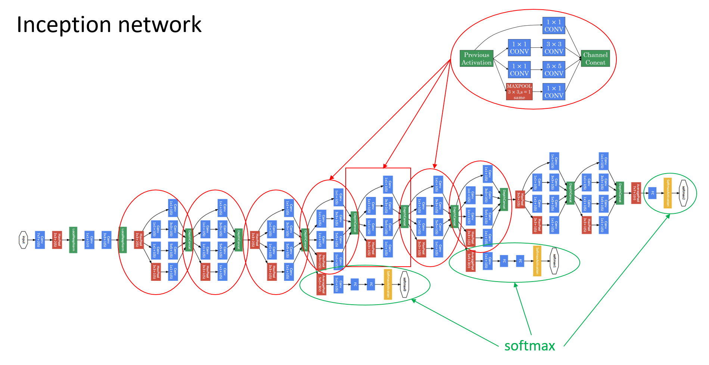

The last few layers of the network is a fully connected layer followed by a softmax layer to try to make a prediction. What these side branches do is it takes some hidden layer and it tries to use that to make a prediction. You should think of this as maybe just another detail of the inception that's worked. But what is does is it helps to ensure that the features computed even in the heading units, even at intermediate layers that they're not too bad for protecting the output cause of a image. And this appears to have a regularizing effect on the inception network and helps prevent this network from overfitting.

### Practical advices for using ConvNets

#### Using Open-Source Implementation

- Starting with open-source implementations is a better way, or certainly a faster way to get started on a new project.
- One of the advantages of doing so also is that sometimes these networks take a long time to train, and someone else might have used multiple GPUs and
a very large dataset to pretrain some of these networks. And that allows you to do transfer learning using these networks.

#### Transfering Learning

The computer vision research community has been pretty good at posting lots of data sets on the Internet so if you hear of things like ImageNet, or MS COCO, or PASCAL types of data sets, these are the names of different data sets that people have post online and a lot of computer researchers have trained their algorithms on.
- [ImageNet][imagenet]: ImageNet is an image database organized according to the WordNet hierarchy (currently only the nouns), in which each node of the hierarchy is depicted by hundreds and thousands of images.
- [Microsoft COCO][mscoco]: COCO is a common object in context. The dataset contains 91 objects types of 2.5 million labeled instances across 328,000 images.
- [PASCAL][pascal]: PASCAL-Context Dataset This dataset is a set of additional annotations for PASCAL VOC 2010. It goes beyond the original PASCAL semantic segmentation task by providing annotations for the whole scene. The statistics section has a full list of 400+ labels.

Sometimes these training takes several weeks and might take many GPUs and the fact that someone else has done this and gone through the painful high-performance search process, means that you can often download open source ways that took someone else many weeks or months to figure out and use that as a very good initialization for your own neural network.

- If you have a small dataset for your image classification problem, you can download some open source implementation of a neural network and download not just the code but also the weights. And then you get rid of the softmax layer and create your own softmax unit that outputs your classification labels.
- To do this, you just freeze the parameters which you don't want to train. A lot of popular learning frameworks support this mode of operation (i.e., set *trainable* parameter to 0).
- Those early frozen layers are some fixed function that doesn't change. So one trick that could speedup training is that we just pre-compute that layer's activations and save them to disk. The advantage of the save-to-disk or the pre-compute method is that you don't need to recompute those activations everytime you take an epoch or take a path through a training set.
- If you have a larger label dataset one thing you could do is then freeze fewer layers. If you have a lot of data, in the extreme case, you could just use the downloaded weights as initialization so they would replace random initialization.

#### Data Augmentation

Having more data will help all computer vision tasks. 

*Some common data augmentation in computer vision*:

- Mirroring
- Random cropping
- Rotation
- Shearing
- Local warping

*Color shifting*: Take different values of R, G and B and use them to *distort the color channels*. In practice, the values R, G and B are drawn from some probability distribution. This makes your learning algorithm more robust to changes in the colors of your images.

- One of the ways to implement color distortion uses an algorithm called PCA. The details of this are actually given in the AlexNet paper, and sometimes called PCA Color Augmentation.
  - If your image is mainly purple, if it mainly has red and blue tints, and very little green, then PCA Color Augmentation, will add and subtract a lot to red and blue, where it balance [inaudible] all the greens, so kind of keeps the overall color of the tint the same. 

*Implementation tips*:

A pretty common way of implementing data augmentation is to really have one thread, almost four threads, that is responsible for loading the data and implementing distortions, and then passing that to some other thread or some other process that then does the training.

- Often the data augmentation and training process can run in parallel.
- Similar to other parts of training a deep neural network, the data augmentation process also has a few hyperparameters, such as how much color shifting do you implement and what parameters you use for random cropping.

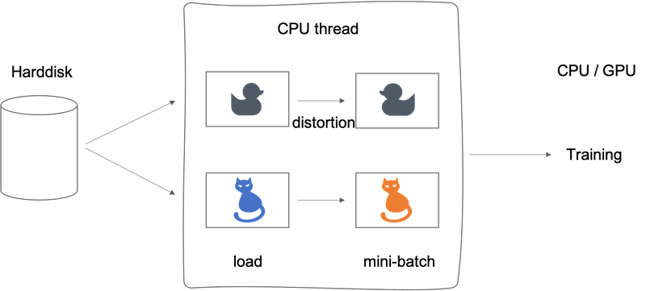

#### State of Computer Vision

- Image recognition: the problem of looking at a picture and telling you is this a cat or not.
- Object detection: look in the picture and actually you're putting the bounding boxes are telling you where in the picture the objects, such as the car as well. The cost of getting the bounding boxes is more expensive to label the objects.

*Data vs. hand-engineering*:

- Having a lot of data: simpler algorithms as well as less hand-engineering. So less needing to carefully design features for the problem, but instead you can have a giant neural network, even a simpler architecture.
- Don't have much data: more hand-engineering ("hacks")

*Two sources of knowledge*:

- Labeled data, (x,y)
- Hand-engineering: features / network architecture / other components

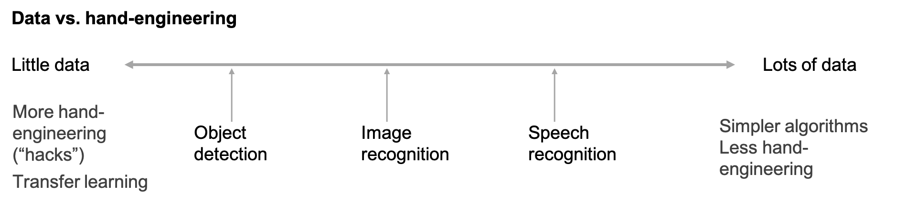

Even though data sets are getting bigger and bigger, often we just don't have as much data as we need. And this is why the computer vision historically and even today has relied more on hand-engineering. And this is also why that the field of computer vision has developed rather complex network architectures, is because in the absence of more data. The way to get good performance is to spend more time architecting, or fooling around with the network architecture.

- Hand-engineering is very difficult and skillful task that requires a lot of insight. Historically the field of the computer vision has used very small datasets and the computer vision literature has relied on a lot of hand-engineering.
- In the last few years the amount of data with the computer vision task has increased so dramatically that the amount of hand-engineering has a significant reduction.
- But there's still a lot of hand-engineering of network architectures and computer vision, which is why you see very complicated hyperparameters choices in computer vision.
- The algorithms of object detection become even more complex and has even more specialized components.
- One thing that helps a lot when you have little data is *transfer learning*.

**Tips for doing well on benchmarks/winning competitions**:

- (1) Ensembling
  - Train several networks independently and average their outputs (not weights).
  - That maybe gives you 1% or 2% better, which really helps win a competition.
  - To test on each image you might need to run an image through 3 to 15 different networks, so ensembling slows down your running time by a factor of 3 to 15.
  - So ensembling is one of those tips that people use doing well in benchmarks and for winning competitions.
  - Almost never use in production to serve actual customers.
  - One big problem: need to keep all these different networks around, which takes up a lot more computer memory.
- (2) Multi-crop at test time
  - Run classifier on multiple versions of test images and average results.
  - Used much more for doing well on benchmarks than in actual production systems.
  - Keep just one network around, which doesn't suck up as much memory, but it still slows down your run time quite a bit.

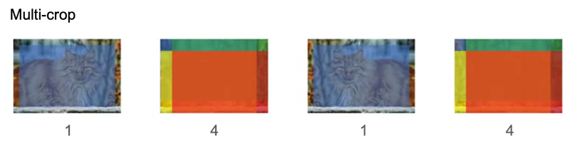

*Use open source code*:

- Use architectures of networks published in the literature
- Use open source implementations if possible
- Use pretrained models and fine-tune on your dataset

#### Tips for Keras

- Keras is a tool for rapid prototyping which allows you to quickly try out different model architectures. Only four steps to build a model using Keras:
  - *Create*: define your model architecture, using functions such as `Input()`, `ZeroPadding2D()`, `Conv2D()`, `BatchNormalization()`, `MaxPooling2D()`, ... These python objects would be used as functions. [Know more about "Objects as functions"][python-pandemonium].
  - *Compile*: `model.compile(optimizer = "...", loss = "...", metrics = ["accuracy"])`. Optimizers include 'adam', 'sgd' or others. The loss function can be 'binary_crossentropy' or 'categorical_crossentropy' or others. See [Keras API Doc](https://keras.io/api/).
  - *Fit/Train*: train the model by `model.fit(x = ..., y = ..., epochs = ..., batch_size = ...)`.
  - *Evaluate/Test*: test the model by `model.evaluate(x = ..., y = ...)`.
- Model visualization tools:
  - *Summarize model*: `model.summary()` prints the details of your layers in a table with the sizes of its inputs/outputs
  - *Visualize model*: `plot_model()` plots your graph in a nice layout.

For a full guidance read the newest tutorial on the Keras documentation: 
- [Introduction to Keras for Engineers](https://keras.io/getting_started/intro_to_keras_for_engineers/)
- [Introduction to Keras for Researchers](https://keras.io/getting_started/intro_to_keras_for_researchers/)

Implementations of VGG16, ResNet and Inception by Keras can be found in [Francois Chollet's GitHub repository](https://github.com/fchollet/deep-learning-models).
  
[d2l_ai_conv_1by1]: https://d2l.ai/chapter_convolutional-neural-networks/channels.html#times-1-convolutional-layer
[imagenet]: http://image-net.org/
[mscoco]: https://www.microsoft.com/en-us/research/publication/microsoft-coco-common-objects-in-context/
[pascal]: https://www.cs.stanford.edu/~roozbeh/pascal-context/
[python-pandemonium]: https://medium.com/python-pandemonium/function-as-objects-in-python-d5215e6d1b0d

## Week 3: Object detection

### Learning Objectives

- Describe the challenges of Object Localization, Object Detection and Landmark Finding
- Implement non-max suppression to increase accuracy
- Implement intersection over union
- Label a dataset for an object detection application
- Identify the components used for object detection (landmark, anchor, bounding box, grid, ...) and their purpose

### Detection algorithms

#### Object Localization


- The classification and the classification of localization problems usually have one object.
- In the detection problem there can be multiple objects.
- The ideas you learn about image classification will be useful for classification with localization, and the ideas you learn for localization will be useful for detection.

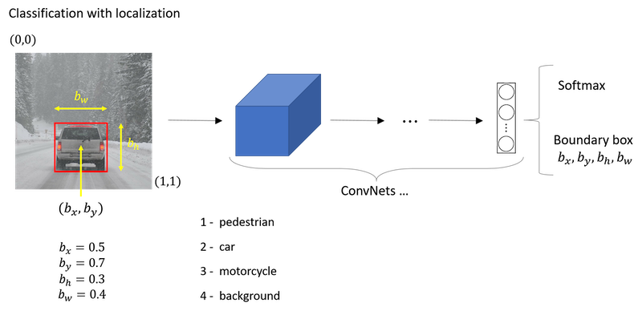

Giving the bounding box then you can use supervised learning to make your algorithm outputs not just a class label but also the four parameters to tell you where is the bounding box of the object you detected.

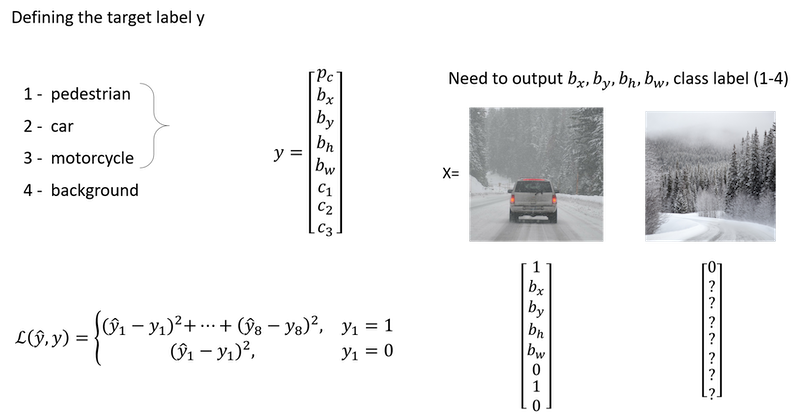

The squared error is used just to simplify the description here. In practice you could probably use a log like feature loss for the `c1, c2, c3` to the softmax output.

#### Landmark Detection

In more general cases, you can have a neural network just output x and y coordinates of important points in image, sometimes called landmarks.

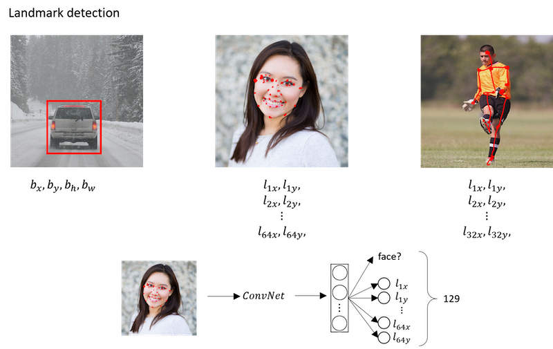

If you are interested in people pose detection, you could also define a few key positions like the midpoint of the chest, the left shoulder, left elbow, the wrist, and so on.

The identity of landmark one must be consistent across different images like maybe landmark one is always this corner of the eye, landmark two is always this corner of the eye, landmark three, landmark four, and so on.

#### Object Detection

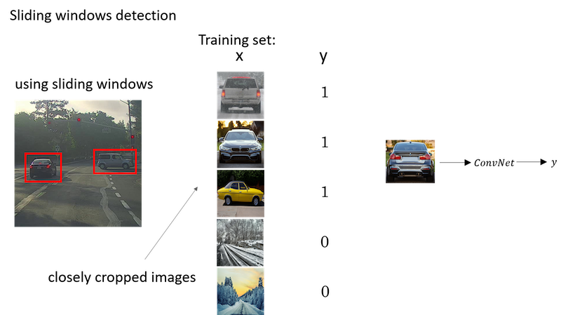

Disadvantage of sliding windows detection is computational cost. Unless you use a very fine granularity or a very small stride, you end up not able to localize the objects accurately within the image.

#### Convolutional Implementation of Sliding Windows

To build up towards the convolutional implementation of sliding windows let's first see how you can turn fully connected layers in neural network into convolutional layers.

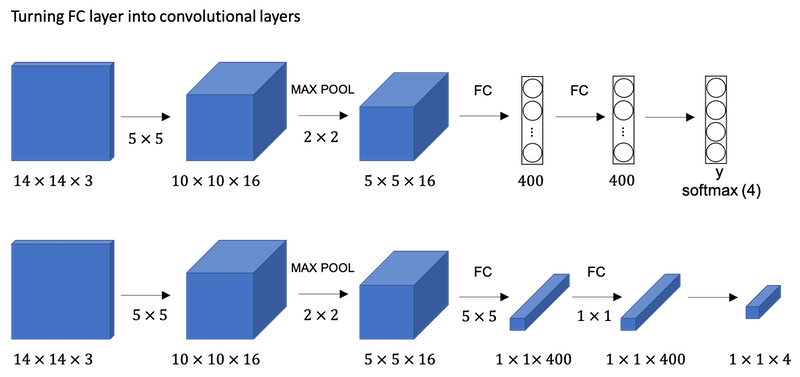

What the convolutional implementation of sliding windows does is it allows *four* processes in the convnet to share a lot of computation. Instead of doing it sequentially, with the convolutional implementation you can implement the entire image, all maybe 28 by 28 and convolutionally make all the predictions at the same time.

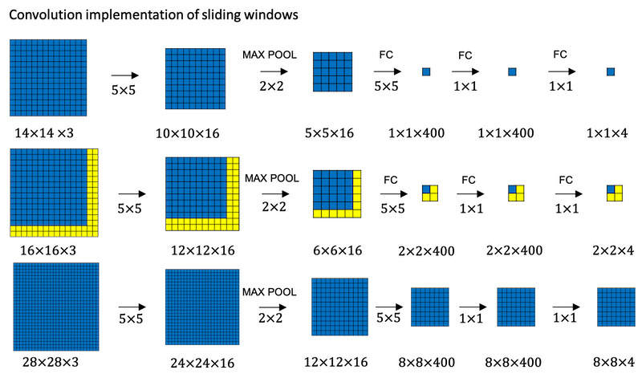

#### Bounding Box Predictions (YOLO)

The convolutional implementation of sliding windows is more computationally efficient, but it still has a problem of not quite outputting the most accurate bounding boxes. The perfect bounding box isn't even quite square, it's actually has a slightly wider rectangle or slightly horizontal aspect ratio.

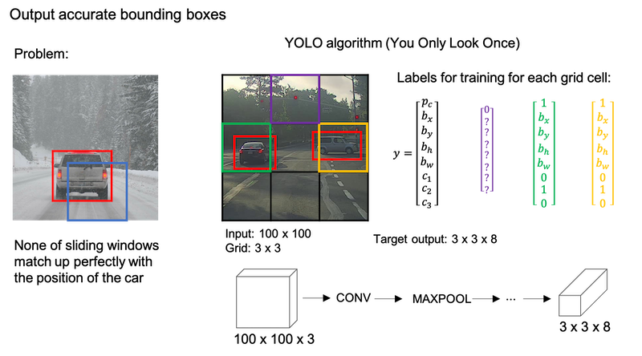

**YOLO algorithm**:

The basic idea is you're going to take the image classification and localization algorithm and apply that to each of the nine grid cells of the image. If the center/midpoint of an object falls into a grid cell, that grid cell is responsible for detecting that object.

The advantage of this algorithm is that the neural network outputs precise bounding boxes as follows.

- First, this allows in your network to output bounding boxes of any aspect ratio, as well as, output much more precise coordinates than are just dictated by the stride size of your sliding windows classifier.
- Second, this is a convolutional implementation and you're not implementing this algorithm nine times on the 3 by 3 grid or 361 times on 19 by 19 grid.

#### Intersection Over Union

`IoU` is a measure of the overlap between two bounding boxes. If we use `IoU` in the output assessment step, then the higher the `IoU` the more accurate the bounding box. However `IoU` is a nice tool for the YOLO algorithm to discard redundant bounding boxes.

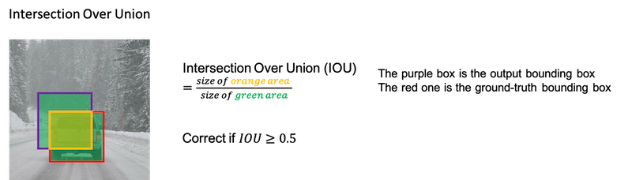

#### Non-max Suppression

One of the problems of Object Detection as you've learned about this so far, is that your algorithm may find multiple detections of the same objects. Rather than detecting an object just once, it might detect it multiple times. Non-max suppression is a way for you to make sure that your algorithm detects each object only once.

- It first takes the largest `Pc` with the probability of a detection.
- Then, the non-max suppression part is to get rid of any other ones with a high (defined by a threshold) `IoU` between the box chosen in the first step.

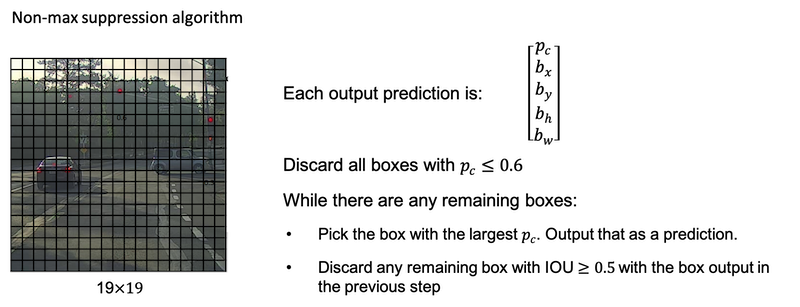

If you actually tried to detect three objects say pedestrians, cars, and motorcycles, then the output vector will have three additional components. And it turns out, the right thing to do is to independently carry out non-max suppression three times, one on each of the outputs classes.

#### Anchor Boxes

One of the problems with object detection as you have seen it so far is that each of the grid cells can detect only one object. What if a grid cell wants to detect multiple objects? This is what the idea of anchor boxes does.

*Anchor box algorithm*:

| previous box | with two anchor boxes |
| :---- | :---- |
| Each object in training image is assigned to grid cell that contains that object’s midpoint. | Each object in training image is assigned to grid cell that contains object’s midpoint and anchor box for the grid cell with highest `IoU`. |
| Output `y`: `3x3x8` | Output `y`: `3x3x16` or `3x3x2x8` |

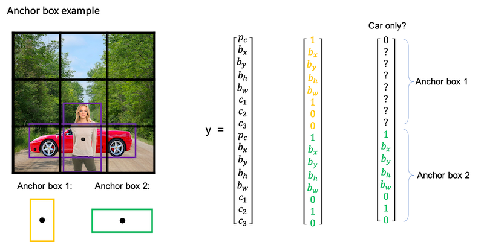

#### YOLO Algorithm

*YOLO algorithm steps*:

- If you're using two anchor boxes, then for each of the nine grid cells, you get two predicted bounding boxes.
- Next, you then get rid of the low probability predictions.
- And then finally if you have three classes you're trying to detect, you're trying to detect pedestrians, cars and motorcycles. What you do is, for each of the three classes, independently run non-max suppression for the objects that were predicted to come from that class.

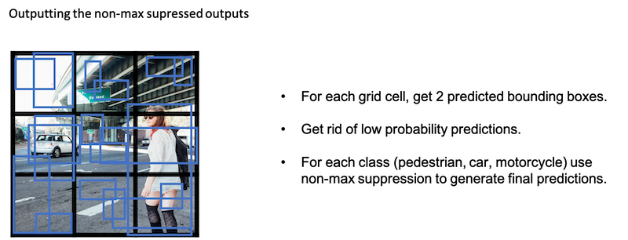

#### (Optional) Region Proposals

| algorithm | description |
| :----: | :---- |
| R-CNN | Propose regions. Classify proposed regions one at a time. Output label + bounding box. The way that they perform the region proposals is to run an algorithm called a segmentation algorithm. One downside of the R-CNN algorithm was that it is actually quite slow. |
| Fast R-CNN | Propose regions. Use convolution implementation of sliding windows to classify all the proposed regions. One of the problems of fast R-CNN algorithm is that the clustering step to propose the regions is still quite slow. |
| Faster R-CNN | Use convolutional network to propose regions. (Most implementations are usually still quit a bit slower than the YOLO algorithm.) |

## Week 4: Special applications: Face recognition & Neural style transfer

Discover how CNNs can be applied to multiple fields, including art generation and face recognition. Implement your own algorithm to generate art and recognize faces.

### Face Recognition

#### What is face recognition

- Verification
  - Input image, name/ID
  - Output whether the input image is that of the claimed person
- Recognition
  - Has a database of K persons
  - Get an input image
  - Output ID if the image is any of the K persons (or “not recognized”)

#### One Shot Learning

One-shot learning problem: to recognize a person given just one single image.

- So one approach is to input the image of the person, feed it too a ConvNet. And have it output a label, y, using a softmax unit with four outputs or maybe five outputs corresponding to each of these four persons or none of the above. However, this doesn't work well.
- Instead, to make this work, what you're going to do instead is learn a **similarity function** `d(img1,img2) = degree of difference between images`. So long as you can learn this function, which inputs a pair of images and tells you, basically, if they're the same person or different persons. Then if you have someone new join your team, you can add a fifth person to your database, and it just works fine.

#### Siamese network

A good way to implement a *similarity function* `d(img1, img2)` is to use a [Siamese network](https://www.paperswithcode.com/method/siamese-network).

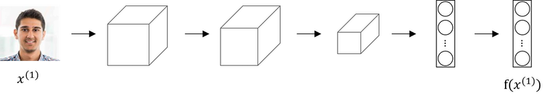

In a Siamese network, instead of making a classification by a softmax unit, we focus on the vector computed by a fully connected layer as an encoding of the input image `x1`.

*Goal of learning*:

- Parameters of NN define an encoding `𝑓(𝑥_𝑖)`
- Learn parameters so that: 
  - If `𝑥_𝑖,𝑥_𝑗` are the same person, `‖f(𝑥_𝑖)−f(𝑥_𝑗)‖^2` is small.
  - If `𝑥_𝑖,𝑥_𝑗` are different persons, `‖f(𝑥_𝑖)−f(𝑥_𝑗)‖^2` is large. 

#### Triplet Loss

One way to learn the parameters of the neural network so that it gives you a good encoding for your pictures of faces is to define an applied gradient descent on the triplet loss function.

In the terminology of the triplet loss, what you're going do is always look at one anchor image and then you want to distance between the anchor and the positive image, really a positive example, meaning as the same person to be similar. Whereas, you want the anchor when pairs are compared to the negative example for their distances to be much further apart. You'll always be looking at three images at a time:

- an anchor image (A)
- a positive image (P)
- a negative image (N)

As before we have `d(A,P)=‖f(A)−f(P)‖^2` and `d(A,N)=‖f(A)−f(N)‖^2`, the learning objective is to have `d(A,P) ≤ d(A,N)`. But if `f` always equals zero or `f` always outputs the same, i.e., the encoding for every image is identical, the objective is easily achieved, which is not what we want. So we need to add an `𝛼` to the left, a margin, which is a terminology you can see on support vector machines. 

*The learning objective*:

`d(A,P) + 𝛼 ≤ d(A,N)` or `d(A,P) - d(A,N) + 𝛼 ≤ 0`

*Loss function*:

```
Given 3 images A,P,N:
L(A,P,N) = max(d(A,P) - d(A,N) + 𝛼, 0)
J = sum(L(A[i],P[i],N[i]))
```

You do need a dataset where you have multiple pictures of the same person. If you had just one picture of each person, then you can't actually train this system.

- During training, if A,P,N are chosen randomly, `𝑑(𝐴,𝑃) + 𝛼 ≤ 𝑑(𝐴,𝑁)` is easily satisfied.
- Choose triplets that're "hard" to train on.

#### Face Verification and Binary Classification

The Triplet loss is a good way to learn the parameters of a ConvNet for face recognition. Face recognition can also be posed as a straight binary classification problem by taking a pair of neural networks to take a Siamese Network and having them both compute the embeddings, maybe 128 dimensional embeddings or even higher dimensional, and then having the embeddings be input to a logistic regression unit to make a prediction. The output will be one if both of them are the same person and zero if different.

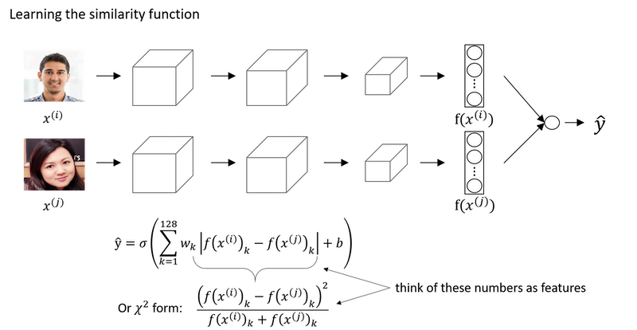

*Implementation tips*:

Instead of having to compute the encoding every single time you can pre-compute that, which can save a significant computation.

#### Summary of Face Recognition

*Key points to remember*:

- Face verification solves an easier 1:1 matching problem; face recognition addresses a harder 1:K matching problem. 
- The triplet loss is an effective loss function for training a neural network to learn an encoding of a face image.
- The same encoding can be used for verification and recognition. Measuring distances between two images' encodings allows you to determine whether they are pictures of the same person. 

*More references*:

- Florian Schroff, Dmitry Kalenichenko, James Philbin (2015). [FaceNet: A Unified Embedding for Face Recognition and Clustering](https://arxiv.org/pdf/1503.03832.pdf)
- Yaniv Taigman, Ming Yang, Marc'Aurelio Ranzato, Lior Wolf (2014). [DeepFace: Closing the gap to human-level performance in face verification](https://research.fb.com/wp-content/uploads/2016/11/deepface-closing-the-gap-to-human-level-performance-in-face-verification.pdf) 
- The pretrained model we use is inspired by Victor Sy Wang's implementation and was loaded using his code: https://github.com/iwantooxxoox/Keras-OpenFace.
- Our implementation also took a lot of inspiration from the official FaceNet github repository: https://github.com/davidsandberg/facenet 

### Neural Style Transfer

#### What is neural style transfer

Paper: [A Neural Algorithm of Artistic Style](https://arxiv.org/abs/1508.06576)

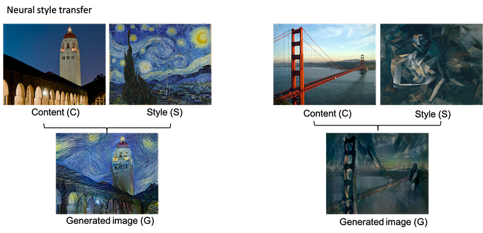

In order to implement Neural Style Transfer, you need to look at the features extracted by ConvNet at various layers, the shallow and the deeper layers of a ConvNet.

#### What are deep ConvNets learning

Paper: [Visualizing and Understanding Convolutional Networks](https://arxiv.org/abs/1311.2901)

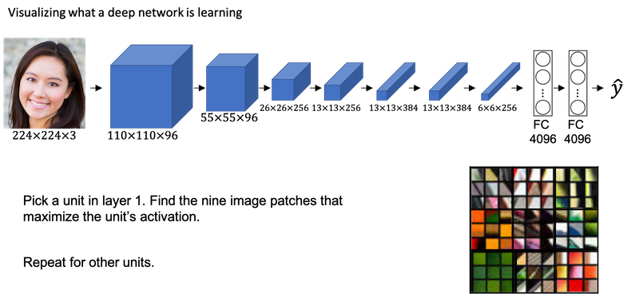

#### Cost Function

*Neural style transfer cost function*:

```
J(G) = alpha * J_content(C, G) + beta * J_style(S, G)
```

*Find the generated image G*:

1. Initiate G randomly, `G: 100 x 100 x 3`
2. Use gradient descent to minimize `J(G)`

#### Content Cost Function

- Say you use hidden layer 𝑙 to compute content cost. (Usually, choose some layer in the middle, neither too shallow nor too deep)
- Use pre-trained ConvNet. (E.g., VGG network)
- Let `𝑎[𝑙](𝐶)` and `𝑎[𝑙](𝐺)` be the activation of layer 𝑙 on the images   
- If `𝑎[𝑙](𝐶)` and `𝑎[𝑙](𝐺)` are similar, both images have similar content

```
J_content(C, G) = 1/2 * ‖𝑎[𝑙](𝐶)−𝑎[𝑙](𝐺)‖^2
```

#### Style Cost Function

Style is defined as correlation between activations across channels.

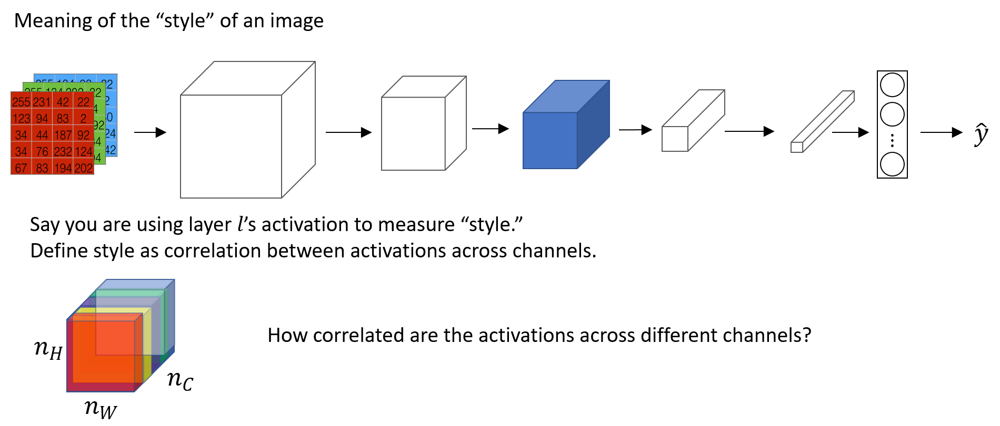


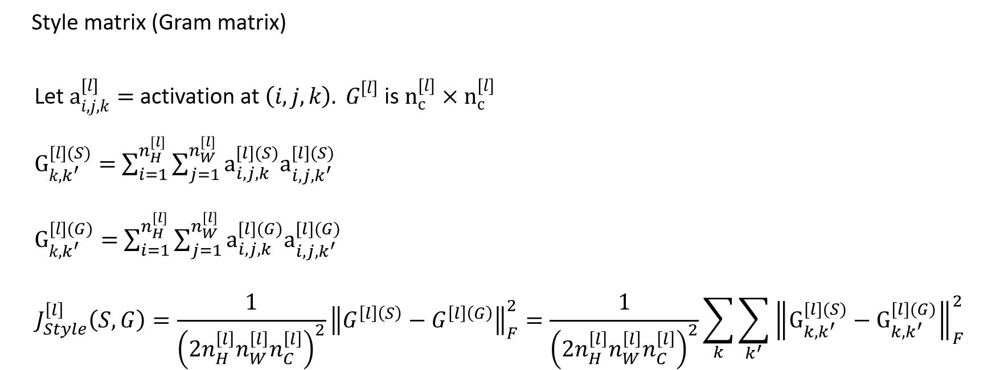

#### 1D and 3D Generalizations

ConvNets can apply not just to 2D images but also to 1D data as well as to 3D data.

For 1D data, like ECG signal (electrocardiogram), it's a time series showing the voltage at each instant time. Maybe we have a 14 dimensional input. With 1D data applications, we actually use a recurrent neural network.

```
14 x 1 * 5 x 1 --> 10 x 16 (16 filters)
```

For 3D data, we can think the data has some height, some width, and then also some depth. For example, we want to apply a ConvNet to detect features in a 3D CT scan, for simplifying purpose, we have 14 x 14 x 14 input here. 

```
14 x 14 x 14 x 1 * 5 x 5 x 5 x 1 --> 10 x 10 x 10 x 16 (16 filters)
```

Other 3D data can be movie data where the different slices could be different slices in time through a movie. We could use ConvNets to detect motion or people taking actions in movies.

---
Notes by Aaron © 2020
