# Course 5: Sequence Models

- [Course 5: Sequence Models](#course-5-sequence-models)
  - [Week 1: Recurrent Neural Networks](#week-1-recurrent-neural-networks)
    - [Recurrent Neural Networks](#recurrent-neural-networks)
      - [Why sequence models](#why-sequence-models)
      - [Notation](#notation)
      - [Recurrent Neural Network Model](#recurrent-neural-network-model)
      - [Backpropagation through time](#backpropagation-through-time)
      - [Different types of RNNs](#different-types-of-rnns)
      - [Language model and sequence generation](#language-model-and-sequence-generation)
      - [Sampling novel sequences](#sampling-novel-sequences)
      - [Vanishing gradients with RNNs](#vanishing-gradients-with-rnns)
      - [Gated Recurrent Unit (GRU)](#gated-recurrent-unit-gru)
      - [Long Short Term Memory (LSTM)](#long-short-term-memory-lstm)
      - [Bidirectional RNN](#bidirectional-rnn)
      - [Deep RNNs](#deep-rnns)
  - [Week 2: Natural Language Processing & Word Embeddings](#week-2-natural-language-processing--word-embeddings)
    - [Introduction to Word Embeddings](#introduction-to-word-embeddings)
      - [Word Representation](#word-representation)
      - [Using word embeddings](#using-word-embeddings)
      - [Properties of word embeddings](#properties-of-word-embeddings)
      - [Embedding matrix](#embedding-matrix)
    - [Learning Word Embeddings: Word2vec & GloVe](#learning-word-embeddings-word2vec--glove)
      - [Learning word embeddings](#learning-word-embeddings)
      - [Word2Vec](#word2vec)
      - [Negative Sampling](#negative-sampling)
      - [GloVe word vectors](#glove-word-vectors)
    - [Applications using Word Embeddings](#applications-using-word-embeddings)
      - [Sentiment Classification](#sentiment-classification)
      - [Debiasing word embeddings](#debiasing-word-embeddings)
  - [Week 3: Sequence models & Attention mechanism](#week-3-sequence-models--attention-mechanism)
    - [Various sequence to sequence architectures](#various-sequence-to-sequence-architectures)
      - [Basic Models](#basic-models)
      - [Picking the most likely sentence](#picking-the-most-likely-sentence)
      - [Beam Search](#beam-search)
      - [Refinements to Beam Search](#refinements-to-beam-search)
      - [Error analysis in beam search](#error-analysis-in-beam-search)
      - [Bleu Score (optional)](#bleu-score-optional)
      - [Attention Model Intuition](#attention-model-intuition)
      - [Attention Model](#attention-model)
    - [Speech recognition - Audio data](#speech-recognition---audio-data)
      - [Speech recognition](#speech-recognition)
      - [Trigger Word Detection](#trigger-word-detection)

## Week 1: Recurrent Neural Networks

>Learn about recurrent neural networks. This type of model has been proven to perform extremely well on temporal data. It has several variants including LSTMs, GRUs and Bidirectional RNNs, which you are going to learn about in this section.

### Recurrent Neural Networks

#### Why sequence models

Examples of sequence data:

- Speech recognition
- Music generation
- Sentiment classification
- DNA sequence analysis
- Machine translation
- Video activity recognition
- Named entity recognition

#### Notation

For a motivation, in the problem of Named Entity Recognition (NER), we have the following notation:

- `x` is the input sentence, such as: `Harry Potter and Hermione Granger invented a new spell.`
- `y` is the output, in this case: `1 1 0 1 1 0 0 0 0`.
- x<sup>\<t></sup> denote the word in the index `t` and y<sup>\<t></sup> is the correspondent output.
- In the *i*-th input example, x<sup>(i)\<t></sup> is *t*-th word and T<sup>x(i)</sup> is the length of the *i*-th example.
- T<sub>y</sub> is the length of the output. In NER, we have T<sub>x</sub> = T<sub>y</sub>.

Words representation introduced in this video is the One-Hot representation.

- First, you have a dictionary which words appear in a certain order.
- Second, for a particular word, we create a new vector with `1` in position of the word in the dictionary and `0` everywhere else.

For a word not in your vocabulary, we need create a new token or a new fake word called unknown word denoted by `<UNK>`.

#### Recurrent Neural Network Model

If we build a neural network to learn the mapping from x to y using the one-hot representation for each word as input, it might not work well. There are two main problems:

- Inputs and outputs can be different lengths in different examples. not every example has the same input length T<sub>x</sub> or the same output length T<sub>y</sub>. Even with a maximum length, zero-padding every input up to the maximum length doesn't seem like a good representation.
- For a naive neural network architecture, it doesn't share features learned across different positions of texts.

*Recurrent Neural Networks*:

- A recurrent neural network does not have either of these disadvantages.
- At each time step, the recurrent neural network that passes on as activation to the next time step for it to use. 
- The recurrent neural network scans through the data from left to right. The parameters it uses for each time step are shared.
- One limitation of unidirectional neural network architecture is that the prediction at a certain time uses inputs or uses information from the inputs earlier in the sequence but not information later in the sequence.
  - `He said, "Teddy Roosevelt was a great president."`
  - `He said, "Teddy bears are on sale!"`
  - You can't tell the difference if you look only at the first three words.


Instead of carrying around two parameter matrices W<sub>aa</sub> and W<sub>ax</sub>, we can simplifying the notation by compressing them into just one parameter matrix W<sub>a</sub>.

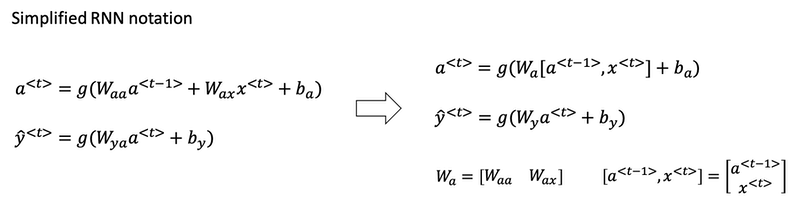

#### Backpropagation through time

In the backpropagation procedure the most significant messaage or the most significant recursive calculation is which goes from right to left, that is, backpropagation through time.

#### Different types of RNNs

There are different types of RNN:

- One to One
- One to Many
- Many to One
- Many to Many

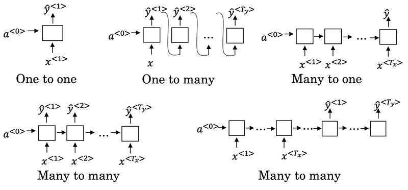

See more details about RNN by [Karpathy](http://karpathy.github.io/2015/05/21/rnn-effectiveness/).

#### Language model and sequence generation

So what a language model does is to tell you what is the probability of a particular sentence.

For example, we have two sentences from speech recognition application:

| sentence | probability |
| :---- | :---- |
| The apple and pair salad. | 𝑃(The apple and pair salad)=3.2x10<sup>-13</sup> |
| The apple and pear salad. | 𝑃(The apple and pear salad)=5.7x10<sup>-10</sup> |

For language model it will be useful to represent a sentence as output `y` rather than inputs `x`. So what the language model does is to estimate the probability of a particular sequence of words `𝑃(y<1>, y<2>, ..., y<T_y>)`.

*How to build a language model*?

`Cats average 15 hours of sleep a day <EOS>` Totally 9 words in this sentence.

- The first thing you would do is to tokenize this sentence.
- Map each of these words to one-hot vectors or indices in vocabulary.
  - Maybe need to add extra token for end of sentence as `<EOS>` or unknown words as `<UNK>`.
  - Omit the period. if you want to treat the period or other punctuation as explicit token, then you can add the period to you vocabulary as well.
- Set the inputs x<sup>\<t></sup> = y<sup>\<t-1></sup>.
- What `a1` does is it will make a softmax prediction to try to figure out what is the probability of the first words y<sup><1></sup>. That is what is the probability of any word in the dictionary. Such as, what's the chance that the first word is *Aaron*?
- Until the end, it will predict the chance of `<EOS>`.
- Define the cost function. The overall loss is just the sum over all time steps of the loss associated with the individual predictions.

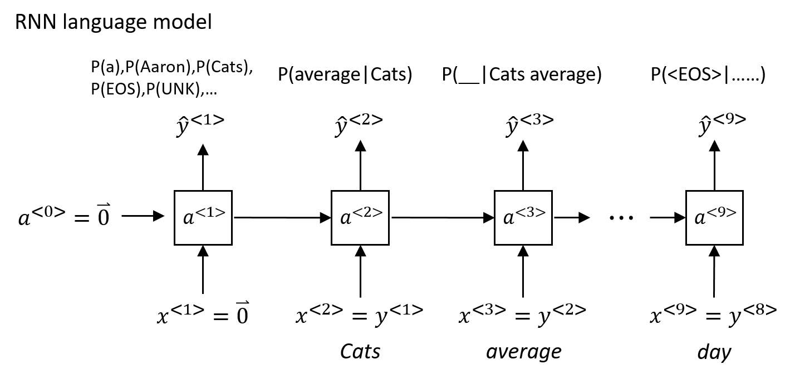

If you train this RNN on a large training set, we can do:

- Given an initial set of words, use the model to predict the chance of the next word.
- Given a new sentence `y<1>,y<2>,y<3>`, use it to figure out the chance of this sentence: `p(y<1>,y<2>,y<3>) = p(y<1>) * p(y<2>|y<1>) * p(y<3>|y<1>,y<2>)`

#### Sampling novel sequences

After you train a sequence model, one way you can informally get a sense of what is learned is to have it sample novel sequences.

*How to generate a randomly chosen sentence from your RNN language model*:

- In the first time step, sample what is the first word you want your model to generate: randomly sample according to the softmax distribution.
  - What the softmax distribution gives you is it tells the chance of the first word is 'a', the chance of the first word is 'Aaron', the chance of the first word is 'Zulu', or the chance of the first word refers to `<UNK>` or `<EOS>`. All these probabilities can form a vector.
  - Take the vector and use `np.random.choice` to sample according to distribution defined by this vector probabilities. That lets you sample the first word.
- In the second time step, remember in the last section, y<sup><1></sup> is expected as input. Here take y&#770;<sup><1></sup> you just sampled and pass it as input to the second step. Then use `np.random.choice` to sample y&#770;<sup><2></sup>. Repeat this process until you generate an `<EOS>` token.
- If you want to make sure that your algorithm never generate `<UNK>`, just reject any sample that come out as `<UNK>` and keep resampling from vocabulary until you get a word that's not `<UNK>`.

*Character level language model*:

If you build a character level language model rather than a word level language model, then your sequence y1, y2, y3, would be the individual characters in your training data, rather than the individual words in your training data. Using a character level language model has some pros and cons. As computers gets faster there are more and more applications where people are, at least in some special cases, starting to look at more character level models.

- Advantages:
  - You don't have to worry about `<UNK>`.
- Disadvantages:
  - The main disadvantage of the character level language model is that you end up with much longer sequences.
  - And so character language models are not as good as word level language models at capturing long range dependencies between how the the earlier parts of the sentence also affect the later part of the sentence.
  - More computationally expensive to train.

#### Vanishing gradients with RNNs

- One of the problems with a basic RNN algorithm is that it runs into vanishing gradient problems.
- Language can have very long-term dependencies, for example:
  - The **cat**, which already ate a bunch of food that was delicious ..., **was** full.
  - The **cats**, which already ate a bunch of food that was delicious, and apples, and pears, ..., **were** full.
- The basic RNN we've seen so far is not very good at capturing very long-term dependencies. It's difficult for the output to be strongly influenced by an input that was very early in the sequence.
- When doing backprop, the gradients should not just decrease exponentially, they may also increase exponentially with the number of layers going through.
- Exploding gradients are easier to spot because the parameters just blow up and you might often see NaNs, or not a numbers, meaning results of a numerical overflow in your neural network computation.
  - One solution to that is apply *gradient clipping*: it is bigger than some threshold, re-scale some of your gradient vector so that is not too big.
- Vanishing gradients is much harder to solve and it will be the subject of GRU or LSTM.

#### Gated Recurrent Unit (GRU)

Gate Recurrent Unit is one of the ideas that has enabled RNN to become much better at capturing very long range dependencies and has made RNN much more effective.

A visualization of the RNN unit of the hidden layer of the RNN in terms of a picture:

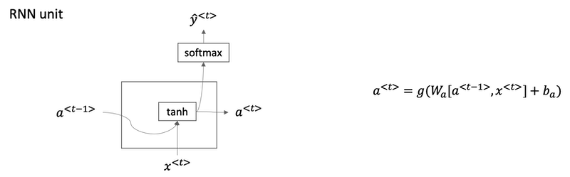

- The GRU unit is going to have a new variable called `c`, which stands for memory cell.
- c&#771;<sup>\<t></sup> is a candidate for replacing c<sup>\<t></sup>.
- For intuition, think of Γ<sub>u</sub> as being either zero or one most of the time. In practice gamma won't be exactly zero or one.
- Because Γ<sub>u</sub> can be so close to zero, can be 0.000001 or even smaller than that, it doesn't suffer from much of a vanishing gradient problem
- Because when Γ<sub>u</sub> is so close to zero this becomes essentially c<sup>\<t></sup> = c<sup>\<t-1></sup> and the value of c<t> is maintained pretty much exactly even across many many time-steps. So this can help significantly with the vanishing gradient problem and therefore allow a neural network to go on even very long range dependencies.
- In the full version of GRU, there is another gate Γ<sub>r</sub>. You can think of `r` as standing for relevance. So this gate Γ<sub>r</sub> tells you how relevant is c<sup>\<t-1></sup> to computing the next candidate for c<sup>\<t></sup>.

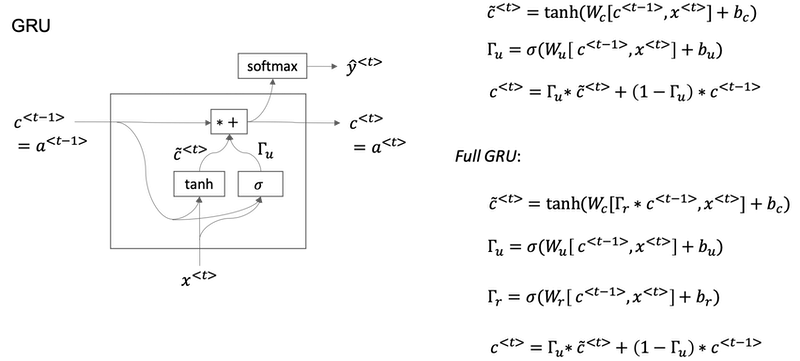

*Implementation tips*:

- The asterisks are actually element-wise multiplication.
- If you have 100 dimensional or hidden activation value, then c<sup>\<t></sup>, c&#771;<sup>\<t></sup>, Γ<sub>u</sub> would be the same dimension.
  - If Γ<sub>u</sub> is 100 dimensional vector, then it is really a 100 dimensional vector of bits, the value is mostly zero and one.
  - That tells you of this 100 dimensional memory cell which are the bits you want to update. What these element-wise multiplications do is it just element-wise tells the GRU unit which bits to update at every time-step. So you can choose to keep some bits constant while updating other bits.
  - In practice gamma won't be exactly zero or one.

#### Long Short Term Memory (LSTM)

Fancy explanation: [Understanding LSTM Network](http://colah.github.io/posts/2015-08-Understanding-LSTMs/)

- For the LSTM we will no longer have the case that a<sup>\<t></sup> is equal to c<sup>\<t></sup>.
- And we're not using relevance gate Γ<sub>r</sub>. Instead, LSTM has update, forget and output gates, Γ<sub>u</sub>, Γ<sub>f</sub> and Γ<sub>o</sub> respectively.

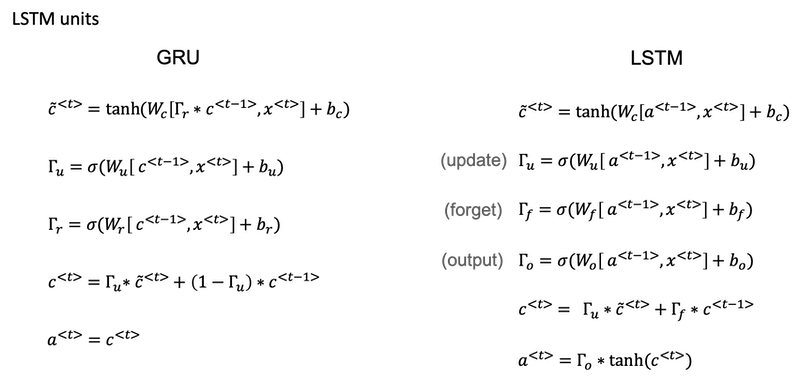

One cool thing about this you'll notice is that this red line at the top that shows how, so long as you set the forget and the update gate appropriately, it is relatively easy for the LSTM to have some value c<sup>\<0></sup> and have that be passed all the way to the right to have your, maybe, c<sup>\<3></sup> equals c<sup>\<0></sup>. And this is why the LSTM, as well as the GRU, is very good at memorizing certain values even for a long time, for certain real values stored in the memory cell even for many, many timesteps.


*One common variation of LSTM*:

- Peephole connection: instead of just having the gate values be dependent only on a<sup>\<t-1></sup>, x<sup>\<t></sup>, sometimes, people also sneak in there the values c<sup>\<t-1></sup> as well.

*GRU vs. LSTM*:

- The advantage of the GRU is that it's a simpler model and so it is actually easier to build a much bigger network, it only has two gates,
so computationally, it runs a bit faster. So, it scales the building somewhat bigger models.
- The LSTM is more powerful and more effective since it has three gates instead of two. If you want to pick one to use, LSTM has been the historically more proven choice. Most people today will still use the LSTM as the default first thing to try.

**Implementation tips**:

- *forget gate Γ<sub>f</sub>*
  * The forget gate Γ<sub>f</sub><sup>\<t></sup> has the same dimensions as the previous cell state c<sup>\<t-1></sup>.
  * This means that the two can be multiplied together, element-wise.
  * Multiplying the tensors Γ<sub>f</sub><sup>\<t></sup> is like applying a mask over the previous cell state.
  * If a single value in Γ<sub>f</sub><sup>\<t></sup> is 0 or close to 0, then the product is close to 0.
    * This keeps the information stored in the corresponding unit in c<sup>\<t-1></sup> from being remembered for the next time step.
  * Similarly, if one value is close to 1, the product is close to the original value in the previous cell state.
    * The LSTM will keep the information from the corresponding unit of c<sup>\<t-1></sup>, to be used in the next time step.

- *candidate value c&#771;<sup>\<t></sup>*
  * The candidate value is a tensor containing information from the current time step that **may** be stored in the current cell state c<sup>\<t></sup>.
  * Which parts of the candidate value get passed on depends on the update gate.
  * The candidate value is a tensor containing values that range from -1 to 1. (tanh function)
  * The tilde "~" is used to differentiate the candidate c&#771;<sup>\<t></sup> from the cell state c<sup>\<t></sup>.

- *update gate Γ<sub>u</sub>*
  * The update gate decides what parts of a "candidate" tensor c&#771;<sup>\<t></sup> are passed onto the cell state c<sup>\<t></sup>.
  * The update gate is a tensor containing values between 0 and 1.
    * When a unit in the update gate is close to 1, it allows the value of the candidate c&#771;<sup>\<t></sup> to be passed onto the hidden state c<sup>\<t></sup>.
    * When a unit in the update gate is close to 0, it prevents the corresponding value in the candidate from being passed onto the hidden state.

- *cell state c<sup>\<t></sup>*
  * The cell state is the "memory" that gets passed onto future time steps.
  * The new cell state c<sup>\<t></sup> is a combination of the previous cell state and the candidate value.

- *output gate Γ<sub>o</sub>*
  * The output gate decides what gets sent as the prediction (output) of the time step.
  * The output gate is like the other gates. It contains values that range from 0 to 1.

- *hidden state a<sup>\<t></sup>*
  * The hidden state gets passed to the LSTM cell's next time step.
  * It is used to determine the three gates (Γ<sub>f</sub>, Γ<sub>u</sub>, Γ<sub>o</sub>) of the next time step.
  * The hidden state is also used for the prediction y<sup>\<t></sup>.

#### Bidirectional RNN

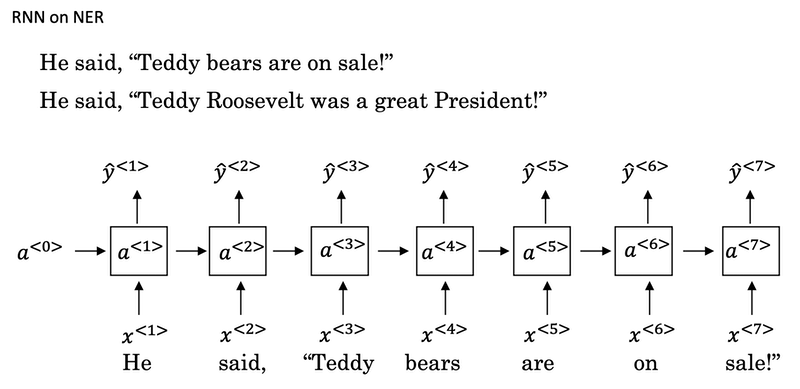

- Bidirectional RNN lets you at a point in time to take information from both earlier and later in the sequence.
- This network defines a Acyclic graph
- The forward prop has part of the computation going from left to right and part of computation going from right to left in this diagram.
- So information from x<sup>\<1></sup>, x<sup>\<2></sup>, x<sup>\<3></sup> are all taken into account with information from x<sup>\<4></sup> can flow through a backward four to a backward three to Y three. So this allows the prediction at time three to take as input both information from the past, as well as information from the present which goes into both the forward and the backward things at this step, as well as information from the future.
- Blocks can be not just the standard RNN block but they can also be GRU blocks or LSTM blocks. In fact, BRNN with LSTM units is commonly used in NLP problems.

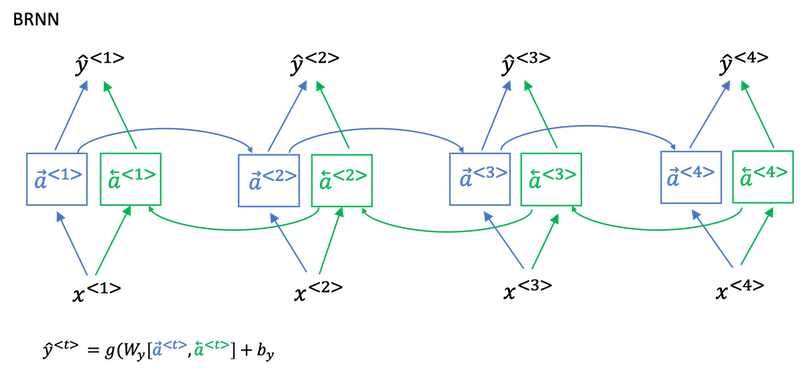

*Disadvantage*:

The disadvantage of the bidirectional RNN is that you do need the entire sequence of data before you can make predictions anywhere. So, for example, if you're building a speech recognition system, then the BRNN will let you take into account the entire speech utterance but if you use this straightforward implementation, you need to wait for the person to stop talking to get the entire utterance before you can actually process it and make a speech recognition prediction. For a real type speech recognition applications, they're somewhat more complex modules as well rather than just using the standard bidirectional RNN as you've seen here.

#### Deep RNNs

- For learning very complex functions sometimes is useful to stack multiple layers of RNNs together to build even deeper versions of these models.
- The blocks don't just have to be standard RNN, the simple RNN model. They can also be GRU blocks LSTM blocks.
- And you can also build deep versions of the bidirectional RNN.

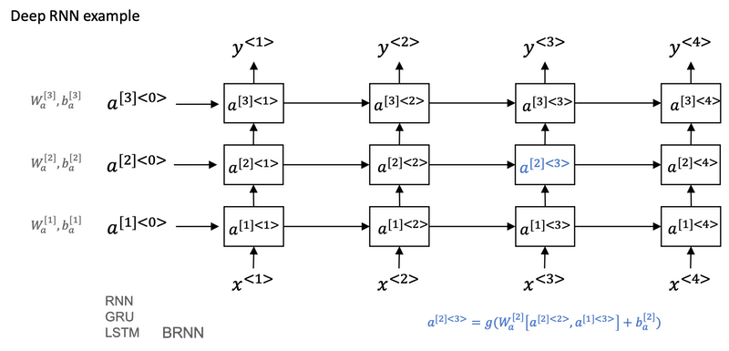

## Week 2: Natural Language Processing & Word Embeddings

>Natural language processing with deep learning is an important combination. Using word vector representations and embedding layers you can train recurrent neural networks with outstanding performances in a wide variety of industries. Examples of applications are sentiment analysis, named entity recognition and machine translation.

### Introduction to Word Embeddings

#### Word Representation

- One of the weaknesses of one-hot representation is that it treats each word as a thing unto itself, and it doesn't allow an algorithm to easily generalize across words.
  - Because the any product between any two different one-hot vector is zero.
  - It doesn't know that somehow apple and orange are much more similar than king and orange or queen and orange.
- Instead we can learn a featurized representation.
  - But by a lot of the features of apple and orange are actually the same, or take on very similar values. And so, this increases the odds of the learning algorithm that has figured out that orange juice is a thing, to also quickly figure out that apple juice is a thing.
  - The features we'll end up learning, won't have a easy to interpret interpretation like that component one is gender, component two is royal, component three is age and so on. What they're representing will be a bit harder to figure out.
  - But nonetheless, the featurized representations we will learn, will allow an algorithm to quickly figure out that apple and orange are more similar than say, king and orange or queen and orange.

  | features\words | Man (5391) | Woman (9853) | King (4914) | Queen (7157) | Apple (456) | Orange (6257) |
  | :------: | :--------: | :----------: | :---------: | :----------: | :---------: | :-----------: |
  | Gender | -1 | 1 | -0.95 | 0.97 | 0.00 | 0.01 |
  | Royal | 0.01 | 0.02 | 0.93 | 0.95 | -0.01 | 0.00 |
  | Age (adult?) | 0.03 | 0.02 | 0.7 | 0.69 | 0.03 | -0.02 |
  | Food | 0.09 | 0.01 | 0.02 | 0.01 | 0.95 | 0.97 |
  | Size | ... | ... | ... | ... | ... | ... |
  | ... | ... | ... | ... | ... | ... | ... |

- One common algorithm for visualizing word representation is the [t-SNE][t-SNE] algorithm due to [Laurens van der Maaten](https://lvdmaaten.github.io/tsne/) and Geoff Hinton.

[t-SNE]: http://www.cs.toronto.edu/~hinton/absps/tsne.pdf

#### Using word embeddings

- Learn word embeddings from large text corpus. (1-100B words) (Or download pre-trained embedding online.)  
- Transfer embedding to new task with smaller training set. (say, 100k words)
- Optional: Continue to finetune the word embeddings with new data.
  - In practice, you would do this only if this task 2 has a pretty big data set.
  - If your label data set for step 2 is quite small, then usually, I would not bother to continue to fine tune the word embeddings.

Word embeddings tend to make the biggest difference when the task you're trying to carry out has a relatively smaller training set.

- Useful for NLP standard tasks.
  - Named entity recognition
  - Text summarization
  - Co-reference
  - Parsing
- Less useful for:
  - Language modeling
  - Machine translation

*Word embedding vs. face recognition encoding*:

- The words encoding and embedding mean fairly similar things. In the face recognition literature, people also use the term encoding to refer to the vectors, `f(x(i))` and `f(x(j))`. Refer to [Course 4](../C4-Convolutional-Neural-Networks/readme.md#face-verification-and-binary-classification).
- For face recognition, you wanted to train a neural network that can take any face picture as input, even a picture you've never seen before, and have a neural network compute an encoding for that new picture.
- What we'll do for learning word embeddings is that we'll have a fixed vocabulary of, say, 10,000 words. We'll learn a fixed encoding or learn a fixed embedding for each of the words in our vocabulary.
- The terms encoding and embedding are used somewhat interchangeably. So the difference is not represented by the difference in terminologies. It's just a difference in how we need to use these algorithms in face recognition with unlimited pictures and natural language processing with a fixed vocabulary.

#### Properties of word embeddings

- Word embeddings can be used for analogy reasoning, which can help convey a sense of what word embeddings are doing even though analogy reasoning is not by itself the most important NLP application.
- `man --> woman` vs. `king --> queen`: 
e<sub>man</sub> - e<sub>woman</sub> ≈ e<sub>king</sub> - e<sub>queen</sub>
- To carry out an analogy reasoning, man is to woman as king is to what?
  - To find a word so that e<sub>man</sub> - e<sub>woman</sub> ≈ e<sub>king</sub> - e<sub>?</sub>.
  - Find word `w`: argmax<sub>w</sub> *sim*(e<sub>w</sub>, e<sub>king</sub>-e<sub>man</sub>+e<sub>woman</sub>)
  - We can use cosine similarity to calculate this similarity.
  - Refer to work paper by [Tomas Mikolov, Wen-tau Yih, and Geoffrey Zweig](https://www.microsoft.com/en-us/research/wp-content/uploads/2016/02/rvecs.pdf).
- What t-SNE does is, it takes 300-D data, and it maps it in a very non-linear way to a 2D space. And so the mapping that t-SNE learns, this is a very complicated and very non-linear mapping. So after the t-SNE mapping, you should not expect these types of parallelogram relationships, like the one we saw on the left, to hold true. And many of the parallelogram analogy relationships will be broken by t-SNE.

  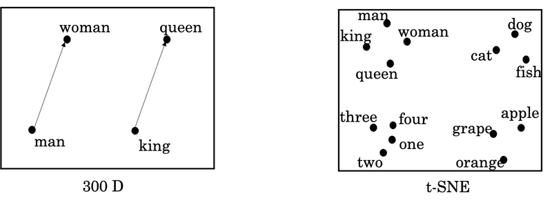

#### Embedding matrix

- When you implement an algorithm to learn a word embedding, what you end up learning is an embedding matrix.
  - E: embedding matrix (300, 10000)
  - O<sub>6257</sub> = [0,......0,1,0,...,0], (10000, 1)
  - E·O<sub>6257</sub> = e<sub>6257</sub>, (300, 1)

    | a | aaron | ... | orange (6257) | ... | zulu | `<UNK>` |
    | :---: | :---: | :---: | :---: | :---: | :---: | :---: |
    | ... | ... | ... | ... | ... | ... | ... |
    | ... | ... | ... | ... | ... | ... | ... |
    | ... | ... | ... | ... | ... | ... | ... |

- Our goal will be to learn an embedding matrix E by initializing E randomly and then learning all the parameters of this (300, 10000) dimensional matrix.
- E times the one-hot vector gives you the embedding vector.
- In practice, use specialized function to look up an embedding.

### Learning Word Embeddings: Word2vec & GloVe

#### Learning word embeddings

- In the history of deep learning as applied to learning word embeddings, people actually started off with relatively complex algorithms. And then over time, researchers discovered they can use simpler and simpler and simpler algorithms and still get very good results especially for a large dataset.
- A more complex algorithm: a neural language model, by Yoshua Bengio, Rejean Ducharme, Pascals Vincent, and Christian Jauvin: [A Neural Probabilistic Language Model][neural-lm].
  - Let's start to build a neural network to predict the next word in the sequence below.

    ```
     I     want   a   glass   of    orange    ______.
    4343   9665   1   3852   6163    6257 
    ```

      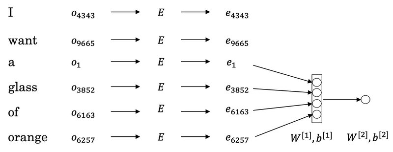

  - If we have a fixed historical window of 4 words (4 is a hyperparameter), then we take the four embedding vectors and stack them together, and feed them into a neural network, and then feed this neural network output to a softmax, and the softmax classifies among the 10,000 possible outputs in the vocab for the final word we're trying to predict. These two layers have their own parameters W1,b1 and W2, b2.
  - This is one of the earlier and pretty successful algorithms for learning word embeddings.

- A more generalized algorithm.
  - We have a longer sentence: `I want a glass of orange juice to go along with my cereal`. The task is to predict the word `juice` in the middle.
  - If it goes to build a language model then is natural for the context to be a few words right before the target word. But if your goal isn't to learn the language model per se, then you can choose other contexts.
  - Contexts:
    - Last 4 words: descibed previously.
    - 4 words on left & right: `a glass of orange ___ to go along with`
    - Last 1 word: `orange`, much more simpler context.
    - Nearby 1 word: `glass`. This is the idea of a **Skip-Gram** model, which works surprisingly well.
  - If your main goal is really to learn a word embedding, then you can use all of these other contexts and they will result in very meaningful work embeddings as well.

[neural-lm]: http://www.iro.umontreal.ca/~lisa/pointeurs/BengioDucharmeVincentJauvin_jmlr.pdf

#### Word2Vec

Paper: [Efficient Estimation of Word Representations in Vector Space](https://arxiv.org/abs/1301.3781) by Tomas Mikolov, Kai Chen, Greg Corrado, Jeffrey Dean.

*The Skip-Gram model*:

- In the skip-gram model, what we're going to do is come up with a few context to target errors to create our supervised learning problem.
- So rather than having the context be always the last four words or the last end words immediately before the target word, what I'm going to do is, say, randomly pick a word to be the context word. And let's say we chose the word `orange`.
- What we're going to do is randomly pick another word within some window. Say plus minus five words or plus minus ten words of the context word and we choose that to be target word.
  - maybe by chance pick `juice` to be a target word, that just one word later.
  - maybe `glass`, two words before.
  - maybe `my`.

    | Context | Target |
    | :----: | :----: |
    | orange | juice |
    | orange | glass |
    | orange | my |

- And so we'll set up a supervised learning problem where given the context word, you're asked to predict what is a randomly chosen word within say, a ±10 word window, or a ±5 word window of the input context word.
- This is not a very easy learning problem, because within ±10 words of the word `orange`, it could be a lot of different words.
- But the goal of setting up this supervised learning problem isn't to do well on the supervised learning problem per se. It is that we want to use this learning problem to learning good word embeddings.

*Model details*:

- Context `c`: `orange` and target `t`: `juice`.
- o<sub>c</sub> ---> E ---> e<sub>c</sub> ---> O(softmax) ---> y&#770;. This is the little neural network with basically looking up the embedding and then just a softmax unit.
- Softmax: 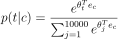, 𝜃<sub>t</sub>: parameter associated with output `t`. (bias term is omitted)
- Loss: L(y&#770;,y) = -sum(y<sub>i</sub>logy&#770;<sub>i</sub>)
- So this is called the skip-gram model because it's taking as input one word like `orange` and then trying to predict some words skipping a few words from the left or the right side.

*Model problem*:

- Computational speed: in the softmax step, every time evaluating the probability, you need to carry out a sum over all 10,000, maybe even larger 1,000,000, words in your vocabulary. It gets really slow to do that every time.

*Hierarchical softmax classifier*:

- Hierarchical softmax classifier is one of a few solutions to the computational problem.
  - Instead of trying to categorize something into all 10,000 categories on one go, imagine if you have one classifier, it tells you is the target word in the first 5,000 words in the vocabulary, or is in the second 5,000 words in the vocabulary, until eventually you get down to classify exactly what word it is, so that the leaf of this tree.
  - The main advantage is that instead of evaluating `W` output nodes in the neural network to obtain the probability distribution, it is needed to evaluate only about `log2(W)` nodes.
  - In practice, the hierarchical softmax classifier doesn't use a perfectly balanced tree or perfectly symmetric tree. The hierarchical softmax classifier can be developed so that the common words tend to be on top, whereas the less common words like durian can be buried much deeper in the tree.

*How to sample context `c`*:

- One thing you could do is just sample uniformly, at random, from your training corpus. 
  - When we do that, you find that there are some words like `the, of, a, and, to` and so on that appear extremely frequently.
  - In your context to target mapping pairs just get these these types of words extremely frequently, whereas there are other words like `orange`, `apple`, and also `durian` that don't appear that often.
- In practice the distribution of words `p(c)` isn't taken just entirely uniformly at random for the training set purpose, but instead there are different heuristics that you could use in order to balance out something from the common words together with the less common words.

*CBOW*:

The other version of the Word2Vec model is CBOW, the continuous bag of words model, which takes the surrounding contexts from middle word, and uses the surrounding words to try to predict the middle word. And the algorithm also works, which also has some advantages and disadvantages.

#### Negative Sampling

Paper: [Distributed Representations of Words and Phrases and their Compositionality](https://arxiv.org/abs/1310.4546) by Tomas Mikolov, Ilya Sutskever, Kai Chen, Greg Corrado, and Jeff Dean.

Negative sampling is a modified learning problem to do something similar to the Skip-Gram model with a much more efficient learning algorithm.

- `I want a glass of orange juice to go along with my cereal.`
- To create a new supervised learning problem: given a pair of words like `orange, juice`, we're going to predict it is a context-target pair or not?
- First, generate a positive example. Sample a context word, like `orange` and a target word, `juice`, associate them with a label of `1`.
- Then generate negative examples. Take `orange` and pick another random word from the dictionary for `k` times.
  - Choose large values of k for smaller data sets, like 5 to 20, and smaller k for large data sets, like 2 to 5.
  - In this example, k=4. x=`(context, word)`, y=`target`.

    | context | word | target? |
    | :----: | :----: | :----: |
    | orange | juice | 1 |
    | orange | king | 0 |
    | orange | book | 0 |
    | orange | the | 0 |
    | orange | of | 0 |

- Compared to the original Skip-Gram model: instead of training all 10,000 of them on every iteration which is very expensive, we're only going to train five, or k+1 of them. k+1 binary classification problems is relative cheap to do rather than updating a 10,000 weights of softmax classifier.
- *How to choose the negative examples*?
  - One thing you could do is sample it according to the empirical frequency of words in your corpus. The problem is you end up with a very high representation of words like 'the', 'of', 'and', and so on.
  - Other extreme method would use `p(w)=1/|V|` to sample the negative examples uniformly at random. This is also very non-representative of the distribution of English words.
  - The paper choose a method somewhere in-between: . f(w<sub>i</sub>) is the observed frequency of word w<sub>i</sub>.

#### GloVe word vectors

Paper: [GloVe: Global Vectors for Word Representation](http://nlp.stanford.edu/pubs/glove.pdf)

- X<sub>ij</sub>: #times j appear in context of i. (Think X<sub>ij</sub> as X<sub>ct</sub>).
  - X<sub>ij</sub> = X<sub>ji</sub>.
  - If the context is always the word immediately before the target word, then X<sub>ij</sub> is not symmetric.
- For the GloVe algorithm, define context and target as whether or not the two words appear in close proximity, say within ±10 words of each other. So, X<sub>ij</sub> is a count that captures how often do words i and j appear with each other or close to each other.
- Model: .
  -  𝜃<sub>i</sub><sup>T</sup>e<sub>j</sub> plays the role of 𝜃<sub>t</sub><sup>T</sup>e<sub>c</sub> in the previous sections.
  - We just want to learn vectors, so that their end product is a good predictor for how often the two words occur together.
  - There are various heuristics for choosing this weighting function `f` that neither gives these words too much weight nor gives the infrequent words too little weight.
    - f(X<sub>ij</sub>) = 0 if X<sub>ij</sub> = 0 to make sure 0log0=0
  - One way to train the algorithm is to initialize `theta` and `e` both uniformly random, run gradient descent to minimize its objective, and then when you're done for every word, to then take the average.
    - For a given words w, you can have e<sup>final</sup> to be equal to the embedding that was trained through this gradient descent procedure, plus `theta` trained through this gradient descent procedure divided by two, because `theta` and `e` in this particular formulation play **symmetric** roles unlike the earlier models we saw in the previous videos, where theta and e actually play different roles and couldn't just be averaged like that.

Conclusion:

- The way that the inventors end up with this algorithm was, they were building on the history of much more complicated algorithms like the newer language model, and then later, there came the Word2Vec skip-gram model, and then this came later.
- But when you learn a word embedding using one of the algorithms that we've seen, such as the GloVe algorithm that we just saw on the previous slide, what happens is, you cannot guarantee that the individual components of the embeddings are interpretable.
- But despite this type of linear transformation, the parallelogram map that we worked out when we were describing analogies, that still works.

### Applications using Word Embeddings

#### Sentiment Classification

| comments | stars |
| :---- | :--: |
| The dessert is excellent. | 4 |
| Service was quite slow. | 2 |
| Good for a quick meal, but nothing special. | 3 |
| Completely lacking in good taste, good service, and good ambience. | 1 |

*A simple sentiment classification model*:


- So one of the challenges of sentiment classification is you might not have a huge label data set.
- If this was trained on a very large data set, like a hundred billion words, then this allows you to take a lot of knowledge even from infrequent words and apply them to your problem, even words that weren't in your labeled training set.
- Notice that by using the average operation here, this particular algorithm works for reviews that are short or long because even if a review that is 100 words long, you can just sum or average all the feature vectors for all hundred words and so that gives you a representation, a 300-dimensional feature representation, that you can then pass into your sentiment classifier.
- One of the problems with this algorithm is it **ignores word order**.
  - "Completely *lacking* in *good* taste, *good* service, and *good* ambiance".
  - This is a very negative review. But the word good appears a lot.

*A more sophisticated model*:


- Instead of just summing all of your word embeddings, you can instead use a RNN for sentiment classification.
  - In the graph, the one-hot vector representation is skipped.
  - This is an example of a many-to-one RNN architecture.

#### Debiasing word embeddings

Paper: [Man is to Computer Programmer as Woman is to Homemaker? Debiasing Word Embeddings](https://arxiv.org/abs/1607.06520)

Word embeddings maybe have the bias problem such as gender bias, ethnicity bias and so on. As word embeddings can learn analogies like man is to woman like king to queen. The paper shows that a learned word embedding might output:

```
Man: Computer_Programmer as Woman: Homemaker
```

Learning algorithms are making very important decisions and so I think it's important that we try to change learning algorithms to diminish as much as is possible, or, ideally, eliminate these types of undesirable biases.

- *Identify bias direction*
  - The first thing we're going to do is to identify the direction corresponding to a particular bias we want to reduce or eliminate.
  - And take a few of these differences and basically average them. And this will allow you to figure out in this case that what looks like this direction is the gender direction, or the bias direction. Suppose we have a 50-dimensional word embedding.
    - g<sub>1</sub> = e<sub>she</sub> - e<sub>he</sub>
    - g<sub>2</sub> = e<sub>girl</sub> - e<sub>boy</sub>
    - g<sub>3</sub> = e<sub>mother</sub> - e<sub>father</sub>
    - g<sub>4</sub> = e<sub>woman</sub> - e<sub>man</sub>
  - g = g<sub>1</sub> + g<sub>2</sub> + g<sub>3</sub> + g<sub>4</sub> + ... for gender vector.
  - Then we have
    - `cosine_similarity(sophie, g)) = 0.318687898594`
    - `cosine_similarity(john, g)) = -0.23163356146`
    -  to see male names tend to have positive similarity with gender vector whereas female names tend to have a negative similarity. This is acceptable.
  - But we also have
    - `cosine_similarity(computer, g)) = -0.103303588739`
    - `cosine_similarity(singer, g)) = 0.185005181365`
    - It is astonishing how these results reflect certain unhealthy gender stereotypes.
  - The bias direction can be higher than 1-dimensional. Rather than taking an average, SVD (singular value decomposition) and PCA might help.
- *Neutralize*
  - For every word that is not definitional, project to get rid of bias.

    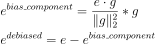
  
- *Equalize pairs*
  - In the final equalization step, what we'd like to do is to make sure that words like grandmother and grandfather are both exactly the same similarity, or exactly the same distance, from words that should be gender neutral, such as babysitter or such as doctor.
  - The key idea behind equalization is to make sure that a particular pair of words are equi-distant from the 49-dimensional g⊥.

  

## Week 3: Sequence models & Attention mechanism

>Sequence models can be augmented using an attention mechanism. This algorithm will help your model understand where it should focus its attention given a sequence of inputs. This week, you will also learn about speech recognition and how to deal with audio data.

### Various sequence to sequence architectures

#### Basic Models

In this week, you hear about sequence-to-sequence models, which are useful for everything from machine translation to speech recognition.

- Machine translation
  - Papers:
    - [Sequence to Sequence Learning with Neural Networks](https://arxiv.org/abs/1409.3215) by Ilya Sutskever, Oriol Vinyals, Quoc V. Le.
    - [Learning Phrase Representations using RNN Encoder-Decoder for Statistical Machine Translation](https://arxiv.org/abs/1406.1078) by Kyunghyun Cho, Bart van Merrienboer, Caglar Gulcehre, Dzmitry Bahdanau, Fethi Bougares, Holger Schwenk, Yoshua Bengio.
  - Input a French sentence: `Jane visite l’Afrique en septembre`, we want to translate it to the English sentence: `Jane is visiting Africa in September`.
  - First, let's have a network, which we're going to call the encoder network be built as a RNN, and this could be a GRU and LSTM, feed in the input French words one word at a time. And after ingesting the input sequence, the RNN then offers a vector that represents the input sentence.
  - After that, you can build a decoder network which takes as input the encoding and then can be trained to output the translation one word at a time until eventually it outputs the end of sequence.
  - The model simply uses an encoder network to find an encoding of the input French sentence and then use a decoder network to then generate the corresponding English translation.

  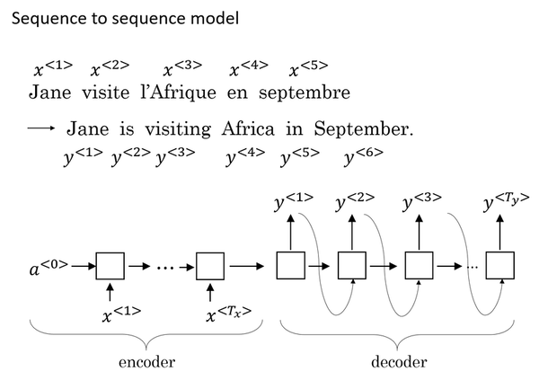
  
- Image Captioning
  - This architecture is very similar to the one of machine translation.
  - Paper: [Deep Captioning with Multimodal Recurrent Neural Networks (m-RNN)](https://arxiv.org/abs/1412.6632) by Junhua Mao, Wei Xu, Yi Yang, Jiang Wang, Zhiheng Huang, Alan Yuille.
  - In Course 4, you've seen how you can input an image into a convolutional network, maybe a pre-trained AlexNet, and have that learn an encoding or learn a set of features of the input image.
  - In the AlexNet architecture, if we get rid of this final Softmax unit, the pre-trained AlexNet can give you a 4096-dimensional feature vector of which to represent this picture of a cat. And so this pre-trained network can be the **encoder** network for the image and you now have a 4096-dimensional vector that represents the image. You can then take this and feed it to an RNN, whose job it is to generate the caption one word at a time.
  
  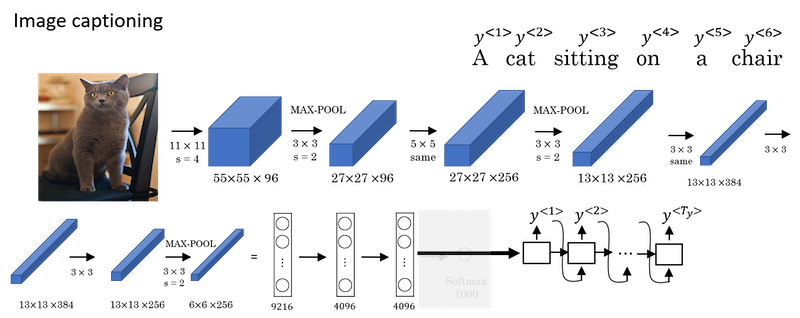

#### Picking the most likely sentence

There are some similarities between the sequence to sequence machine translation model and the language models that you have worked within the first week of this course, but there are some significant differences as well.

- The machine translation is very similar to a **conditional** language model.
  - You can use a language model to estimate the probability of a sentence.
  - The decoder network of the machine translation model looks pretty much identical to the language model, except that instead of always starting along with the vector of all zeros, it has an encoder network that figures out some representation for the input sentence.
  - Instead of modeling the probability of any sentence, it is now modeling the probability of the output English translation conditioned on some input French sentence. In other words, you're trying to estimate the probability of an English translation.
  
  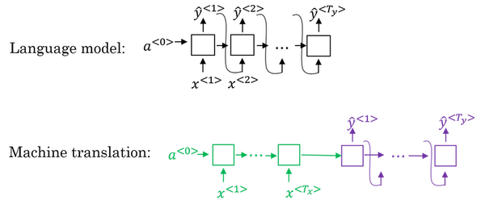
  
- The difference between machine translation and the earlier language model problem is: rather than wanting to generate a sentence at random, you may want to try to find the most likely English translation.
- In developing a machine translation system, one of the things you need to do is come up with an algorithm that can actually find the value of y that maximizes p(y<sup>\<1></sup>,...,y<sup>\<T_y></sup>|x<sup>\<1></sup>,...,x<sup>\<T_x></sup>). The most common algorithm for doing this is called **beam search**.
  - The set of all English sentences of a certain length is too large to exhaustively enumerate. The total number of combinations of words in the English sentence is exponentially larger. So it turns out that the greedy approach, where you just pick the best first word, and then, after having picked the best first word, try to pick the best second word, and then, after that, try to pick the best third word, that approach doesn't really work.
  - The most common thing to do is use an approximate search out of them. And, what an approximate search algorithm does, is it will try, it won't always succeed, but it will to pick the sentence, y, that maximizes that conditional probability.

#### Beam Search

In the example of the French sentence, `"Jane, visite l'Afrique en Septembre"`.

- Step 1: pick the first word of the English translation.
  - Set `beam width B = 3`.
  - Choose the most likely **three** possibilities for the first words in the English outputs. Then Beam search will store away in computer memory that it wants to try all of three of these words.
  - Run the input French sentence through the encoder network and then this first step will then decode the network, this is a softmax output overall 10,000 possibilities (if we have a vocabulary of 10,000 words). Then you would take those 10,000 possible outputs p(y<sup>\<1></sup>|x) and keep in memory which were the *top three*.
  - For example, after this step, we have the three words as `in, Jane, September`.
  
  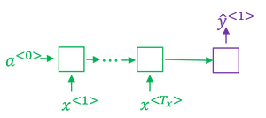
  
- Step 2: consider the next word.
  - Find the pair of the first and second words that is most likely it's not just a second where is most likely. By the rules of conditional probability, it's p(y<sup>\<1></sup>,y<sup>\<2></sup>|x) = p(y<sup>\<1></sup>|x) * p(y<sup>\<2></sup>|x,y<sup>\<1></sup>).
  - After this step, `in september, jane is, jane visit` is left. And notice that `September` has been rejected as a candidate for the first word.
  - Because `beam width` is equal to 3, every step you instantiate three copies of the network to evaluate these partial sentence fragments and the output.
  - Repeat this step until terminated by the end of sentence symbol.
  
  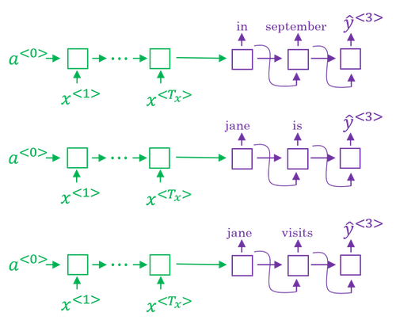
  
- If beam width is 1, this essentially becomes the greedy search algorithm.

#### Refinements to Beam Search

- *Length normalization:*
  - Beam search is to maximize the probability:
  
    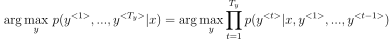
  
  - But multiplying a lot of numbers less than 1 will result in a very tiny number, which can result in numerical underflow.
  - So instead, we maximizing a log version:
  
    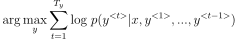
  
  - If you have a very long sentence, the probability of that sentence is going to be low, because you're multiplying many terms less than 1. And so the objective function (the original version as well as the log version) has an undesirable effect, that maybe it unnaturally tends to prefer very short translations. It tends to prefer very short outputs.
  - A normalized log-likelihood objective:
  
    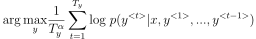
  
    - 𝛼 is another hyperparameter
    - 𝛼=0 no normalizing
    - 𝛼=1 full normalization

- *How to choose beam width B?*
  - If beam width is large:
    - consider a lot of possibilities, so better result
    - consuming a lot of different options, so slower and memory requirements higher
  - If beam width is small:
    - worse result
    - faster, memory requirements lower
  - choice of beam width is application dependent and domain dependent
    - In practice, B=10 is common in a production system, whereas B=100 is uncommon.
    - B=1000 or B=3000 is not uncommon for research systems.
    - But when B gets very large, there is often diminishing returns.

- Unlike exact search algorithms like BFS (Breadth First Search) or DFS (Depth First Search), Beam Search runs faster but is not guaranteed to find exact maximum for argmax<sub>y</sub>𝑃(𝑦|𝑥).

#### Error analysis in beam search

- Beam search is an approximate search algorithm, also called a heuristic search algorithm. And so it doesn't always output the most likely sentence.
- In order to know whether it is the beam search algorithm that's causing problems and worth spending time on, or whether it might be the RNN model that's causing problems and worth spending time on, we need to do error analysis with beam search.
- Getting more training data or increasing the beam width might not get you to the level of performance you want.
- You should break the problem down and figure out what's actually a good use of your time.
- *The error analysis process:*
  - Problem:
    - To translate: `Jane visite l’Afrique en septembre.` (x)
    - Human: `Jane visits Africa in September.` (y<sup>*</sup>)
    - Algorithm: `Jane visited Africa last September.` (y&#770;) which has some error.
  - Analysis:
    - Case 1:
      | Human | Algorithm | p(y<sup>*</sup>\|x) vs p(y&#770;\|x) | At fault? |
      | :---: | :-------: | :--------------------------------: | :-------: |
      | Jane visits Africa in September. | Jane visited Africa last September. | p(y<sup>*</sup>\|x) > p(y&#770;\|x) | Beam search |
      | ... | ... | ... | ... |
    - Case 2:
      | Human | Algorithm | p(y<sup>*</sup>\|x) vs p(y&#770;\|x) | At fault? |
      | :---: | :-------: | :--------------------------------: | :-------: |
      | Jane visits Africa in September. | Jane visited Africa last September. | p(y<sup>*</sup>\|x) ≤ p(y&#770;\|x) | RNN |
      | ... | ... | ... | ... |

#### Bleu Score (optional)

Paper: [BLEU: a Method for Automatic Evaluation of Machine Translation](https://www.aclweb.org/anthology/P02-1040.pdf) by Kishore Papineni, Salim Roukos, Todd Ward, and Wei-Jing Zhu.

BLEU stands for **bilingual evaluation understudy**.

- The reason the BLEU score was revolutionary for machine translation was because this gave a pretty good, by no means perfect, but pretty good single real number evaluation metric and so that accelerated the progress of the entire field of machine translation.
- The intuition behind the BLEU score is we're going to look at the machine generated output and see if the types of words it generates appear in at least one of the human generated references. And so these human generated references would be provided as part of the dev set or as part of the test set.
  - One way to measure how good the machine translation output is to look at each of the words in the output and see if it appears in the references.
  - An extreme example:
    - French: `Le chat est sur le tapis.`
    - Reference 1: `The cat is on the mat.`
    - Reference 2: `There is a cat on the mat.`
    - MT output: `the the the the the the the.`
    - Precision: 7/7. This is not a particularly useful measure because it seems to imply that this MT output has very high precision.
  - Instead, what we're going to use is a modified precision measure in which we will give each word credit only up to the maximum number of times it appears in the reference sentences.
    - Modified precision: 2/7. The numerator is the count of the number of times the word, `the`, appears. We take a max, we clip this count, at 2.

- In the BLEU score, you don't want to just look at isolated words. You maybe want to look at pairs of words as well. Let's define a portion of the BLEU score on bigrams.
  - MT output: `The cat the cat on the mat.`

    | Bigram | Count | Count<sub>clip</sub> |
    | :----- | :---: | :----: |
    | the cat | 2 | 1 |
    | cat the | 1 | 0 |
    | cat on | 1 | 1 |
    | on the | 1 | 1 |
    | the mat | 1 | 1 |
    | *sum* | 6 | 4 |

  - Modified bigram precision: 4/6

- Generally, Bleu score on n-grams is defined as:

    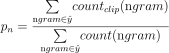

- **Combined Bleu score** = 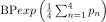
  - BP is for **brevity penalty**. Preventing short sentences from scoring too high.
  - `BP = 1`, if `MT_output_length > reference_output_length`, or
  - `BP = exp⁡(1 − reference_output_length / MT_output_length)`, otherwise.

#### Attention Model Intuition

Paper: [Neural Machine Translation by Jointly Learning to Align and Translate](https://arxiv.org/abs/1409.0473) by Dzmitry Bahdanau, Kyunghyun Cho, Yoshua Bengio.

You've been using an Encoder-Decoder architecture for machine translation. Where one RNN reads in a sentence and then different one outputs a sentence. There's a modification to this called the Attention Model that makes all this work much better.

The French sentence:

>Jane s'est rendue en Afrique en septembre dernier, a apprécié la culture et a rencontré beaucoup de gens merveilleux; elle est revenue en parlant comment son voyage était merveilleux, et elle me tente d'y aller aussi.

The English translation:

>Jane went to Africa last September, and enjoyed the culture and met many wonderful people; she came back raving about how wonderful her trip was, and is tempting me to go too.

- The way a human translator would translate this sentence is not to first read the whole French sentence and then memorize the whole thing and then regurgitate an English sentence from scratch. Instead, what the human translator would do is read the first part of it, maybe generate part of the translation, look at the second part, generate a few more words, look at a few more words, generate a few more words and so on.

  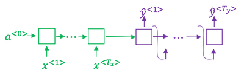

- The Encoder-Decoder architecture above is that it works quite well for short sentences, so we might achieve a relatively high Bleu score, but for very long sentences, maybe longer than 30 or 40 words, the performance comes down. (The blue line)

  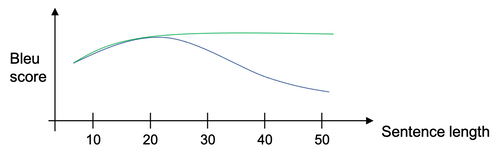

- The Attention model which translates maybe a bit more like humans looking at part of the sentence at a time. With an Attention model, machine translation systems performance can look like the green line above.

  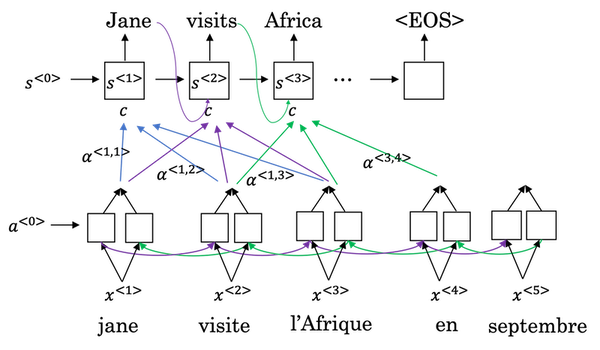

- What the Attention Model would be computing is a set of attention weights and we're going to use 𝛼<sup>\<1,1></sup> to denote when you're generating the first words, how much should you be paying attention to this first piece of information here and 𝛼<sup>\<1,2></sup> which tells us what we're trying to compute the first word of *Jane*, how much attention we're paying to the second word from the inputs, and 𝛼<sup>\<1,3></sup> and so on.
- Together this will be exactly the context from, denoted as `C`, that we should be paying attention to, and that is input to the RNN unit to try to generate the first word.
- In this way the RNN marches forward generating one word at a time, until eventually it generates maybe the `<EOS>` and at every step, there are **attention weighs** 𝛼<sup>\<t,t'></sup> that tells it, when you're trying to generate the *t*-th English word, how much should you be paying attention to the *t\'*-th French word.

#### Attention Model

- Assume you have an input sentence and you use a bidirectional RNN, or bidirectional GRU, or bidirectional LSTM to compute features on every word. In practice, GRUs and LSTMs are often used for this, maybe LSTMs be more common. The notation for the Attention model is shown below.

  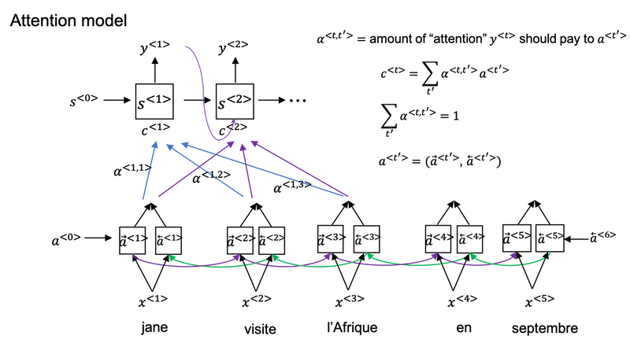

- Compute attention weights:

  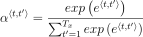

- Compute e<sup>\<t,t'></sup> using a small neural network:
  - And the intuition is, if you want to decide how much attention to pay to the activation of t', it seems like it should depend the most on is what is your own hidden state activation from the previous time step. And then a<sup>\<t'></sup>, the features from time step t', is the other input.
  - So it seems pretty natural that 𝛼<sup>\<t,t'></sup> and e<sup>\<t,t'></sup> should depend on s<sup>\<t-1></sup> and a<sup>\<t'></sup> . But we don't know what the function is. So one thing you could do is just train a very small neural network to learn whatever this function should be. And trust the backpropagation and trust gradient descent to learn the right function.

    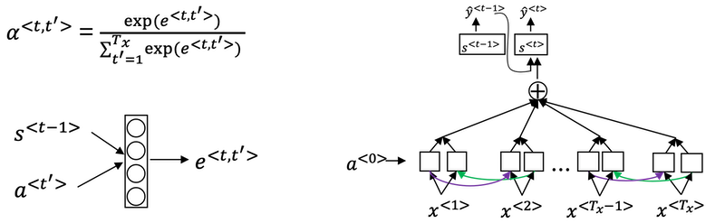

- One downside to this algorithm is that it does take quadratic time or quadratic cost to run this algorithm. If you have T<sub>x</sub> words in the input and T<sub>y</sub> words in the output then the total number of these attention parameters are going to be T<sub>x</sub> * T<sub>y</sub>.

- Visualize the attention weights 𝛼<sup>\<t,t'></sup>:

  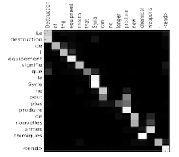

*Implementation tips*:

* The diagram on the left shows the attention model.
* The diagram on the right shows what one "attention" step does to calculate the attention variables 𝛼<sup>\<t,t'></sup>.
* The attention variables 𝛼<sup>\<t,t'></sup> are used to compute the context variable context<sup>\<t></sup> for each timestep in the output (t=1, ..., T<sub>y</sub>).

<table>
<td> 
 <br>
</td> 
<td> 
 <br>
</td> 
</table>
<caption><center>Neural machine translation with attention</center></caption>

### Speech recognition - Audio data

#### Speech recognition

- What is the speech recognition problem? You're given an audio clip, x, and your job is to automatically find a text transcript, y.
- So, one of the most exciting trends in speech recognition is that, once upon a time, speech recognition systems used to be built using *phonemes* and this were, I want to say, hand-engineered basic units of cells.
  - Linguists use to hypothesize that writing down audio in terms of these basic units of sound called phonemes would be the best way to do speech recognition.
- But with end-to-end deep learning, we're finding that phonemes representations are no longer necessary. But instead, you can built systems that input an audio clip and directly output a transcript without needing to use hand-engineered representations like these.
  - One of the things that made this possible was going to much larger data sets.
  - Academic data sets on speech recognition might be as a 300 hours, and in academia, 3000 hour data sets of transcribed audio would be considered reasonable size.
  - But, the best commercial systems are now trains on over 10,000 hours and sometimes over a 100,000 hours of audio.

*How to build a speech recognition?*

- **Attention model for speech recognition**: one thing you could do is actually do that, where on the horizontal axis, you take in different time frames of the audio input, and then you have an attention model try to output the transcript like, "the quick brown fox".

  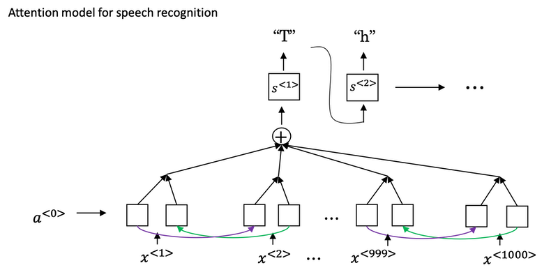

- **CTC cost for speech recognition**: Connectionist Temporal Classification
  - Paper: [Connectionist Temporal Classification: Labelling Unsegmented Sequence Data with Recurrent Neural Networks](https://www.cs.toronto.edu/~graves/icml_2006.pdf) by Alex Graves, Santiago Fernandes, Faustino Gomez, and Jürgen Schmidhuber.
  
    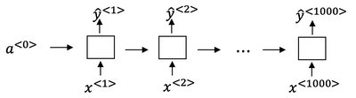

  - For simplicity, this is a simple of what uni-directional for the RNN, but in practice, this will usually be a bidirectional LSTM and bidirectional GRU and usually, a deeper model. But notice that the number of time steps here is very large and in speech recognition, usually the number of input time steps is much bigger than the number of output time steps.
    - For example, if you have 10 seconds of audio and your features come at a 100 hertz so 100 samples per second, then a 10 second audio clip would end up with a thousand inputs. But your output might not have a thousand alphabets, might not have a thousand characters.
  - The CTC cost function allows the RNN to generate an output like `ttt_h_eee___[]___qqq__`, here `_` is for "blank", `[]` for "space".
  - The basic rule for the CTC cost function is to collapse repeated characters not separated by "blank".

#### Trigger Word Detection

- With the rise of speech recognition, there have been more and more devices. You can wake up with your voice, and those are sometimes called *trigger word detection systems*.

  

- The literature on triggered detection algorithm is still evolving, so there isn't wide consensus yet, on what's the best algorithm for trigger word detection.
- With a RNN what we really do, is to take an audio clip, maybe compute spectrogram features, and that generates audio features x<sup>\<1></sup>, x<sup>\<2></sup>, x<sup>\<3></sup>, that you pass through an RNN. So, all that remains to be done, is to define the target labels y.
  - In the training set, you can set the target labels to be zero for everything before that point, and right after that, to set the target label of one. Then, if a little bit later on, the trigger word was said again at this point, then you can again set the target label to be one.
  - Actually it just won't actually work reasonably well. One slight disadvantage of this is, it creates a very imbalanced training set, so we have a lot more zeros than we want.
  - One other thing you could do, that it's little bit of a hack, but could make the model a little bit easier to train, is instead of setting only a single time step to operate one, you could actually make it to operate a few ones for several times. *Guide to label the positive/negative words)*:
    - Assume labels y<sup>\<t></sup> represent whether or not someone has just finished saying "activate."
      - y<sup>\<t></sup> = 1 when that that clip has finished saying "activate".
      - Given a background clip, we can initialize y<sup>\<t></sup> = 0 for all `t`, since the clip doesn't contain any "activates."
    - When you insert or overlay an "activate" clip, you will also update labels for y<sup>\<t></sup>.
      - Rather than updating the label of a single time step, we will update 50 steps of the output to have target label 1.
      - Recall from the lecture on trigger word detection that updating several consecutive time steps can make the training data more balanced.

*Implementation tips*:

- Data synthesis is an effective way to create a large training set for speech problems, specifically trigger word detection.
- Using a spectrogram and optionally a 1D conv layer is a common pre-processing step prior to passing audio data to an RNN, GRU or LSTM.
- An end-to-end deep learning approach can be used to build a very effective trigger word detection system.

---
Notes by Aaron © 2020

